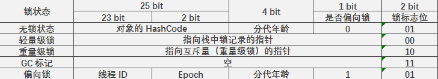

#   volatile 与 synchronized 锁的四种状态

1.  [volatile](#c-1)
1.  [synchronized 锁的四种状态](#c-2)
    1.  [Java 对象头简介](#c-2-1)
    1.  [轻量级锁](#c-2-2)
    1.  [偏向锁](#c-2-3)

---

## <a id="c-1">1. volatile</a>

### 1.1 概念

-   缓冲行：CPU 高速缓存中可以分配的最小存储单位。

-   原子操作：不可中断的一个或者一系列操作。

### 1.2 volatile 原理

被 volatile 修饰的变量进行 **写操作** 时，JVM 就会向处理器发送一条 **lock** 前缀的指令。接着，JVM 将这个变量所在 **缓存行** 的数据写会到系统内存。

同时，为了保证各个处理器的缓存一致性，每个处理器通过嗅探在总线上传播的数据来检查自己缓存的值是否过期了。当处理器发现自己 **缓存行** 对应的内存地址被修改，就会将 **当前处理器** 的 **缓存行** 设置为无效状态。此时，如果当前处理器需要用到这个数据时，就会重新从系统内存中读取数据到当前处理器的缓存中。

### 1.3 volatile 总结

1.  Lock 前缀指令会引起处理器缓存写回到到内存。

1.  一个处理器的缓存写回到内存会导致其他处理器中的缓存无效。

##  <a id="c-2">2. synchronized 锁的四种状态</a>

synchronized 可以认为是重量级锁。但是，JVM 为了减少不必要的消耗，为 synchronized 提供了四种状态：无锁状态、偏向锁、轻量级锁和重量级锁。

### <a id="c-2-1">2.1 Java 对象头结构</a>

> synchronized 用的锁是存在 Java 对象头中。对这部分感兴趣的请看这篇文章 —— [探秘 Hotspot 虚拟机中的对象](../books/jvm-5.md)。

熟悉 Java 虚拟机的人知道，Java 对象存储在堆中，对象引用存储在 Java 虚拟机栈中。

而对象在内存中存储的布局可以分为 3 块区域：

1.  对象头
1.  实例数据
1.  对齐填充

**对象头** 分为 2 部分：

1.  Mark Word

    -   Mark Word 中储存着对象自身的运行时数据：哈希码（HashCode）、GC 分代年龄、锁状态标志、线程持有的锁、偏向线程 ID、偏向时间戳等。

    -   类型指针，对象指向它的类元数据的指针，虚拟机通过这个指针来确定这个对象是哪个类的实例。这个指针是指向方法区对象类型数据的指针。

    -   如果对象是数组，还有一部分于存储数组长度。

    

1.  类型指针

### <a id="c-2-2">2.2 轻量级锁</a>

前面之所以讲到 Java 对象头，是因为理解 Java 对象头是理解轻量级锁和偏向锁的关键。

轻量级锁的本意是在没有多线程竞争的前提下，减少传统的重量级锁使用操作系统互斥量产生的性能消耗。

### 1.  轻量级锁的加锁过程：

1.  在代码进入同步块时，如果发现同步对象的锁标志位为 01 时，说明此时对象没有被锁定或者是偏向锁状态。

1.  接着，虚拟机会在当前线程的栈帧中建立一个名为锁记录（Lock Record）的空间。当前线程会将当前锁对象的 Mark Word 拷贝到锁记录中。

1.  然后，虚拟机将使用 CAS 操作尝试将对象的 Mark Word 更新为指向 Lock Record 的指针。

1.  如果更新成功，那么说明当前线程拥有了该对象的锁，并且对象 Mark Word 的锁标志位将转变为 00。

1.  如果更新失败，虚拟机会检查对象的 Mark Word 是否指向了当前线程的栈帧。

    1.  如果指向了当前线程的栈帧，说明当前线程已经获取了对象的锁，那就可以直接进入同步块继续执行。

    1.  如果没有指向当前线程的栈帧，说明此时该对象存在竞争，并且已经被其他线程所占用了，进行锁升级。
    
如果有两条以上的线程争用同一个对象锁，那轻量级锁将不再有效，会膨胀为重量级锁，锁标志位的值也转变为 10，Mard Word 中存储的就是指向重量级锁的指针，后面的线程如果尝试获取该对象锁将被阻塞住。

### 2.  轻量级锁的解锁过程：

轻量级锁的解锁过程也是通过 CAS 操作进行的。

如果对象头中的 Mark Word 还指向着当前线程的 Lock Record，那就通过 CAS 来将对象当前的 Mark Word 和当前线程栈中复制的 Displayed Mark Word 替换回来。

-   如果 CAS 替换成功，整个同步过程就完成了。

-   如果 CAS 替换失败，说明在解锁过程中，有其他线程在尝试获取对象锁并且它们是获取轻量级锁失败了（这个时候的对象锁已经膨胀为重量级锁，其他尝试获取该对象锁的线程将被阻塞中）。这个时候，在释放锁的同时还要唤醒被挂起的线程。

## <a id="c-2-3">2.3 偏向锁</a>

你可以把偏向锁理解为是在轻量级锁的基础上做的性能优化。

回顾一下，轻量级锁的作用：在无竞争情况下，减少使用重量级锁所带来的性能消耗（获取对象锁的线程会阻塞其他尝试获取该对象锁的线程）。轻量级锁是通过 CAS 来消除同步使用互斥量，一旦出现竞争情况，就将轻量级锁升级为重量级锁。

那么，偏向锁是在无竞争的情况下把整个同步都消除掉，连 CAS 都不做了（除了第一次）。

偏向锁是偏向于第一个获得它的线程。

### 1.  偏向锁的获取

当锁对象第一次被线程获取的时候，虚拟机将会把 Mark Word 中的锁标志位转换成 01。同时，使用 CAS 操作把获取到这个锁的线程的 ID 记录在 Mark Word 中。如果 CAS 操作成功，持有偏向锁的线程以后每次进入这个锁相关的同步块时，虚拟机都可以不再进行任何同步操作。

### 2.  偏向锁的撤销与膨胀

偏向锁使用了一种等到竞争出现才释放锁的机制，所以当其他线程尝试竞争偏向锁时，持有偏向锁的线程才会释放偏向锁。

在一个对象锁已经被一个线程所占有的前提下，如果此时有其他线程尝试获取该对象锁，那么偏向模式就宣告结束。此时，Java 虚拟机根据拥有对象锁的线程的状态来撤销偏向锁，恢复到未锁定状态或是膨胀为轻量级锁。

## [BACK](../books/concurrency.md)