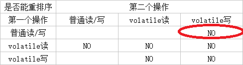

# volatile、synchronized 和 final 的内存语义

> 时间: 2018年11月13日

1.  [volatile](#1-1)
1.  [synchronized 的内存语义](#1-2)
1.  [final](#1-3)

---

## <a id="1-1">1. volatile</a>

volatile 变量的特性：

1.  可见性。对一个 volatile 变量的读，总算是能看到（任意线程）对这个 volatile 变量最后的写入值。

1.  原子性。对任意单个 volatile 变量的读/写具有原子性，但类似于 volatile++ 这种复合操作不具有原子性。

### 1.1 volatile 写 - 读 的内存语义

-   volatile 写的内存语义

    当写一个 volatile 变量时，JMM 会把该线程对应的本地内存中的共享变量值刷新到主内存中。

-   volatile 读的内存语义

    当读一个 volatile 变量时，JMM 会把该线程对应的本地内存设置为无效。线程接下来将从主内存中读取共享变量。

### 1.2 volatile 内存语义的实现

为了实现 volatile 内存语义，JMM 会分别限制这两种类型（volatile 读与 volatile 写这两个操作）的重排序。

下面这个表格是 JMM 针对编译器指定的 volatile 重排序规则表：

> 注意：圈红的是 JSR-133 增强 volatile 语义之后添加的规则。

根据上面的表格，可以得出下面的结论：

1.  第一个操作是 volatile 读时，无论第二个操作是什么，都不允许将 volatile 之后的操作重排序到 volatile 读之前。

1.  第二个操作是 volatile 写时，无论第一个操作是什么，都不允许将 volatile 之前的操作重排序到 volatile 写之后。

1.  当第一个操作是 volatile 写且第二个操作是 volatile 读时，也不允许将这两个操作重排序。

针对于上面的 volatile 规则，JMM 通过在指令操作间插入一些内存屏障来达到这个效果。

-   在每个 volatile 写操作的前面插入一个 StoreStore 屏障。
-   在每个 volatile 写操作的后面插入一个 StoreLoad 屏障。
-   在每个 volatile 读操作的后面插入一个 LoadLoad 屏障。
-   在每个 volatile 读操作的后面插入一个 LoadStore 屏障。

## <a id="1-2">2. synchronized 的内存语义</a>

-   释放锁的内存语义

    当线程释放锁的时候，JMM 会把该线程对应的本地内存中的共享变量刷新到主内存中。

-   获取锁的内存语义

    当线程获取锁的时候，JMM 会把该线程对应的本地内存设置为无效。从而时而被监视器保护的临界区代码必须从主内存中重新读取共享变量的值。

> 了解过锁的内存语义之后，我们发现，volatile 的读与获取锁的内存语义是一样的；volatile 的写与释放锁的内存语义是一样的。

### 2.1 锁内存语义的实现

这里将借助 ReentrantLock 的源代码，来分析锁内存语义的具体实现机制。有兴趣可以看一下这篇文章 [ReentrantLock](../../mds/concurrency/c-5-1.md)。

## <a id="1-3">3. final</a>

对于 final 域，编译器和处理器要遵守两个重排序规则：

1.  在 **构造函数内** 对一个 final 域的写入，与随后把这个被构造对象的引用赋值给一个引用变量，这两个操作之间不能重排序。

1.  初次读一个包含 final 域的 **对象的引用**，与随后初次读这个 final 域，这两个操作之间不能重排序。

### 3.1 final 域内存语义的实现

-   写 final 域的内存语义实现

    1.  JMM 禁止编译器把 final 域的写重排序到构造函数之外。

    1.  编译器会在 final 域的写之后，构造函数 return 之前，插入一个 StroeStore 屏障。这个屏障的作用是禁止处理器把 final 域的写重排序到构造函数外。

-   读 final 域内存语义的实现

    编译器会在读 final 域这个操作的前面插入一个 LoadLoad 屏障，来禁止处理器把 final 域的读重排序到初次读取这个 final 域所对应的对象的引用。

### 3.2 final 域为引用类型

在构造函数内对一个 final 引用的对象的成员域的写入，与随后在构造函数外把这个被构造对象的引用赋值给一个引用变量。

## [BACK](../books/concurrency.md)