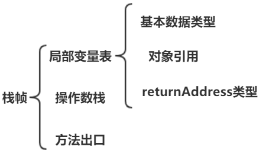

# 运行时数据区域

> 分析 JVM 运行时各个区域的作用

##  1. 程序计数器（线程私有）

1.  每个线程都有自己的程序计数器，其生命周期与线程相同。

1.  程序计数器记录了当前线程执行字节码文件的行号。

1.  此区域是唯一一个在 JVM 规范中没有规定 OutOfMemoryError 情况的区域。

##  2. Java 虚拟机栈（线程私有）

1.  Java 虚拟机栈描述的是 **Java 方法执行的内存模型**。

1.  在 Java 方法执行的时候会创建一个栈帧（stack frame）。栈帧是方法执行时的基本数据结构。其结构如下：

    

1.  局部变量表分配的内存空间在编译期间就已经确定。

1.  此区域会可能会出现 StackOverflowError 和 OutOfMemoryError 异常。

##  3. 本地方法栈（线程私有）

作用与 Java 虚拟机栈非常相似，区别是本地方法栈区域是为 Native 方法服务，而 Java 虚拟机栈是为 Java 方法服务。

##  4. Heap（线程共享）

1.  堆是垃圾回收器主要管理的区域，所以堆也称为 GC 堆。

1.  堆中存放的是 **所有的对象实例** 和 **数组**。

1.  不需要连续的内存；可以选择固定大小；可以扩展。

1.  此区域可能会抛出 OutOfMemoryError 异常。

##  5. 方法区（线程共享）

1.  方法区用于储存已被虚拟机加载的类信息、常量、静态变量、即时编译器编译后的代码等数据。

1.  class 文件除了有版本、字段、方法、接口等描述信息外，还有常量池。

1.  常量池存放编译期生成的各种字面量和符号引用。

    1.  字面量就是我们所说的常量概念，如文本字符串、被声明为 final 的常量值等。

    1.  符号引用是一组符号来描述所引用的目标，符号可以是任何形式的字面量，只要使用时能无歧义地定位到目标即可。

1.  运行时常量池是方法区的一部分，所有线程共享。虚拟机加载 Class 后把常量池中的数据放入到运行时常量池。

1.  JDK7 版本中，字符串常量池已经被移到堆中。

1.  当常量池无法再申请到内存时会抛出 OutOfMemoryError 异常。