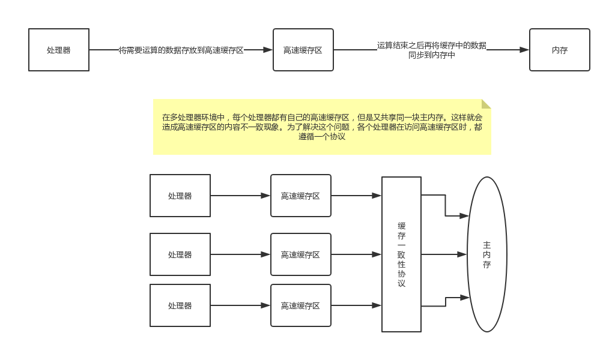
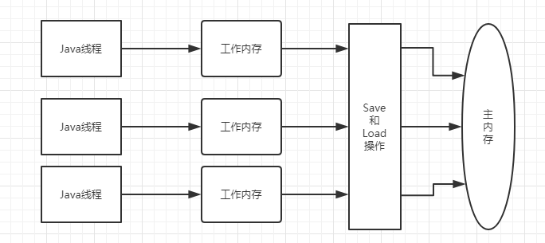
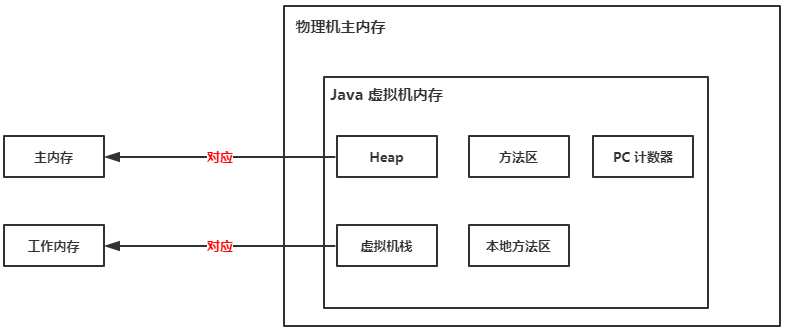

# Java 内存模型

1.  [物理机内存访问](#1-1)
1.  [Java 内存模型](#1-2)
    1.  [Java 内存模型结构](#1-2-1)
    1.  [内存间交互操作](#1-2-2)
1.  [volatile 解析](#1-3)

---

## <a id="1-1">1.   物理机内存访问</a>

处理器至少要与内存交互，如读取运算数据、存储运算结果等，这个 I/O 操作是很难消除的。由于计算机的存储设备与处理器的运算速度有几个数量级的差距，所以现代计算机系统不得不都加入一层读写速度与处理器运算速度接近的高速缓存区来作为内存与处理器之间的缓存。

在内存和处理器之间加入高速缓存之后，将会带来一个问题：缓存不一致性问题。

### 1.1 缓存不一致问题

在多处理器系统中，每个处理器都有一个自己的高速缓存，但是它们又共享同一块主内存。那么，当多个处理器的运算任务都涉及同一块主内存区域块时，将可能导致各自的缓存数据不一致。

### 1.2 解决缓存不一致问题

为了解决缓存不一致所带来的问题，各个处理器访问缓存时都遵循一些协议，在读写时要根据协议来进行操作，这类协议有 MSI、MESI、MOSI、Synapse、Firefly 以及 Dragon Protocol 等。



## <a id="1-2">2.   Java 内存模型</a>

Java 虚拟机视图通过定义一种 Java 内存模型来 **屏蔽** 掉各种硬件和操作系统的内存访问差异，以实现让 Java 程序在各个平台下都能达到一致的内存访问效果。

### <a id="1-2-1">2.1 Java 内存模型结构</a>

Java 内存模型的主要目标是定义程序中各个变量的访问规则，即在虚拟机中将变量存储到主内存和从主内存中取出变量这样的底层细节。

上面提到的 **主内存** 和下面即将要提到的 **工作内存** 是 Java 内存模型中最重要的两块区域。



#### 2.1.1 如何理解主内存和工作内存？

-   主内存：可以类比上面物理机的主内存，但是这里只是 Java 虚拟机内存的一部分。

-   工作内存：每条线程都有一个属于自己的工作内存（可以类比上面物理机的高速缓存）。线程对变量的所有操作（赋值，读取等）都必须在工作内存中进行，不能直接读写主内存中的变量。

这个主内存和工作内存与 [运行时数据区域](../books/jvm-1.md) 这篇所讲述的 Java 内存区域中的 Java 堆、栈、方法区并不是同一个层次的划分，这两者基本上是没有关系的，如果两者一定要勉强对应起来，就如下图所示：



### <a id="1-2-2">2.2 内存间交互操作</a>

Java 虚拟机定义了 8 种原子操作，来完成一个变量如何从主内存拷贝到工作内存、如何从工作内存同步回主内存之类的实现细节，即实现了主内存和工作内存之间的交互协议。

下面来看看这 8 种操作：

1.  lock

    作用于 **主内存中的变量**，它把一个变量标识为一条线程独占的状态。其他线程只有等到当前线程执行了 unlock 操作之后才可能获取到这个变量。

1.  unlock

    作用于 **主内存中的变量**，它把一个处于锁定状态的变量释放出来，释放后的变量才可以被其他线程锁定。

1.  read

    作用于 **主内存中的变量**，它把一个变量的值从主内存中传输到线程的工作内存中，以便随后的 load 动作使用。

1.  load

    作用于 **工作内存中的变量**，它把 read 操作从主内存中得到的变量值载入工作内存中的变量副本中。

1.  use

    作用于 **工作内存中的变量**，它把工作内存中一个变量的值传递给执行引擎，每当虚拟机遇到一个需要 **使用到变量的值的字节码指令** 将会执行这个操作。

1.  assign

    作用于 **工作内存中的变量**，它把执行引擎接收到的值 **赋值** 给工作内存中一个变量，每当虚拟机遇到一个给 **变量赋值的字节码指令** 将会执行这个操作。

1.  store

    作用于 **工作内存中的变量**，它把一个变量的值从线程的工作内存中传输到主内存，以便随后的 write 操作使用。

1.  write

    作用于 **主内存中的变量**，它把 store 操作从工作内存得到的变量值同步回主内存的变量中。

除此之外，Java 内存模型还规定了在执行上述 8 种基本操作时 **必须满足** 如下规则：

1.  read 和 load、store 和 write 这两对操作必须同时出现，即不允许一个变量从主内存读取了但工作内存不接受，或者从工作内存中将变量传输到主内存，但是主内存不接受的情况出现。

1.  不允许一个线程丢弃它的最近的 assign 操作，即变量在工作内存中改变了之后必须把这个变化同步回主内存。

1.  不允许一个线程没有原因地（没有发生过任何 assgin 操作）把数据从线程的工作内存同步回主内存中。

1.  一个新的变量只能在主内存中 “诞生”，不允许在工作内存中直接使用一个未被初始化（load 或 assgin）的变量，换句话说，就是对一个变量实施 use、store 操作之前，必须先执行过了 assgin 和 load 操作。

1.  一个变量在同一时刻只允许一个线程对其进行 lock 操作，但 lock 操作可以被同一条线程重复执行多次，多次执行 lock 后，只有执行相同次数的 unlock 操作，变量才会解锁。

1.  如果对一个变量执行 lock 操作，那将会清空工作内存中此变量的值，在执行引擎使用这个变量前，需要重新执行 load 或 assign 操作初始化变量的值。

1.  如果一个变量事先没有被 lock 操作锁定，那就不允许对它执行 unlock 操作，也不允许去 unlock 一个被其他线程锁定住的变量。

1.  对一个变量执行 unlock 操作之前，必须先把此变量同步回主内存中（执行 store、write 操作）。

## <a id="1-3">3. volatile 解析</a>

当一个变量定义为 volatile 之后，它将具备两种特性：

1.  保证此变量对所有线程的 **可见性**。这里的可见性，是指当一条线程修改了这个变量的值，新值对于其他线程来说是可以立即得知的。

1.  禁止指令重排序优化。

### 3.1 volatile 的可见性并不代表着线程安全

```java
public static volatile int race = 0;

public static void increase() {
    race++;
}
```

上面这个语句在多线程情况下，并不是线程安全的。用 Javap 反编译上面这段代码，如下：

```java
public static void increase() {
    Code: 
     Stack=2, Locals=0, Args_size=0
     0:   getstatic       #13; //Field race: I
     3:   iconst_1
     4:   iadd
     5:   putstatic       #13; //Field race: I
     8:   return
    LineNumberTable:
     line 14:  0
     line 15:  8
}
```

通过上面的字节码，我们可以看到 `race++` 这行代码解析成字节码时，是分解为了四个指令：`putstatic`、`iconst_1`和`iadd`，最后通过 `putstatic` 指令同步回主内存。volatile 只能保证在执行 `getstatic` 指令的时候，是线程安全的。但是对于后面的其他指令操作并不是线程安全的。

### 3.2 volatile 变量的规则

下面总结一下，Java 内存模型对 volatile 变量定义的特殊规则。

> 这里可以结合前面提到的 Java 内存模型定义的 8 种原子操作来对照理解。

假定：

    T 表示一个线程， V 和 W 表示两个 volatile 变量；

    动作 A 是线程 T 对变量 V 实施的 use 或 assign 动作；

    动作 F 是和动作 A 相关联的 load 或 store 动作；

    动作 P 是和动作 F 相关联的 read 或 write 动作；

    动作 B 是线程 T 对变量 V 实施的 use 或 assign 动作；

    动作 G 是和动作 B 相关联的 load 或 store 动作；

    动作 Q 是和动作 G 相关联的 read 或 write 动作；

1.  只有当线程 T 对变量 V 执行的前一个动作是 load 的时候，线程 T 才能对变量 V 执行 use 动作；并且，只有当线程 T 对变量 V 执行的后一个动作是 use 的时候，线程 T 才能对变量 V 执行 load 动作。

    同时，根据 JVM 提供的 8 种基本操作规则中的其中一条：

    > read 和 load、store 和 write 这两对操作必须同时出现，即不允许一个变量从主内存读取了但工作内存不接受，或者从工作内存中将变量传输到主内存，但是主内存不接受的情况出现。

    可以理解为，对于 volatile 变量 V 而言，read、load、use 这三个操作必须是按照此顺序执行，并且这三个操作是连续的。这样就保证了当前线程能够看见其他线程对 volatile 的变量 V 所做的修改后的值。

1.  只有当线程 T 对变量 V 执行的前一个动作是 assgin 的时候，线程 T 才能对变量 V 执行 store 动作；并且，只有当线程 T 对变量 V 执行的后一个动作是 store 的时候，线程 T 才能对变量 V 执行 assgin 动作。

    同时，根据 JVM 提供的 8 种基本操作规则中的其中一条：

    > read 和 load、store 和 write 这两对操作必须同时出现，即不允许一个变量从主内存读取了但工作内存不接受，或者从工作内存中将变量传输到主内存，但是主内存不接受的情况出现。

    可以理解为，对于 volatile 变量 V 而言，assign、store、write 这三个操作必须是按照此顺序执行，并且这三个操作是连续的。这样就保证了当前线程对 volatile 变量 V 的修改能及时被其他线程看到。

1.  如果 A 优先于 B，那么 P 优先于 Q。

总结一下就是：

-   规则 1 和规则 2 解释了 volatile 变量可见性。

-   规则 3 解释了 volatile 变量禁止指令重排序优化。

## [BACK](../books/jvm.md)