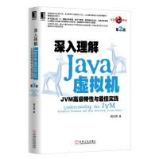
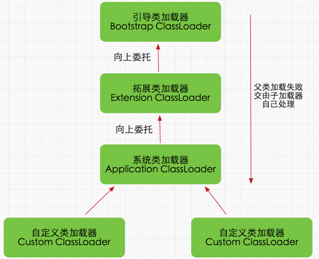
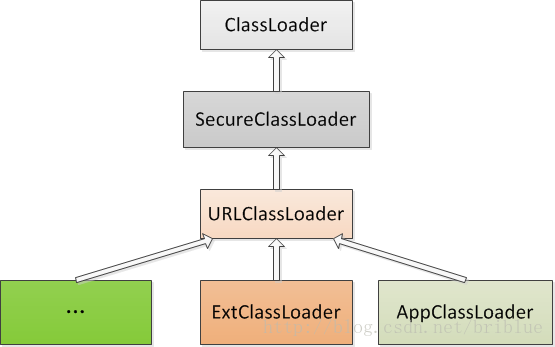

# Book

## 目录

- [Java内存区域与内存溢出异常](#OOM)
    - [运行时数据区域](../books/jvm-1.md)
    - [探秘 Hotspot 虚拟机中的对象](../books/jvm-5.md)
- 垃圾收集器与内存分配策略
    - [垃圾收集器](../books/jvm-2.md)
    - [内存分配与回收策略](../books/jvm-3.md)
- [类文件结构](#CLASS-FILE-STRUCTURE)
- 虚拟机类加载机制
    - [类加载的过程](../books/jvm-4.md)
    - [类加载器](#CLASSLOADER-MECHINE)
- [Java内存模型与线程](#MEMORY-MODEL-AND_THREAD)
    - [物理机的内存模型](#PHYSIC-MEMORY-MODEL)
    - [Java内存模型](#JAVA-MEMORY-MODEL)
    - [Java与线程](#JAVA-AND-THREAD)
- [线程安全和锁优化](#THREAD-SECURITY-AND-LOCK-OPTIMIZE)

# <a id="CLASS-FILE-STRUCTURE">类文件结构</a>

-	Class文件是一组以8位字节为基础单位的二进制流，各个数据项目严格按照顺序紧凑地排列在Class文件之中。
-	Class文件格式采用一种类似C语言结构体的伪结构来储存数据。
-	Class文件结构只有两种数据类型：无符号数、表。
-	无符号数：属于基本的数据类型，可以用来描述数字、索引引用、数量值或者按照UTF-8编码构成字符串值。

表：由多个无符号数和其他表作为数据项构成。

##	魔数
每个Class文件的头4个字节称为魔数，魔数唯一的作用就是确定这个文件是否为一个能被虚拟机接受的Class文件。

第5，6字节是次版本号（Minor Version），第7，8字节是主板本号（Major Version）。

##	常量池
紧接着主板本号之后的是常量池。

常量池中主要存放两大类常量：字面量和符号引用。

字面量包括：文本字符串、声明为final的常量值。
符号引用包括：
-   类和接口的全限定名。
-   字段的名称和描述符
-   方法的名称和描述符

##	访问标志
常量池之后，紧接着是访问标志。

访问标志用于识别一些类或者接口层次的访问信息，包括：这个class是类还是接口；是否定义为public类型；是否定义为abstract类型；如果是类的话，是否被声明为final等。

##	类索引、父类索引与接口索引集合
Class文件中由这三项数据来确定这个类的继承关系。

##	字段表集合
字段表用于描述接口或者类中声明的变量。

字段包括类级变量和实例级变量，不包括方法内部的局部变量。

# <a id="CLASSLOADER-MECHINE">类加载器</a>

### 概念

加载阶段中的“通过一个类的全限定名来获取描述此类的二进制字节流”这个动作放到Java虚拟机外部实现，以便让应用程序自己决定如何去获取所需要的类。实现这个动作的代码块就是“类加载器”。

###	类与类加载器
比较两个类是否相等，还需要判断这两个类是否由同一个ClassLoader加载进来的。

###	双亲委派模型
1.	从Java虚拟机角度来看，只存在2中类加载器：
    -	启动类加载器（Bootstrap ClassLoader），在HotSpot中这个加载器是C++实现的。
    -  	其他类加载器，由Java语言实现的，独立于JVM外部，并且全都继承自抽象类java.lang.ClassLoader.

2.	从开发人员角度来看，存在3种类加载器：
    -	Bootstrap ClassLoader（启动类加载器）
    -	Extension ClassLoader（扩展类加载器）
    -	Application ClassLoader（应用程序类加载器）

###	双亲委派模式的工作过程

 
如果一个类加载器收到了类加载的请求，它首先不会自己去尝试加载这个类，而是把这个请求委派给父类加载器去完成，每一个层次的类加载器都是如此。因此所有的加载请求最终都应该委派到顶层的启动类加载器中，只有当父加载器反馈自己无法完成这个加载请求时，子加载器才会尝试自己加载。
 
###	双亲委派模型的代码实现

实现双亲委派的代码都集中在java.lang.ClassLoader的loadClass()方法中。

 
双亲委派模型的好处：
1.	每个类都只会被加载一次，避免了重复加载，这样也不会出现
2.	有效的避免了某些恶意类的加载（比如自定义的java.lang.Object类）。

### 双亲委派模式在什么情况下会被打破？

ContextClassLoader：有些时候ClassLoader的双亲委托机制不能完成一些特定的类加载任务，比如java提供一些SPI，由厂商来进行具体的实现，比如jdbc，各个数据库厂商根据java提供的SPI来实现各自数据库的连接；这些SPI都定义在核心类里，由bootstrap ClassLoader加载，而在SPI 接口中的代码经常需要加载具体的实现类，但厂商的具体实现又不能由Bootstrap ClassLoader加载，这个时候就需要ContextClassLoader。

##  [BACK](../../mds/summary.md)