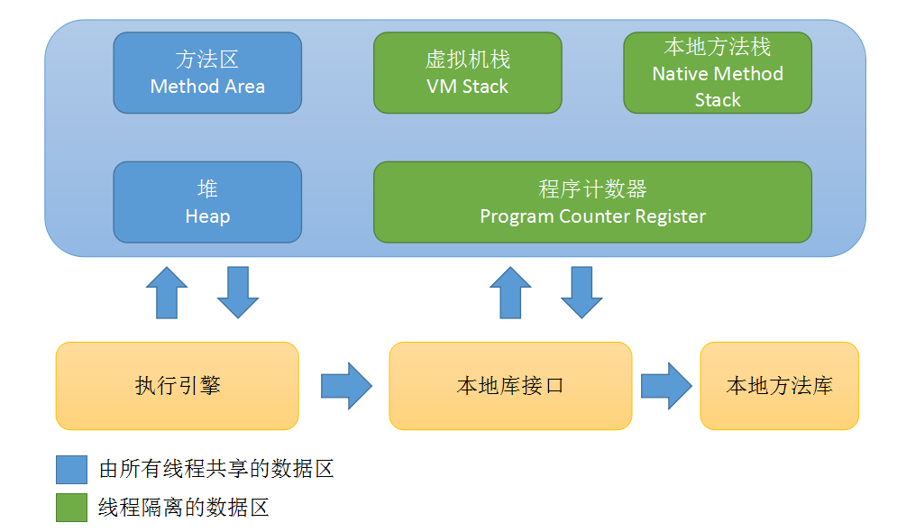
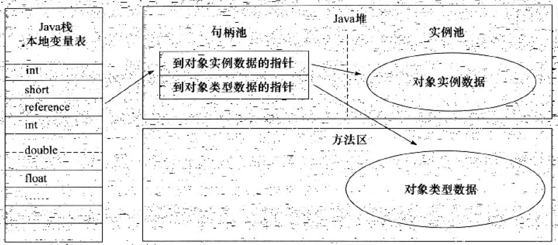
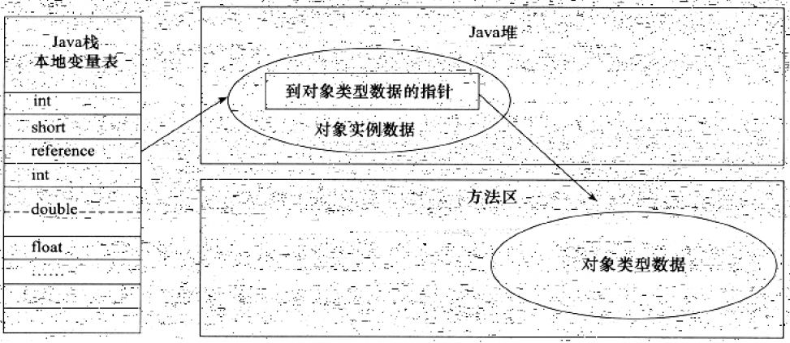
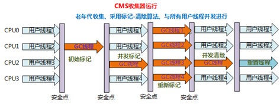
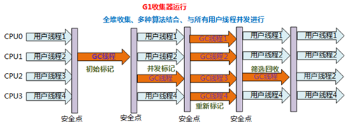
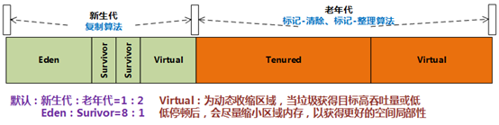
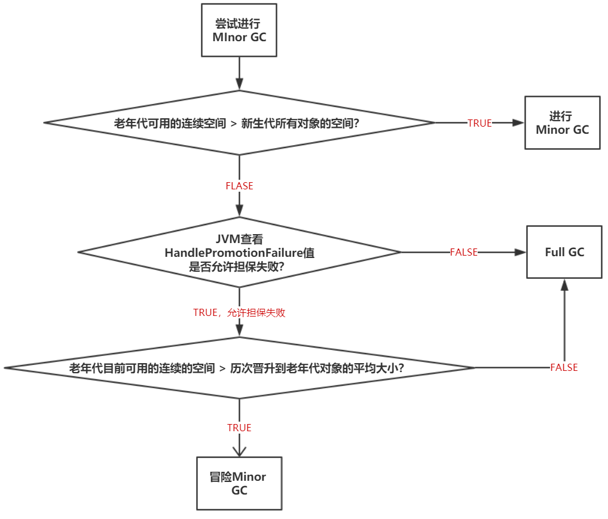
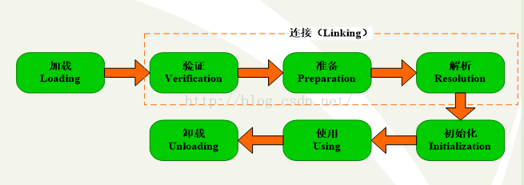
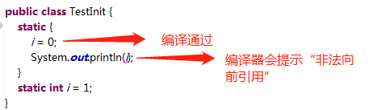

# Book

## 目录

- [Java内存区域与内存溢出异常](#OOM)
    - [运行时数据区域](#RUNTIME-AREA)
    - [HotSpot虚拟机对象](#HOTSPOT-OBJ)
    - [总结](#OOM-SUMMARY)
- [垃圾收集器与内存分配策略](#GC-MECHINE-AND-MEMORY-ALLOCATION-STRATEGY)
    - [概述](#GC-OVERVIEW)
    - [引用](#REFERENCE)
    - [垃圾收集算法](#GC-ARITHMETHIC)
    - [HotSpot的算法实现](#HOTSPOT)
    - [垃圾收集器](#GC)
    - [内存分配与回收策略](#MEMORY-ALLOCATION-STRATEGY)
- [类文件结构](#CLASS-FILE-STRUCTURE)
- [虚拟机类加载机制](#CLASSLOADER)
    - [类加载的时机](#CLASS-LOAD-TIME)
    - [类加载的过程](#CLASS-LOAD-PROCESS)
    - [验证](#FILE-VALIDATION)
    - [准备](#FILE-PREPARE)
    - [解析](#FILE-ANALYSIS)
    - [初始化](#FILE-INIT)
    - [类加载器](#CLASSLOADER-MECHINE)
- [Java内存模型与线程](#MEMORY-MODEL-AND_THREAD)
    - [物理机的内存模型](#PHYSIC-MEMORY-MODEL)
    - [Java内存模型](#JAVA-MEMORY-MODEL)
    - [Java与线程](#JAVA-AND-THREAD)
- [线程安全和锁优化](#THREAD-SECURITY-AND-LOCK-OPTIMIZE)

# <a id="RUNTIME-AREA">运行时数据区域</a>

### PC Register(Program Counter Register，线程私有)，是当前线程所执行的字节码的行号指示器。
- 此内存区域是唯一一个在Java虚拟机规范中没有规定任何OutOfMemoryError情况的区域。（这是一个固定的整数的储存空间，所以没有规定OOM）字节码解释器工作时就是通过改变这个计数器的值来选取下一条需要执行的字节码指令。
- Java虚拟机的多线程是通过线程轮流切换并分配处理器执行时间的方式来实现的。为了线程切换后能恢复到正确的执行位置，每条线程都需要有一个独立的PC Register，各条线程之间计数器互不影响，独立储存。
- PC Register值：
    1. 线程正在执行的是一个Java方法，这个计数器记录的是正在执行的虚拟机字节码指令的地址。
    2. 线程正在执行的是Native方法，这个计数器值为空（undefined）。

### VM Stack(Java 虚拟机栈，线程私有)，生命周期和线程相同。
- 虚拟机栈描述的是Java方法执行的内存模型：每个方法在执行的同时都会创建出一个栈帧(Stack Frame)，用于储存局部变量表、操作数栈、动态链接、方法出栈等信息。
- 局部变量表，存放了编译期可知的各种基本数据类型、对象引用。注意：其中64位长度的long和double类型的数据会占用2个局部变量空间(Slot)，其余的基本数据类型都只占1个。
- StackOverflowError（内存溢出）与OutOfMemoryError（内存泄漏）的区别:
    1. 如果线程请求的栈深度大于虚拟机所允许的深度，将抛出StackOverflowError异常。
    2. 如果虚拟机栈可以动态扩展且扩展时无法申请到足够的内存，就会抛出OutOfMemoryError异常。

### Native Method Stack(本地方法栈，线程私有)
- 与虚拟机栈之间的区别就是虚拟机栈为虚拟机执行Java方法服务，而本地方法栈则为虚拟机使用到的Native方法服务。
- 本地方法栈区也会抛出StackOverflowError和OutOfMemoryError异常。

### Heap(Java堆、GC堆，线程共享)
- Java堆是Java虚拟机所管理的内存中最大的一块，是垃圾收集器管理的主要区域。
- Java堆是被所有线程共享的一块内存区域。
- Java堆存放对象实例以及数组。
- 按分代收集算法来分：新生代和老年代。
- 划分的目的是为了更好地回收内存，或者更快地分配内存。

### Method Area(方法区，线程共享)
- 方法区，用于储存已被虚拟机加载的类信息、常量、静态变量、及时编译器编译后的代码等数据。
- Runtime Constant Pool(运行时常量池)，是方法区的一部分，所以运行时常量池自然受到方法区内存的限制，当常量池无法再申请到内存的时候，将会抛出OutOfMemoryError异常。
- Constant Pool Table(常量池)，用于存放编译期生成的各种字面量和符号引用。

### 直接内存
- 直接内存既不是虚拟机运行时数据区的一部分，也不是Java虚拟机规范中定义的内存区域。
- 由于频繁使用，也可能导致OutOfMemoryError异常的出现。

# <a id="HOTSPOT-OBJ">HotSpot虚拟机对象</a>

### 创建对象（new指令）
- 检查这个指令的参数是否能在常量池中定位到一个类的符号引用。
- 检查这个符号引用代表的类是否已被加载、解析和初始化过。如果没有，必须先执行相应的类加载过程。
- 类加载检查通过之后（其实对象所需的内存大小已经完全确定），JVM将为新生对象分配内存，此时一块确定大小的内存从Java堆中划分出来。
- Java堆的划分方式：选择哪种分配方式由**Java堆是否规整决定**
    - 指针碰撞(Bump the Pointer),假设Java堆中内存是**绝对规整**的，所有用过的内存都放在一边，空闲的内存放在另一边，中间放着一个指针作为分界点的指示器。
    - 空闲列表(Free List),假设Java堆中的内存并**不是规整**的，虚拟机就必须维护一个列表，记录上哪些内存块是可用的，在分配的时候从列表中找到一块足够大的空间划分给对象实例，并更新列表上的记录。

> 对象在内存中储存的布局可以分为3块区域：对象头（Header）、实例数据（Instance Data）、对齐填充（Padding）。

### 对象的内存布局
- HotSpot虚拟机的**对象头**包括2部分：
    - 第一部分，用于储存对象自身的运行时数据，哈希码（HashCode）、GC分代年龄、锁状态标志、线程持有的锁、偏向线程ID等。
    - 第二部分是类型指针，即对象指向它的类元数据的指针。虚拟机通过这个指针来确定这个对象是哪个类的实例。
    - 如果对象是一个Java数组，对象头中还有一块用于记录数组的长度的数据，因为虚拟机可以通过普通Java对象的元数据信息确定Java对象的大小，但是从数组的元数据中却无法确定数组的大小。

- **实例数据**，是对象真正储存的有效信息，也是在程序代码中所定义的各种类型的字段内容。

- **对齐填充**，并不是必然存在的，也没有特别的含义，它仅仅起着占位符的作用。对于HotSpot VM要求对象的大小必须是8字节的整数倍。当对象实例数据部分没有对齐时，就需要通过对齐填充来不全。

### 对象的访问定位
- 主流的访问方式：句柄、直接指针。
    - **句柄**，Java堆中将会划分出一块内存作为句柄池，reference中储存的就是对象的句柄地址，而句柄中包含了类信息。
    
    - **直接指针**
    
- 句柄与直接指针的优缺点:
    - 句柄：reference中储存的是稳定的句柄地址，在对象被移动时只会改变句柄中的实例数据指针，而reference本身不需要修改。
    - 直接指针：速度更快，它节省了一次指针定位的时间开销，由于对象的访问在Java中非常频繁，因此这类开销积少成多也是一项非常可观的执行成本(HotSport是使用直接指针进行对象访问的)。

- HotSpot虚拟机中不区分虚拟机栈和本地方法栈。

# <a id="OOM-SUMMARY">总结</a>
- 程序计数器、虚拟机栈、本地方法栈3个区域随线程而生、随线程而灭。
- 栈中的每一个栈帧中分配的多少内存基本上是在类结构确定下来时就已知的。因此这几个区域的内存分配和回收都具备确定性，就不需要过多考虑回收的问题。

# <a id="GC-OVERVIEW">概述</a>
### 为什么要去了解GC和内存分配？
当需要排查各种内存溢出、内存泄漏问题时，当垃圾收集成为系统达到更高并发量的瓶颈时，我们就需要对这些“自动化”的技术实施必要的监控和调节。
- 判断对象是否存活的算法
    - 引用计数算法(Reference Counting) 
    给对象中添加一个引用计数器，每当有一个地方引用它时，计数器值就加1；当引用失效时，计数器值就减1；任何时刻计数器为0的对象就是不可能再被使用。
    - 可达性分析算法(Reachability Analysis) 
    通过一系列的称为“GC Roots”的对象作为起始点，从这些节点开始向下搜索，搜索所走过的路径称为引用链(Refence Chain)，当一个对象到GC Roots没有任何引用链相连时，则证明此对象不可用。

# <a id="REFERENCE">引用</a>
### 概念：
1.  JDK1.2之前，Java中的引用的定义：如果reference类型的数据中储存的数值代表的是另外一块内存的起始地值，就称这块内存代表着一个引用。
    广义定义：当内存空间还足够时，则能保留在内存之中；如果内存空间在进行垃圾收集之后还是非常紧张，则可以抛弃这些对象。
2.	JDK1.2之后，Java中引用的分类：
    -  强引用(**Strong Reference**)
    使用new创建对象时，被创建的对象就是强引用。比如：Object obj = new Object()。只要强引用还存在，垃圾收集器永远不会回收掉被引用的对象。
    -  软引用(**Soft Reference**)
    描述一些还有用但并非必须的对象。软引用关联着的对象，在系统将要发生内存溢出异常之前，将会把这些对象列进回收范围之中，进行第二次回收。如果这次回收之后内存还是不足，才会抛出内存溢出异常。
    -	弱引用(**Weak Reference**)
    强度比软引用更弱一点。被弱引用关联的对象只能生存到下一次垃圾收集发生之前。
    -	虚引用(**Phantom Reference**)
    最弱的一种引用关系。唯一目的：对象被收集器回收时，收到一个系统通知。

### 可达性分析算法中的对象死亡过程

真正宣告一个对象的死亡，至少要经历两次标记过程。
-	第一次标记并且进行一次筛选，筛选的条件是此对象是否有必要执行finalize()方法。
当对象没有覆盖finalize()方法，或者finalize()方法已经被虚拟机调用过，Java虚拟机将这两种方法视为“没有必要执行”。
-	如果这个对象被判定为有必要执行finalize()方法，接着将对象放置在F-Queue的队列中。稍后由JVM自动创建的、低优先级的Finalizer线程去触发对象的finalize()方法，但并不承诺会等待它运行结束。
    -   原因：避免对象在finalize()方法中执行缓慢，或发生死循环。这些都有可能导致F-Queue中的其他对象处于永久等待，甚至导致整个内存回收系统奔溃。
    -   finalize()方法是对象逃脱死亡命运的最后一次机会。GC会对F-Queue队列中的对象进行第二次标记，没有逃脱的对象将真正被回收。

###  回收方法区
在HotSpot虚拟机中就是永久代。
-	永久代的垃圾收集的主要内容：废弃常量和无用的类(我认为这里是类信息)。
-	判断无用的类条件：
    1. 该类的所有实例都已经被回收，在Java堆中不存在该类的任何实例。
    2. 加载该类的ClassLoader已经被回收。
    3. 该类对应的java.lang.Class对象没有在任何地方被引用，无法在任何地方通过反射访问该类的方法。

# <a id="GC-ARITHMETHIC">垃圾收集算法</a>
###  标记-清除算法(Mark-Sweep)  
“标记-清除”算法，分为标记和清除两个阶段。
-   标记阶段，遍历所有GC Roots可达的对象标记为存活的对象。
    
-   清除阶段：遍历堆中所有的对象，将没有标记的对象全部清除掉。
    
-   缺点：
    1.  效率问题。标记和清除两个过程的效率都不高。
    2.	空间问题。标记清除之后会产生大量不连续的内存碎片，空间碎片太多可能导致以后在程序运行过程中需要分配较大对象时，无法找到足够的连续内存而不得不提前触发另一次垃圾收集动作。

###  复制算法(Copying)  
将可用内存按容量划分为大小相等的两块，每次只使用其中的一块。当这块的内存用完了，就将还存活着的对象复制到另外一块内存上面，然后再把已使用过的内存空间一次清理掉。
-	优点：
    每次都是对整个半区进行内存回收，内存分配时也就不用考虑内存碎片等复杂情况。实现简单，运行高效。
-	缺点：
    1.  内存缩小为原来的一半。
    2.  在对象存活率较高时，就要进行较多的复制操作，效率将会变低。

###  标记-整理算法(Mark-Compact)  
标记过程与“标记-清除”算法一样，接着让所有存活的对象都向一端移动，然后直接清理掉端边界以外的内存。
-	优点：适用于老年代。内存空间利用率相比较复制算法要高

###  分代收集算法  
一般把Java堆分为新生代和老年代，这样就可以根据各个年代的特点采用最适当的收集算法。
-	新生代：适用复制算法
-	老年代：因为对象存活率高，适用于“标记-清理”或者“标记整理”算法进行回收。

# <a id="HOTSPOT">HotSpot的算法实现</a>

由于在进行可达性分析时，必须确保所有的引用一致性。这就导致了GC进行时必须停顿所有Java执行线程(Stop The World)。

###	1. 枚举根节点(OopMap可以快速准确地完成GC Roots枚举)
    
从可达性分析中从GC Roots节点找引用链这个操作为例：在枚举根节点的时候，GC必须停顿。在这个分析过程中，对象引用关系不能发生变化，否则分析结果的准确性就无法保证。

在HotSpot中通过一组OopMap的数据结构来确定哪些地方存放着对象引用。(这样做的好处就是在系统停顿的时间内，不需要一个不漏的检查完所有执行上下文和全局的引用位置)

###	2. 安全点
HotSpot没有为每条指令都生成OopMap，只在安全点(Safepoint)停顿下来，开始GC。
选择安全点需要考虑的2个问题：
1.	如何选择安全点？
    是否具有让程序长时间执行的特征
2.	如何在GC发生时让所有线程都“跑”到最近的安全点上再停顿下来？
    -   抢先式中断
        这个不需要线程的代码主动配合，在GC发生时，首先把所有线程中断，如果发现有线程中断的地方不在安全点上，就恢复线程，让它“跑”到安全点上。
    -   主动式中断
        当GC需要中断线程的时候，不直接对线程操作，仅仅是设置一个标志，各个线程执行时主动轮流访问这个标志，发现中断标志为真时就自己中断挂起。（轮流访问标志的地方和安全点是重合的）

###	3. 安全区域
安全区域是指在一段代码片段之中，引用关系不会发生变化。在这个区域中的任意地方开始GC都是安全的。

# <a id="GC">垃圾收集器</a>

> 	并行(Parallel)：指多条垃圾收集线程并行工作，但此时用户线程仍然处于等待状态。
>	并发(Concurrent)：指用户线程与垃圾收集线程同时执行(但并不一定是并行的，可能会交替执行)，用户程序在继续运行，而垃圾收集程序运行于另一个CPU上。

##  Serial收集器
Serial收集器是最基本，发展历史最悠久的收集器。  
特点：
1.	是一个单线程的收集器，所以只会使用一个CPU或者一条收集线程去完成垃圾收集工作。  
2.	在进行垃圾收集时，必须暂停其他所有的工作线程，直到它收集结束(Stop the World)。  
优点：简单高效  
应用场景：  
1.	可用于收集内存不大（几十兆到一两百兆）的新生代，可以在较短时间内完成收集，只要不频繁发生，都是可以接受的。
2.	对于运行在Client模式下的虚拟机来说是一个很好的选择。  

##  ParNew收集器
ParNew收集器其实就是Serial收集器的多线程版本。除了使用多条线程进行垃圾收集之外，其余行为与Serial收集器完全一样。  
特点：多线程  
应用场景：适用于Server模式下的虚拟机中首选的新生代收集器。  

## Parallel Scavenge收集器
**吞吐量 = 运行用户代码时间/(运行用户代码时间 + 垃圾收集时间)**  
Parallel Scavenge收集器是一个并行的多线程、新生代收集器。  
与CMS收集器的区别：因此不能一起使用
-	CMS等收集器的关注点是尽可能地缩短垃圾收集时用户线程的停顿时间。
-	Parallel Scavenge收集器的目标是达到一个可控制的吞吐量。  
特点：
-	新生代收集器
-	采用复制算法
-	多线程收集
应用场景：
-	以高吞吐量为目标，即减少垃圾收集时间，让用户代码获得更长的运行时间，主要适合在后台运算而不需要有太多交互的任务。
-  	适用于批量处理、工资支付，订单处理。

## 	Serial Old收集器
是Serial收集器的老年代版本。  
特点：  
-	单线程、老年代收集器
-	使用“标记-整理”算法
-	主要给Client模式下的虚拟机使用
-	如果在Server模式下使用，主要出于下面两个目的：
    1. 在JDK1.5之前，与Parallel Scavenge收集器搭配使用。
    2. 作为CWS收集器的后备预案，在并发收集发生Concurrent Mode Failure时使用

##  Parallel Old收集器
是Parallel Scavenge收集器的老年代版本。    
特点：
1.	多线程、老年收集器
2.	使用“标记-整理”算法
3.	JDK1.6中开始提供

应用场景：

在注重吞吐量以及CPU资源敏感的场合，都可以优先考虑Parallel Scanvenge + Parallel Old收集器

## CMS收集器
CMS(Concurrent Mark Sweep)收集器是一种以获取最短回收停顿时间为目标的收集器。
特点：
1.	采用“标记-清除”算法
2.	老年代收集器

优点：并发收集、低停顿

缺点：
### 1. CMS收集器对CPU资源非常敏感。   

CMS默认启动的回收线程数=(CPU数+3)/4。   
垃圾线程CPU资源比例=(CPU数+3)/(4*CPU数)。
-   当CPU数量>=4时，垃圾收集线程不少于25％的CPU资源，并随着CPU数量的增加而下降。   
-   当CPU数量<4时，这个时候CMS对用户程序的印象就变大了。比如CPU数量为2个，此时垃圾线程占的CPU为1.25个，这就导致用户程序的执行速度降低了50％左右。

>   为了应付这种情况，虚拟机提供了一种增量式并发收集器(i-CMS)(效率一般，已经被弃用)，让GC线程和用户线程交替执行，尽量减少GC线程的独占资源时间。这样导致整个垃圾收集的时间会更长，但对用户程序的影响就会显得少很多。

### 2. CMS收集无法处理浮动垃圾，可能出现”Concurrent Mode Failure”失败而导致另一次Full GC的产生。  

**浮动垃圾概念**：就是当GC线程在并发清除阶段，用户线程还在运行着，此时还是有新的垃圾不断的产生。CMS无法在当次收集中处理它们，只能等待下次收集。    
可以通过调高参数-**XX:CMSInitiatingOccupancyFraction**的值，来提高触发CMS的百分比。

### 3. 空间碎片过多

由于基于”标记-清除”算法实现的收集器，收集结束时会产生大量的空间碎片。不过，CMS收集器提供了一个-**XX:+UseCMSCompactAtFullCollection**开关参数（默认开启），用于在CMS收集器顶不住要进行FullGC时开启内存碎片的合并整理过程。合并的过程是无法并发的。

## CMS运作过程：
1.  初始标记(CMS initial mark)  
    仅仅只是标记一下GC Roots能直接关联到的对象，速度很快。
2.  并发标记(CMS concurrent mark)   
    进行GC Roots Tracing的过程。
3.  重新标记(CMS remark)    
为了修正并发标记期间因用户程序继续运作而导致标记产生变动的那一部分对象的标记记录。这个阶段的停顿时间一般会比初始标记阶段稍长一些，但远比并发标记的时间短。
4.  并发清除(CMS concurrent sweep)  
注意：在初始标记和重新标记这两个过程中，仍然需要“Stop The World”。

##	G1(Garbage-First)收集器
G1收集器是面向服务端应用的垃圾收集器。

特点：
1.	并行与并发   
G1能够利用多个CPU来缩短STW停顿的时间，并且仍然可以用过并发的方式让Java程序继续执行。
2.	分代收集    
G1将整个Java堆划分为多个大小相等的独立区域(Region)。但是分代概念在G1中依然保留。
3.	空间整合    
整体上，G1是基于“标记-整理”算法实现；局部上，G1是基于“复制”算法实现的。因此，G1在运作期间是不会产生内存空间碎片，收集之后能够提供规整的可用内存。
4.	可预测的停顿  
G1和CMS的关注点都是降低停顿时间。     
相较于CMS而言，G1还能建立可预测的停顿时间模型，能让使用者明确指定在一个长度为M毫秒的时间片段内，消耗在垃圾收集上的时间不得超过N毫秒。

###   为什么G1收集器能够建立可预测的停顿时间模型？
1.	因为G1收集器有计划地避免在整个Java堆中进行全区域的垃圾收集。
2.	G1跟踪各个Region里面的垃圾堆积的价值大小。
价值大小 = 回收所获得的空间大小以及回收所需时间的经验值。
3.	后台维护一个优先列表，每次根据允许的收集时间，优先回收价值最大的Region。

###   一个对象被不同区域(Region)引用的问题？
-   提出问题：   
如果一个对象被不同区域引用，那么在以前的垃圾收集器做可达性分析时就需要扫描整个Java堆才能确保准确性，在G1垃圾收集器中也是这样做的吗？

-   解决方案：   
在G1收集器中，Region之间的对象引用都是通过Remembered Set来避免全堆扫描的。每个Region中都有一个与之对应的Remebered Set。Reference类型的数据进行写操作时，会产生一个Write Barrier暂时中断写操作，来检查Reference引用的对象是否处于不同的Region之中，如果是，便通过CardTable把相关引用信息记录到被引用对象所属的Region的Remembered Set中。

## G1收集器的运作步骤：
###	初始标记

1.  仅仅是标记一下GC Roots能直接关联到的对象。

2.  修改TAMS(Next Top at Mark Start)的值，让下一阶段的用户程序并发运行时，能在正确可用的Region中创建新的对象。  
    
**注意**：这个阶段会停顿用户程序线程，但是耗时很短。
    
-	并发标记    
    从GC Roots开始对堆中对象进行可达性分析，找出存活的对象。    

    **注意**：这个阶段耗时较长，但可与用户程序并发执行。

-	最终标记    
    为了修正在并发标记期间，因用户程序继续运作而导致标记产生变动的那一部分标记记录。虚拟机将这段时间(并发标记阶段)对象变化记录在线程的Remembered Set Logs里面。最终标记阶段需要把Remembered Set Logs的数据合并到Remembered Set中。  

    注意：这个阶段会停顿用户程序线程，但是可以并行执行。

-	筛选标记
    1.  对各个Region的回收价值和成本进行排序。
    2.  根据用户所期望的GC停顿时间来制定回收计划。
    3.  按计划回收一些价值高的Region中垃圾对象。

    注意：可以并行进行，提高收集效率，降低停顿时间，并增加吞吐量。

### G1收集器应用场景

-	面向服务端应用，针对具有大内存、多处理器的机器。
-	最主要的应用是为需要低GC延迟，并具有大堆的应用程序提供解决方案。

# <a id="MEMORY-ALLOCATION-STRATEGY">内存分配与回收策略</a>

## 内存分配

从大方向来讲：

-	在堆上分配（JIT编译优化后可能在栈上分配），主要在新生代的Eden中分配。
-	如果启动了本地线程分配缓冲，将按线程优先在TLAB上分配。
-	少数情况下也可能会直接分配在老年代中

**注意**：分配的规则并不是百分百固定的，细节取决于当前使用的是哪一种垃圾收集组合。

### Minor GC和Full GC有什么区别？

-	（新生代GC）Minor GC：指发生在新生代的垃圾收集动作。
-	（老年代GC）Full GC/Major GC：指发生在老年代的GC，出现了Major GC，经常会伴随至少一次的Minor GC。

###	对象优先在Eden分配
1.  将新生代内存分为一块较大的Eden空间和两块较小的Survivor空间。
2.  每次使用Eden和其中一块Survivor。
3.  当回收时，将Eden和使用中的Survivor中还存活的对象一次性复制到另一块Survivor。
4.  接着再去清理Eden和使用过的Survivor。
5.  后面就使用Eden和复制过去的那块Survivor空间，重复步骤3。

**默认比例**:Eden：Survivor = 8：1，即每次可以使用90％的空间，只有一块Survivor的空间被浪费。

> 当Eden区没有足够空间进行分配时，JVM将发起一次Minor GC（新生代GC）。
Minor GC时，如果发现存活的对象无法全部放入Survivor空间，只好通过分配担保机制提前转移到老年代。

###	大对象直接进入老年代
大对象指需要大量连续内存空间的Java对象，如很长的字符串、数组。

“-XX:PretenureSizeThreshold”参数，令大于这个设置值的对象直接在老年代分配。

#### 大对象对JVM有什么影响？
1.	大对象很容易导致内存还有不少空间就提前出发GC，以获取足够的连续空间来储存它们，所以应该尽量避免使用创建大对象。
2.	长期存活的对象将进入老年代

    JVM给每个对象定义一个对象年龄计数器。

    计算流程：
    1.  在Eden中分配的对象，经过Minor GC后还存活，就复制移动到Survivor区，年龄为1。
    2.	而后，每经历一次Minor GC后还存活，在Survivor区复制移动一次，年龄就增加一岁。
    3.	如果年龄达到一定的程度，就晋升到老年代中。
    “-XX:+MaxTenuringThreshold”：设置新生代对象晋升到老年代的年龄阈值，默认为15。

###	动态对象年龄判定
JVM为了更好适应不同程序，不是永远要求等到MaxTenuringThreshold中设置的年龄。

如果在Survivor空间中相同年龄的所有对象大小总和大于Survivor空间的一半，大于或等于该年龄的对象就可以直接进入老年代。

###	空间分配担保（Handle Promotion，个人觉得翻译成处理晋升更好）

当Survivor空间不够用时，需要依赖其他内存（老年代）进行分配担保。

# <a id="CLASS-FILE-STRUCTURE">类文件结构</a>

-	Class文件是一组以8位字节为基础单位的二进制流，各个数据项目严格按照顺序紧凑地排列在Class文件之中。
-	Class文件格式采用一种类似C语言结构体的伪结构来储存数据。
-	Class文件结构只有两种数据类型：无符号数、表。
-	无符号数：属于基本的数据类型，可以用来描述数字、索引引用、数量值或者按照UTF-8编码构成字符串值。

表：由多个无符号数和其他表作为数据项构成。

##	魔数
每个Class文件的头4个字节称为魔数，魔数唯一的作用就是确定这个文件是否为一个能被虚拟机接受的Class文件。

第5，6字节是次版本号（Minor Version），第7，8字节是主板本号（Major Version）。

##	常量池
紧接着主板本号之后的是常量池。

常量池中主要存放两大类常量：字面量和符号引用。

字面量包括：文本字符串、声明为final的常量值。
符号引用包括：
-   类和接口的全限定名。
-   字段的名称和描述符
-   方法的名称和描述符

##	访问标志
常量池之后，紧接着是访问标志。

访问标志用于识别一些类或者接口层次的访问信息，包括：这个class是类还是接口；是否定义为public类型；是否定义为abstract类型；如果是类的话，是否被声明为final等。

##	类索引、父类索引与接口索引集合
Class文件中由这三项数据来确定这个类的继承关系。

##	字段表集合
字段表用于描述接口或者类中声明的变量。

字段包括类级变量和实例级变量，不包括方法内部的局部变量。

#   <a id="CLASS-LOAD-TIME">虚拟机类加载机制</a>

### 什么是虚拟机的类加载机制？

虚拟机把描述类的数据从Class文件加载到内存，并对数据进行校验、转换解析和初始化，最终形成可以被虚拟机直接使用的Java类型，这就是虚拟机的类加载机制。

## 类加载的时机

类从类加载到虚拟机内存中开始，到卸载出内存为止，它的整个生命周期包括：

-   加载（Loading）
-   验证（Verification）
-   准备（Preparation）
-   解析（Resolution）
-   初始化（Initialization）
-   使用（Using）
-   卸载（Unloading）

其中，加载、验证、准备、初始化和卸载这5个阶段的顺序是 **确定** 的。但是，解析阶段则不一定：解析阶段在某些情况下，可以在初始化阶段之后再开始，这是为了支持Java语言的运行时绑定。

## 什么情况下需要开始类加载过程的第一个阶段：加载？

1.	遇到new、getstatic、putstatic或invokestatic这4条字节码指令时，如果对应类没有进行初始化，则需要先加载该类。
    -	new：使用new关键字实例化对象的时候（仅第一次调用的时候）。
    -	getstatic：读取一个类的静态字段。
    -	putstatic：设置一个类的静态字段。（被final修饰、已在编译期把结果放入常量池的静态字段除外）。
    -	invokestatic：调用一个类的静态方法。    
2.	使用java.lang.reflect包的方法对类进行反射调用的时候，如果类没有进行初始化，则需要先加载该类。
3.	当初始化一个类的时候，如果发现其父类还没有进行初始化过程，则需要先触发其父类的初始化。
> 注意：接口与类初始化的唯一区别就是接口不一定要初始化父接口，只有在用到的时候才初始化。
4.	当虚拟机启动时，用户需要指定一个要执行的主类，虚拟机会先初始化这个主类。
5.	当使用JDK1.7的动态语言支持时，如果一个java.lang.invoke.MethodHandle实例后的解析结果

##	以下3种情况不会开始加载类

-	以子类为访问入口，去访问父类中的静态变量，此时子类不会加载。
-	初始化某个类的数组的时候，该类不会被加载。
-	访问类的静态常量(final)的时候，该类不会被加载。

# <a id="CLASS-LOAD-PROCESS">类加载的过程</a>

“加载”是“类加载”过程的一个阶段。

> 注意：加载阶段与连接阶段的部分内容是交叉进行的，加载阶段尚未完成，连接阶段可能已经开始，但这些夹在加载阶段之中进行的动作，仍然属于连接阶段的内容，这两个阶段的开始时间仍然保持着固定的先后顺序。

###	加载阶段需要完成以下3件事情：
1.	通过一个类的全限定名（包名.外部类名$内部类名）来获取定义此类的二进制字节流。
    -  	从ZIP包中读取，最终成为日后JAR、EAR、WAR格式的基础。
    -	从网络中获取，典型的应用就是Applet。
    -	运行时计算生成，最多的就是动态代理技术，在java.lang.reflect.Proxy中，用了ProxtGenerator.generateProxyClass来为特定接口生成形式为“$*Proxy”的代理类的二进制字节流。
    -	JSP文件生成对应的Class类。
2.	将这个字节流所代表的静态储存结构转化为方法区的运行时数据结构。
3.	在内存中生成一个代表这个类的java.lang.Class对象，作为方法区这个类的各种数据的访问入口。

####	数组类本身不通过类加载器创建，是由Java虚拟机直接创建的。
###	数组类创建过程需要遵循的规则：
1.	如果数组的组件类型（数组去掉一个维度的类型）是引用类型，就递归采用类加载过程去加载这个组件类。

    比如，Object[] a = new Object[10]; 其组件类型就是Object。

2.	如果数组的组件类型非引用类型。Java虚拟机将会把数组C标记为与引导类加载器关联。
    
    比如，Object[][] aa = new Object[10][10]；其组件类型就是Object[]，为非引用类型。

3.	数组类的可见性与它的组件类型的可见性一致，如果组件类型不是引用类型，那数组类的可见性将默认为public。

#   <a id="FILE-VALIDATION">验证</a>

> 验证是连接阶段的第一步。

### 目的

为了确保Class文件的字节流中包含的信息符合当前虚拟机的要求，不会危害虚拟机自身的安全。

### 验证细节
从整体上看，验证分为4个阶段：文件格式验证、元数据验证、字节码验证、符号验证。

-   文件格式验证：验证字节流是否符合Class文件格式的规范，并且能被当前版本的虚拟机处理。
    这阶段的验证是基于 **二进制字节流** 进行的，只有通过了这个阶段的验证之后，字节流才会进入内存的方法区中进行储存。后面的3个验证阶段全部是基于方法区的储存结构进行的。
    -	是否以魔数0xCAFEBABE开头。
    -	主、次版本是否在当前虚拟机处理范围之外。

-	元数据验证：主要目的是对类的元数据信息进行语义校验，保证不存在不符合Java语言规范的元数据信息。
    -	这个类是否有父类
    -	这个类的父类是否集成了不允许被继承的类（被final修饰的类）

-	字节码验证  
    对类的方法体进行校验分析

-	符号验证：发生在虚拟机将符号引用转化为直接引用的时候。
    -	符号引用中通过字符串描述的全限定名是否能找到对应的类。
    -	符号引用中的类、字段、方法的访问性（private、protected、public、default）是否可被当前类访问。

###	总结
-	验证阶段非常重要，当不是一定必要的。
-	可以通过-Xverify:none参数来关闭大部分的类验证措施，以缩短虚拟机类加载的时间。
-	验证阶段就是对一个class文件从文件的结构到方法内部结构的验证。

#   <a id="FILE-PREPARE">准备</a>

> 准备阶段是正式为类变量分配内存并设置类变量初始值的阶段。

-   类变量使用的内存都将在方法区中分配。
-   假设一个类变量的定义为：
    
    `public static int value = 123;` 

    那变量value在准备阶段过后的初始值为 **0** 而不是 **123** ，因为此时尚未开始执行任何java方法，在初始化阶段才会执行value=123操作。

    但是有例外：    
    如果，变量被修饰成静态常量的时候，就会在准备阶段初始化。    
    `public static final int value = 123;`

#   <a id="FILE-ANALYSIS">解析</a>

>	解析阶段是虚拟机将常量池内的 **符号引用** 替换成 **直接引用** 的过程。

-	符号引用，以一组符号来描述所引用的目标，符号可以是任何形式的字面量，只要使用时能够无歧义地定位到目标即可。
    
    在Java中，一个java类将会编译成一个class文件。在编译时，java类并不知道所引用的类的实际地址，因此只能使用符号引用来代替。
与JVM实现的内存布局不相关。

-	直接引用，可以是直接指向目标的指针，相对偏移量或是一个能间接定位到目标的句柄。具体指向哪里，这与JVM实现的内存布局相关。

### 类或接口的解析

如果要把一个从未解析过的符号引用N解析为一个类或者接口C的直接引用，需要一下3个步骤

1.	如果C不是数组类型，那虚拟机将会把代表N的全限定名传递给D的类加载器去加载这个C，在加载过程中，由于元数据验证、字节码验证的需要，有可能会触发其他相关类的加载动作。一旦这个过程出现了任何异常，解析过程就宣告失败。

2.	如果C是数组类型，并且数组的元素类型为对象，将会按照第一点的规则加载数组元素类型。接着虚拟机生成一个代表此数组维度和元素的数组对象。

3.	进行符号引用验证。

###	字段解析

将字段所属的类或者接口用C表示：

1.	如果C本身就包含了简单名称和字段描述符都与目标相匹配的字段，则返回这个字段的直接引用，查找结束。

2.	否则，如果在C中实现了接口，将会按照继承关系从下往上递归搜索各个接口和它的父接口，如果接口中包含了简单名称和字段描述符都与目标相匹配的字段，则返回这个字段的直接引用，查找结束。

3.	否则，如果C不是java.lang.Object的话，将会按照继承关系从下往上递归搜索其父类，如果在父类中包含了简单名称和字段描述符都与目标相匹配的字段，则返回这个字段的直接引用，查找结束。

4.	否则查找失败，抛出java.lang.NoSuchFieldError异常。

    **注意** ：在实际的应用中，虚拟机的编译器实现可能会比上面的规范还要严格。如果有一个同名字段同时出现在C的接口和父类中，或者同时在自己或者父类的多个接口中出现，那么编译期可能会拒绝编译。
 
###	类方法解析

C表示类。

1.	类方法和接口方法符号引用的常量类型定义是分开的。如果发现类方法表中发现 **class_index** 中的索引的C是接口，那么直接抛出java.lang.IncompatibleClassChangeError异常。

2.	过了第一步，查找C中是否有简单名称和描述符都与目标相匹配的方法。如果有直接返回这个方法的直接引用，查找结束。

3.	如果没有，在类C的父类中递归查找是否有简单名称和描述符都与目标相匹配的方法。如果有则返回这个方法的直接引用，查找结束。

4.	如果没有，在类C实现的接口列表以及他们的父接口之中递归查找是否有简单名称和描述符都与目标相匹配的方法，如果存在，说明C是一个抽象类，查找结束，抛出java.lang.IllegalAccessError异常。

5.	否则，方法查找失败，抛出java.lang.NoSuchMethodError。

###	接口方法解析

1.	如果在接口方法表中发现class_index中的索引C是个类，直接抛出java.lang.IncompatibleClassChangeError异常。

2.	否则在接口中查找是否有简单名称和描述符都与目标相匹配的方法，有的话直接返回这个方法的直接引用，查找结束。

3.	否则，在接口C的父接口中递归查找，直到java.lang.Object类（不包括Object类）为止，看是否有简单名称和描述符都与目标相匹配的方法，如果有返回这个方法的直接引用，查找结束。

4.	否则，查找失败，抛出java.lang.NoSuchMethodError。

# <a id="FILE-INIT">初始化</a>

>	初始化，这个阶段是类加载的最后一步。

这个阶段才真正开始执行类中定义的Java程序代码（或者是字节码）。

初始化阶段是执行类构造器 `<clinit>` ()方法的过程。

-   `<clinit>` ()方法是由编译器自动收集类中的所有类变量的赋值动作和静态语句块中的语句合并产生的。

-   静态语句块只能访问到定义在静态语句块之前的变量。定义在静态语句块之后的变量，在前面的静态语句块中可以定义。

    

-	虚拟机会保证在子类的 `<clinit>` ()方法执行之前，父类的 `<clinit>` ()方法已经执行完毕。这就意味着父类的静态语句块要优先于子类的静态语句块。

-	 `<clinit>` ()方法对于类或者接口来说并不是必需的。因为如果类中既没有静态语句块，也没有静态变量赋值的赋值动作，那么编译器可以不为这个类生成 `<clinit>` ()方法。

-	接口中不能使用静态语句块。接口与类都能生成 `<clinit>` ()方法，但是不一样，区别在于，接口在执行 `<clinit>` ()方法时，不会先去执行父接口的 `<clinit>` ()方法。只有等到需要的时候才会去执行父接口的 `<clinit>` ()方法。

-	 `<clinit>` ()方法在多线程的环境中能被JVM正确的加锁、同步。

# <a id="CLASSLOADER-MECHINE">类加载器</a>

### 概念

加载阶段中的“通过一个类的全限定名来获取描述此类的二进制字节流”这个动作放到Java虚拟机外部实现，以便让应用程序自己决定如何去获取所需要的类。实现这个动作的代码块就是“类加载器”。

###	类与类加载器
比较两个类是否相等，还需要判断这两个类是否由同一个ClassLoader加载进来的。

###	双亲委派模型
1.	从Java虚拟机角度来看，只存在2中类加载器：
    -	启动类加载器（Bootstrap ClassLoader），在HotSpot中这个加载器是C++实现的。
    -  	其他类加载器，由Java语言实现的，独立于JVM外部，并且全都继承自抽象类java.lang.ClassLoader.

2.	从开发人员角度来看，存在3种类加载器：
    -	Bootstrap ClassLoader（启动类加载器）
    -	Extension ClassLoader（扩展类加载器）
    -	Application ClassLoader（应用程序类加载器）

###	双亲委派模式的工作过程

 
如果一个类加载器收到了类加载的请求，它首先不会自己去尝试加载这个类，而是把这个请求委派给父类加载器去完成，每一个层次的类加载器都是如此。因此所有的加载请求最终都应该委派到顶层的启动类加载器中，只有当父加载器反馈自己无法完成这个加载请求时，子加载器才会尝试自己加载。
 
###	双亲委派模型的代码实现

实现双亲委派的代码都集中在java.lang.ClassLoader的loadClass()方法中。

 
双亲委派模型的好处：
1.	每个类都只会被加载一次，避免了重复加载，这样也不会出现
2.	有效的避免了某些恶意类的加载（比如自定义的java.lang.Object类）。

### 双亲委派模式在什么情况下会被打破？

ContextClassLoader：有些时候ClassLoader的双亲委托机制不能完成一些特定的类加载任务，比如java提供一些SPI，由厂商来进行具体的实现，比如jdbc，各个数据库厂商根据java提供的SPI来实现各自数据库的连接；这些SPI都定义在核心类里，由bootstrap ClassLoader加载，而在SPI 接口中的代码经常需要加载具体的实现类，但厂商的具体实现又不能由Bootstrap ClassLoader加载，这个时候就需要ContextClassLoader。

##  [BACK](../../mds/summary.md)