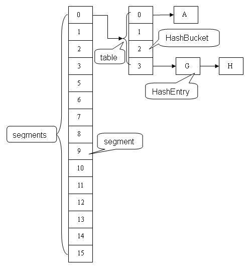
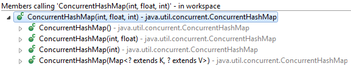
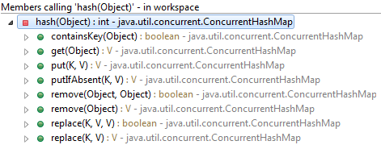
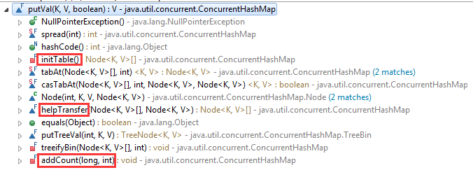
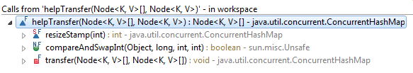

#   ConcurrentHashMap

### 目录

-   JDK7
    -   [为什么使用ConcurrentHashMap](#why-to-use)
    -   [ConcurrentHashMap的原理](#principle-of-concurrenthashmap)
    -   [ConcurrentHashMap的结构](#data-structure)
    -   [ConcurrentHashMap的初始化](#init-jdk7)
    -   [put方法](#put-jdk7)
        -   [初始化Segment](#init-segement-jdk7)
        -   [获取链表：entryForHash](#get-entry-jdk7)
        -   [获取读写锁：scanAndLockForPut](#get-reentrantlock-jdk7)
        -   [扩容：rehash](#rehash-jdk7)
        -   [get方法](#get-jdk7)
        -   [定位Segment](#position-segment)
        -   [JDK7 ConcurrentHashMap总结](#jdk7-summary)

-   JDK8
    -   [put方法详解](#put-jdk8)
        -   [三个核心方法](#core-method)
        -   [put方法大概](#put-overview)
        -   [初始化table](#init-table-jdk8)
        -   [helpTransfer](#transfer-jdk8)
        -   [addCount](#addCount-jdk8)
    -   [为什么ConcurrentHashMap在JDK8中将其数据结构转换成红黑树](#why-change-data-structure)
    -   [JDK8 ConcurrentHashMap总结](#jdk8-summary)

##  <a id="why-to-use">为什么使用ConcurrentHashMap？</a>

-   线程不安全的HashMap。在多线程下，对HashMap进行put操作会出现死循环。
-   HashTable的效率不高。一个线程在进行读写的时候，其他线程只能等待，其性能可想而知。

##  <a id="principle-of-concurrenthashmap">ConcurrentHashMap的原理</a>

在ConcurrentHashMap中，有多个ReentrantLock，每一把锁都储存着一部分的数据。当多线程访问容器里不同数据段的时候，线程间就不会存在锁竞争。

##  <a id="data-structure">ConcurrentHashMap的结构</a>

**ConcurrentHashMap** 是由 **Segment** 数组结构和 **HashEntry** 数组结构组成。

-   Segment是ReentrantLock，在ConcurrentHashMap中扮演锁的角色。
-   HashEntry则用于 **储存** 键值对数据。



## <a id="init-jdk7">ConcurrentHashMap的初始化</a>



我们就从ConcurrentHashMap的空构造方法开始深入了解其初始化过程。

```java
static final int DEFAULT_INITIAL_CAPACITY = 16;

static final float DEFAULT_LOAD_FACTOR = 0.75f;

static final int DEFAULT_CONCURRENCY_LEVEL = 16;

public ConcurrentHashMap() {
    this(DEFAULT_INITIAL_CAPACITY, DEFAULT_LOAD_FACTOR, DEFAULT_CONCURRENCY_LEVEL);
}
```

接着来看一下，**ConcurrentHashMap(int, float, int)** 初始化了哪些变量。

```java
public ConcurrentHashMap(int initialCapacity,float loadFactor,int concurrencyLevel) {
    if (!(loadFactor > 0) || initialCapacity < 0 || concurrencyLevel <= 0)
        throw new IllegalArgumentException();
    //  并发最大的等级为 2^16 = 65536
    if (concurrencyLevel > MAX_SEGMENTS)
        concurrencyLevel = MAX_SEGMENTS;
    //  Find power-of-two sizes best matching arguments

    int sshift = 0;
    //  ssize是Segment数组的长度，为2^n
    int ssize = 1;
    while (ssize < concurrencyLevel) {
        ++sshift;
        ssize <<= 1;
    }

    //  默认的concurrencyLevel为16
    //  sshift为4
    //  ssize为16
    //  segmentShift为28
    //  segmentMask为15
    this.segmentShift = 32 - sshift;
    this.segmentMask = ssize - 1;

    //  初始容量initialCapacity是用从来设置整个map的大小，最大为2^30
    if (initialCapacity > MAXIMUM_CAPACITY)
        initialCapacity = MAXIMUM_CAPACITY;

    //  c为ssize的倍数，且c*ssize >= initialCapacity。
    int c = initialCapacity / ssize;
    if (c * ssize < initialCapacity)
        ++c;

    //  cap为每个Segment可分配的链表个数，最少每个segment可以放2个链表，且链表的个数为2^n(n >= 1)。
    int cap = MIN_SEGMENT_TABLE_CAPACITY; // MIN_SEGMENT_TABLE_CAPACITY == 2;
    while (cap < c)
        cap <<= 1;

    // create segments and segments[0]
    Segment<K,V> s0 = new Segment<K,V>( loadFactor, 
                                        (int)(cap * loadFactor),
                                        (HashEntry<K,V>[])new HashEntry[cap]);
    Segment<K,V>[] ss = (Segment<K,V>[])new Segment[ssize];

    // 往数组写入 segment[0]
    UNSAFE.putOrderedObject(ss, SBASE, s0); // ordered write of segments[0]
    this.segments = ss;
}
```

-   初始化五个变量：
    -   段偏移量segementShift
    -   段掩码segementMask
    -   segment数组(不可扩容)
    -   segment[0]
    -   table，每个 Segment 里面最起码有2个

segment数组的长度是由 `ssize` 来决定的其长度的。 `ssize` 是由concurrencyLevel(并发等级) 来决定。 这里的concurrencyLevel为16,所以 `sshift` 为4， `ssize` 为16，即这里的segment数组的长度为16，  `segmentShift` 为28， `segmentMask` 为15。

## <a id="put-jdk7">put</a>

```java
public V put(K key, V value) {
    Segment<K,V> s;

    //  value不能为null
    if (value == null)
        throw new NullPointerException();
    
    //  计算key的哈希码
    int hash = hash(key);

    int j = (hash >>> segmentShift) & segmentMask;

    // 下面直接通过获取主内存中的变量，来判断当前要插入的槽点是否已经初始化过了
    if ((s = (Segment<K,V>)UNSAFE.getObject(segments, (j << SSHIFT) + SBASE)) == null) //  in ensureSegment
        // 初始化segment[j]，这里是会出现共享资源竞争现象，后面会介绍 ensureSement 如何规避这种情况
        s = ensureSegment(j);
    
    //  往初始化的segment里面添加节点
    return s.put(key, hash, value, false);
}
```

第一层，根据hash值很快就能找到相应的segment，之后就是segment内部的put操作。

```java
final V put(K key, int hash, V value, boolean onlyIfAbsent) {
    // 先获取该segment的独占锁，稍后会详解
    HashEntry<K,V> node = tryLock() ? null : scanAndLockForPut(key, hash, value);
    V oldValue;
    try {
        //  这个table就是前面构造函数中初始化的 (HashEntry<K,V>[])new HashEntry[cap]
        HashEntry<K,V>[] tab = table;
        //  再利用hash，求该key所应该存放的数组下标位置
        int index = (tab.length - 1) & hash;
        //  获取index值下所对应的链表的表头
        HashEntry<K,V> first = entryAt(tab, index);
        //  下面进行是对链表存在和链表不存在的情况下，进行put操作
        for (HashEntry<K,V> e = first;;) {
            //  当链表存在时
            if (e != null) {
                K k;
                //  如果key已经存在，将已存在的值返回。同时将新的value覆盖掉旧的value。
                if ((k = e.key) == key ||
                    (e.hash == hash && key.equals(k))) {
                    oldValue = e.value;
                    if (!onlyIfAbsent) {
                        e.value = value;
                        ++modCount;
                    }
                    break;
                }

                //  遍历链表下一个
                e = e.next;
            }
            else {
                //  node 到底是不是 null，这个要看获取锁的过程，不过和这里都没有关系。
                //  如果不为 null，那就直接将它设置为链表表头；如果是null，初始化并设置为链表表头。
                if (node != null)
                    node.setNext(first);
                else
                    node = new HashEntry<K,V>(hash, key, value, first);
                
                //  这里的count是针对于当前Segment，也就是说count记录了当前Segment数组里面节点的总数。
                //  这里将count+1赋值给临时变量c，是为了避免后面的扩容或者是添加节点到表头出问题而导致的数据不一致现象。
                int c = count + 1;
                if (c > threshold && tab.length < MAXIMUM_CAPACITY)
                    //  如果c大于当前segment的阈值时，就扩容
                    rehash(node);
                else
                    //  否则将当前节点设置为表头
                    setEntryAt(tab, index, node);
                ++modCount;
                count = c;
                oldValue = null;
                break;
            }
        }
    } finally {
        //  解锁
        unlock();
    }
    return oldValue;
}
```

> 由于有独占锁的保护，所以segment内部的操作并不复杂。至于这里面的并发问题，我们后面在介绍。

到这里put操作就结束了，接下来，我们来详细看看其中一些关键的操作。

### <a id="init-segement-jdk7">初始化槽：ensureSegment</a>

这里可以考虑并发，因为可能会有多个线程对segment[k]进行初始化。

```java
private Segment<K,V> ensureSegment(int k) {
    final Segment<K,V>[] ss = this.segments;
    long u = (k << SSHIFT) + SBASE; // raw offset
    Segment<K,V> seg;

    //  先检查一下，当前Segment是否已经被初始化了
    if ((seg = (Segment<K,V>)UNSAFE.getObjectVolatile(ss, u)) == null) {

        //  以segment[0]作为其他segment的原型，这就是初始化的过程中要初始化segment[0]的原因
        Segment<K,V> proto = ss[0]; // use segment 0 as prototype
        int cap = proto.table.length;
        float lf = proto.loadFactor;
        int threshold = (int)(cap * lf);

        //  初始化segment[k]中的数组
        HashEntry<K,V>[] tab = (HashEntry<K,V>[])new HashEntry[cap];

        //  重复检查当前Segment是否已经被初始化了
        if ((seg = (Segment<K,V>)UNSAFE.getObjectVolatile(ss, u)) == null) { // recheck

            //  初始化当前Segment
            Segment<K,V> s = new Segment<K,V>(lf, threshold, tab);

            //  使用while循环检查当前Segment是否已经被初始化了
            while ((seg = (Segment<K,V>)UNSAFE.getObjectVolatile(ss, u)) == null) {
                //  只有当CAS成功交换，退出循环检查
                //  这个seg = s很灵性
                if (UNSAFE.compareAndSwapObject(ss, u, null, seg = s))
                    break;
            }
        }
    }
    return seg;
}
```

在并发环境，通过[CAS](./c-3.md)下来控制。

### <a id="get-entry-jdk7">获取链表：entryForHash</a>

在了解如何获取读写锁之前，我们先来看一下，ConcurrentHashMap是如何通过给定的segment和key的哈希码来获取链表的。

```java
static final <K,V> HashEntry<K,V> entryForHash(Segment<K,V> seg, int h) {
    HashEntry<K,V>[] tab;
    // 如果给定的segment未初始化或者是其指向的链表数组为初始化，那么返回null
    // 否则就根据key的哈希码来计算数组下标，获取对应的链表
    return (seg == null || (tab = seg.table) == null) ? null :
        (HashEntry<K,V>) UNSAFE.getObjectVolatile
        (tab, ((long)(((tab.length - 1) & h)) << TSHIFT) + TBASE);
}
```
### <a id="get-reentrantlock-jdk7">获取读写锁: scanAndLockForPut</a>

```java
HashEntry<K,V> node = tryLock() ? null : scanAndLockForPut(key, hash, value);
```

前面在调用segment.put方法的时候，会先去获取当前的segment的可重入锁。如果获取失败，那么进入到 `scanAndLockForput` 中，来获取读写锁。

```java
private HashEntry<K,V> scanAndLockForPut(K key, int hash, V value) {

    // 获取在当前segment中该hash对应的链表
    HashEntry<K,V> first = entryForHash(this, hash);
    HashEntry<K,V> e = first;
    HashEntry<K,V> node = null;
    int retries = -1; // negative while locating node

    // 循环试图获取当前segment的对象锁
    while (!tryLock()) { // 获取同步锁失败
        HashEntry<K,V> f; // to recheck first below
        if (retries < 0) {
            if (e == null) {
                if (node == null) // speculatively create node
                    // 如果代码执行到这里，说明当前数组的链表是空的，接着顺便初始化一下链表
                    // 同时也说明，当前这个segment存在竞争
                    node = new HashEntry<K,V>(hash, key, value, null);
                retries = 0;
            }
            else if (key.equals(e.key))
                retries = 0;
            else
                // 顺着链表往下走
                e = e.next;
        }
        //  MAX_SCAN_RETRIES 是根据当前的JVM的处理器个数来决定的，如果大于1，MAX_SCAN_RETRIES为 64， 否则为 1。
        else if (++retries > MAX_SCAN_RETRIES) {
            // 当retries大于最大重试次数，进入阻塞队列，等待锁
            // lock()是阻塞方法，直到获取锁之后返回
            lock();
            break;
        }
        else if ((retries & 1) == 0 &&
                    // 如果重试次数的最低位为1(其实就是重试次数为奇数)且当前这个链表已经发生变化时
                    // 将当前链表赋值给e和first，重设retries，重新进行scanAndLockForPut
                    (f = entryForHash(this, hash)) != first) {
            e = first = f; // re-traverse if entry changed
            retries = -1;
        }
    }
    return node;
}
```

这个方法有两个出口：

-   tryLock()成功，终止循环。
-   重试次数超过了MAX_SCAN_RETRIES，进入lock方法，此方法会阻塞等待，直到成功拿到独占锁。

### <a id="rehash-jdk7">扩容：rehash</a>

>   **重复一下**： segment数组不能扩容，扩容是 segment 数组某个位置内部的数组 HashEntry[] 进行扩容，扩容后，容量为原来的 2 倍。

在进行put操作的时候，如果当前segment的节点数加上当前要添加的节点的数量大于其阈值，那么进行扩容。

>   这里不需要考虑并发，因为执行到这里时，已经获取该segment的独占锁。

接下来看一下，rehash的细节。

```java
private void rehash(HashEntry<K,V> node) {

    // 将当前segment下的数组赋值给oldTable
    HashEntry<K,V>[] oldTable = table;
    int oldCapacity = oldTable.length;

    // 新的数组长度为旧的数组长度的2倍
    int newCapacity = oldCapacity << 1;

    // 重新计算阈值
    threshold = (int)(newCapacity * loadFactor);

    // 初始化新的数组
    HashEntry<K,V>[] newTable = (HashEntry<K,V>[]) new HashEntry[newCapacity];
    int sizeMask = newCapacity - 1;

    // 下面这个for循环看起来很复杂，其实就是做了一件事情：将旧table里面的所有节点迁移到新的table中
    for (int i = 0; i < oldCapacity ; i++) {
        //  e是oldTable[i]对应的链表的表头
        //  接下来就是遍历该链表里面的所有的节点
        HashEntry<K,V> e = oldTable[i];
        if (e != null) {
            // next为下一个节点
            HashEntry<K,V> next = e.next;
            // 计算新的数组下标
            int idx = e.hash & sizeMask;
            // 表明旧链表里面只有一个节点
            if (next == null)  
                newTable[idx] = e;
            else { 
                // 将链表表头赋值给lastRun
                HashEntry<K,V> lastRun = e;
                // 将头节点e的新下标赋值给lastIdx
                int lastIdx = idx;
                
                // 下面这个循环会找到一个lastRun节点，这个节点之后的所有元素是将要放在一起的
                for (HashEntry<K,V> last = next;
                        last != null;
                        last = last.next) {
                    int k = last.hash & sizeMask;
                    if (k != lastIdx) {
                        lastIdx = k;
                        lastRun = last;
                    }
                }

                // 将lastRun及其之后的所有节点组成的节点放入到lastIdx这个位置
                newTable[lastIdx] = lastRun;
                // 下面的操作是处理 lastRun之间的节点，
                // 这些即可能是分配到另一个链表中，也可能分配到上面那个链表中
                for (HashEntry<K,V> p = e; p != lastRun; p = p.next) {
                    V v = p.value;
                    int h = p.hash;
                    int k = h & sizeMask;
                    HashEntry<K,V> n = newTable[k];
                    newTable[k] = new HashEntry<K,V>(h, p.key, v, n);
                }
            }
        }
    }
    // 将新来的node放到刚刚的两个链表的其中一个中
    int nodeIndex = node.hash & sizeMask; // add the new node
    node.setNext(newTable[nodeIndex]);
    newTable[nodeIndex] = node;
    table = newTable;
}
```

### <a id="get-jdk7">get过程分析</a>

-   计算 hash 值，找到 segment 数组中的具体位置，或我们前面用的“槽”
-   槽中也是一个数组，根据 hash 找到数组中具体的位置
-   到这里是链表了，顺着链表进行查找即可

```java
public V get(Object key) {
    Segment<K,V> s; // manually integrate access methods to reduce overhead
    HashEntry<K,V>[] tab;

    // 计算key的哈希码
    int h = hash(key);
    long u = (((h >>> segmentShift) & segmentMask) << SSHIFT) + SBASE;
    // 根据哈希码获取相应的segment
    if ((s = (Segment<K,V>)UNSAFE.getObjectVolatile(segments, u)) != null &&
        (tab = s.table) != null) {
        
        // 获取链表并遍历
        for (HashEntry<K,V> e = (HashEntry<K,V>) UNSAFE.getObjectVolatile
                    (tab, ((long)(((tab.length - 1) & h)) << TSHIFT) + TBASE);
                e != null; e = e.next) {
            
            K k;
            if ((k = e.key) == key || (e.hash == h && key.equals(k)))
                return e.value;
        }
    }
    return null;
}
```

## <a id="position-segment">定位Segement</a>

如何获取Segment？ConcurrentHashMap在对Segment操作之前都需要对元素进行再散列。



```java
private int hash(Object k) {
    int h = hashSeed;

    if ((0 != h) && (k instanceof String)) {
        return sun.misc.Hashing.stringHash32((String) k);
    }

    h ^= k.hashCode();

    // Spread bits to regularize both segment and index locations,
    // using variant of single-word Wang/Jenkins hash.
    h += (h <<  15) ^ 0xffffcd7d;
    h ^= (h >>> 10);
    h += (h <<   3);
    h ^= (h >>>  6);
    h += (h <<   2) + (h << 14);
    return h ^ (h >>> 16);
}
```

### 再散列的目的就是减少散列冲突

下面看个例子

```java
System.out.println(Integer.parseInt("0001111", 2) & 15);
System.out.println(Integer.parseInt("0011111", 2) & 15);
System.out.println(Integer.parseInt("0111111", 2) & 15);
System.out.println(Integer.parseInt("1111111", 2) & 15);
```

结果:

```txt
15
15
15
15
```

可见，只要低位一样，无论高位值是什么，其散列的结果总是一样的。

```java
public static int hash(int h) {
    h += (h <<  15) ^ 0xffffcd7d;
    h ^= (h >>> 10);
    h += (h <<   3);
    h ^= (h >>>  6);
    h += (h <<   2) + (h << 14);
    return h ^ (h >>> 16);
}

System.out.println(hash(Integer.parseInt("0001111", 2)));
System.out.println(hash(Integer.parseInt("0011111", 2)));
System.out.println(hash(Integer.parseInt("0111111", 2)));
System.out.println(hash(Integer.parseInt("1111111", 2)));
```

结果:

```txt
1197988430
-146603592
2003387966
-2097100774
```

经过再散列之后，数据就不会有冲突了。

### 定位Segment算法

```java
private Segment<K,V> segmentForHash(int h) {
    long u = (((h >>> segmentShift) & segmentMask) << SSHIFT) + SBASE;
    return (Segment<K,V>) UNSAFE.getObjectVolatile(segments, u);
}
```

### <a id="jdk7-summary">JDK7 ConcurrentHashMap总结</a>

1.  Segment 数组是不可扩展的，Segment 指向的链表数组是能够扩展的。
1.  ConcurrentHashMap 是数组（ReentrantLock数组）+ 链表的结构。
1.  初始化ConcurrentHashMap的时候，会初始化segment[0]。
    
    其segment[0]的作用就是为在ensureSegment方法中提供初始化数组长度和阈值的原型。

1.  初始化 Segment 是通过 CAS 方式来初始化的，此阶段存在资源竞争。

1.  put方法是线程安全的

    因为在进行 put 之前，会先去获取segment的对象锁，同时 rehash() 操作可能也会在 put() 方法中被调用，这样就能够避免 HashMap 在多线程环境下扩容导致节点之间出现回环链的情况。

## JDK8

> 以空的构造函数来初始化ConcurrentHashMap

JDK8中的ConcurrentHashMap与JDK7中的比较还是有很多的变化。在JDK8中，ConcurrentHashMap摒弃了Segment(分段锁)，转而启用了一种新的方式来实现(数组 + 链表 + 红黑树)。但是底层还是用 **CAS** 来控制在并发中的正确性。


### <a id="put-jdk8">put方法详解</a>
在了解put过程之前，我们先来看一下ConcurrentHashMap中的三个核心方法。

#### <a id="core-method">三个核心方法</a>

ConcurrentHashMap定义了三个原子操作，用于对指定位置的节点进行操作。正是这些原子操作保证了ConcurrentHashMap的线程安全。

```java
// 获取i位置上的Node节点
static final <K,V> Node<K,V> tabAt(Node<K,V>[] tab, int i) {
    return (Node<K,V>)U.getObjectVolatile(tab, ((long)i << ASHIFT) + ABASE);
}

// 通过CAS来更新i位置上的节点
// 1. 通过i，在查找tab中对应的内存值
// 2. 判断内存值是否与旧的期望值c相等，如果相等，将内存值赋值为修改的新值v并返回true。
// 3. 否则，返回false。
static final <K,V> boolean casTabAt(Node<K,V>[] tab, int i,
                                    Node<K,V> c, Node<K,V> v) {
    return U.compareAndSwapObject(tab, ((long)i << ASHIFT) + ABASE, c, v);
}

// 利用volatile方法设置节点位置的值
static final <K,V> void setTabAt(Node<K,V>[] tab, int i, Node<K,V> v) {
    U.putObjectVolatile(tab, ((long)i << ASHIFT) + ABASE, v);
}
```

### <a id="put-overview">put方法大概</a>

#### 第一层put

```java
public V put(K key, V value) {
    return putVal(key, value, false);
}
```

#### 第二层put

```java
final V putVal(K key, V value, boolean onlyIfAbsent) {
    // key和value都不能为null，否则抛出空指针异常
    if (key == null || value == null) throw new NullPointerException();
    // 获取hash
    int hash = spread(key.hashCode());
    // binCount != 0，说明对链表或者红黑树进行了操作
    int binCount = 0;
    // 下面这个for循环是包含了2种不同情况下的put操作
    for (Node<K,V>[] tab = table;;) {
        Node<K,V> f; int n, i, fh;
        // 第一次进行put操作的时候需要先初始化table，接着马上进入第二次循环
        if (tab == null || (n = tab.length) == 0)
            // 后面会介绍
            tab = initTable();
        
        // 第一种情况：put的位置未初始化(链表未初始化)
        else if ((f = tabAt(tab, i = (n - 1) & hash)) == null) {
            // 前面已经介绍过这个方法，通过这个方法可以刷新主内存中的值，如果CAS成功退出循环，否则重新循环判断。
            if (casTabAt(tab, i, null, new Node<K,V>(hash, key, value, null)))
                break;                   
        }

        // MOVED == -1
        // 先不去看这个分支是干什么的，key哈希码居然是可以为-1
        // 根据分支里面所执行的方法名称也可以知晓是在扩容做数据迁移
        else if ((fh = f.hash) == MOVED)
            // 后面会介绍
            tab = helpTransfer(tab, f);
        
        // 第二种情况：对应的链表已经初始化
        else {
            V oldVal = null;

            // 看到synchronized说明这个时候可能会出现资源竞争
            synchronized (f) {

                // 拿到要插入的节点锁之后，先判断改节点是否已经被其他线程修改过了
                // 如果已经被修改过了，那么重新循环判断
                if (tabAt(tab, i) == f) {

                    // 联系下面else分支的操作，可以推断出fh>=0，说明当前是链表状态
                    if (fh >= 0) {
                        binCount = 1;

                        // 遍历链表，可能发生两种情况：
                        // 1. key已经存在于链表。新值覆盖旧值，并返回旧值
                        // 2. 将节点放在链表末端。
                        for (Node<K,V> e = f;; ++binCount) {
                            K ek;

                            // 当要存放的节点中的key已经存在链表中时，旧值被新值覆盖，跳出循环，并将旧值返回。
                            if (e.hash == hash &&
                                ((ek = e.key) == key ||
                                    (ek != null && key.equals(ek)))) {
                                oldVal = e.val;

                                // onlyIfAbsent == false
                                if (!onlyIfAbsent)
                                    e.val = value;
                                break;
                            }
                            Node<K,V> pred = e;
                            // 将节点放入当前链表的末端
                            if ((e = e.next) == null) {
                                pred.next = new Node<K,V>(hash, key, value, null);
                                break;
                            }
                        }
                    }
                    // fh<0
                    else if (f instanceof TreeBin) {
                        Node<K,V> p;
                        binCount = 2;

                        // 调用红黑树的插入节点方法，putTreeVal返回null，说明插入成功，否则说明key已经存在于红黑树中
                        if ((p = ((TreeBin<K,V>)f).putTreeVal(hash, key, value)) != null) {
                            oldVal = p.val;
                            if (!onlyIfAbsent)
                                p.val = value;
                        }
                    }
                }
            }

            // binCount != 0说明对链表或者红黑树操作过，即已经获取了put的结果
            if (binCount != 0) {
                // 链表节点个数在达到8个的时候，要从链表到红黑树的转变。
                if (binCount >= TREEIFY_THRESHOLD)
                    treeifyBin(tab, i);

                // oldVal != null 说明，key已经存在于链表或者红黑树中了，返回旧值
                if (oldVal != null)
                    return oldVal;
                break;
            }
        }
    }

    // 后面介绍
    addCount(1L, binCount);
    return null;
}
```

到这里一个完整的put过程就已经介绍结束了。但是里面有一些方法还是需要拿出来仔细的研究。



下面就仔细研究一下 **initTable** 、 **helpTransfer** 和 **addCount** 这三个方法。


### <a id="init-table-jdk8">初始化table</a>

> 从上面的操作中我们也可以知道，ConcurrentHashMap是在put的过程中开始初始化Map容器的。

在了解初始化table的细节之前，先来看看ConcurrentHashMap **出镜率** 很高的一个内部成员属性 - **`sizeCtl`**。

```java
/**
  * Table initialization and resizing control.  When negative, the
  * table is being initialized or resized: -1 for initialization,
  * else -(1 + the number of active resizing threads).  Otherwise,
  * when table is null, holds the initial table size to use upon
  * creation, or 0 for default. After initialization, holds the
  * next element count value upon which to resize the table.
  */
private transient volatile int sizeCtl;
```

大概的意思就是讲hash表初始化或扩容时的一个控制位标识量。**负数** 代表正在进行初始化或扩容操作；**-1** 代表正在初始化；**-N** 表示有 **N-1** 个线程正在进行扩容操作；**正数** 或 **0** 代表hash表还没有被初始化。

接下来看看 **initTable** 这个初始化table方法。

```java
private final Node<K,V>[] initTable() {
    Node<K,V>[] tab; int sc;

    // 这里的while循环是避免initTable在并发下，重复初始化table
    while ((tab = table) == null || tab.length == 0) {

        // sizeCtl<0 说明其他线程正在初始化table，接着就让出线程
        if ((sc = sizeCtl) < 0)
            Thread.yield(); 

        // 通过CAS来将sizeCtl设置为-1，若CAS成功，进行初始化工作；否则，继续重新循环判断table是否初始化。
        else if (U.compareAndSwapInt(this, SIZECTL, sc, -1)) {
            try {

                // 在while循环判断的时候已经判断过一遍了，为什么这里还需要再判断一遍？
                // 那是因为，在并发情况下可能会出现sc获取的是已经初始化之后的值，这个时候也是能够进到这个分支，所以需要重复判断
                if ((tab = table) == null || tab.length == 0) {
                    // 默认容量为16
                    int n = (sc > 0) ? sc : DEFAULT_CAPACITY;
                    @SuppressWarnings("unchecked")
                    // 创建节点数组
                    Node<K,V>[] nt = (Node<K,V>[])new Node<?,?>[n];
                    // 初始化table
                    table = tab = nt;
                    // 更新sc，这里是12
                    sc = n - (n >>> 2);
                }
            } finally {
                // 更新sizeCtl
                sizeCtl = sc;
            }
            break;
        }
    }
    return tab;
}
```

### <a id="transfer-jdk8">helpTransfer</a>

这是协助扩容的方法,不是真正扩容的方法。

看看其内部调用哪些方法：



先来看一下helpTransfer做了哪些工作。

```java
final Node<K,V>[] helpTransfer(Node<K,V>[] tab, Node<K,V> f) {
    Node<K,V>[] nextTab; int sc;

    if (tab != null && (f instanceof ForwardingNode) &&
        (nextTab = ((ForwardingNode<K,V>)f).nextTable) != null) {
        int rs = resizeStamp(tab.length);
        while (nextTab == nextTable && table == tab &&
                (sc = sizeCtl) < 0) {
            if ((sc >>> RESIZE_STAMP_SHIFT) != rs || sc == rs + 1 ||
                sc == rs + MAX_RESIZERS || transferIndex <= 0)
                break;
            if (U.compareAndSwapInt(this, SIZECTL, sc, sc + 1)) {
                transfer(tab, nextTab);
                break;
            }
        }
        return nextTab;
    }
    return table;
}
```

# <a id="why-change-data-structure">为什么ConcurrentHashMap在JDK8中将其数据结构转换成红黑树</a>

其实最根本的原因就是 **性能**。在JDK8之前，ConcurrentHashMap的数据结构是 **数组+链表**，这对于添加节点或者扩容数组的时候其时间复杂程度为O(n)。而在JDK8，ConcurrentHashMap的数据结构是 **数组+链表+红黑树**。当链表中的元素达到了 8 个时，会将链表转换为红黑树，在这些位置进行查找的时候可以降低时间复杂度为 O(logN)。

# <a id="jdk8-summary">JDK8 ConcurrentHashMap总结</a>

1. 在调用put方法时，key和value都不能为null。

1. 在调用put方法时，开始初始化数组。

1. 先插入后扩容。

1. put方法之所以是线程安全，是因为下面两个原因：
    1. 在链表还未初始化的情况下，通过 **CAS** 来保证了链表不会被重复初始化。
    2. 在链表已经初始化的情况下，通过 **sychronized** 来获取链表的排斥锁，来保证了put方法的原子性操作。

##   参考
-   [占小狼](https://www.jianshu.com/p/c0642afe03e0)
-   《Java并发容器和框架》
-   [javadoop](https://javadoop.com/post/hashmap)
-   [CSND - 惟愿无事](https://blog.csdn.net/u010723709/article/details/48007881)

##  [BACK](../../mds/summary.md)