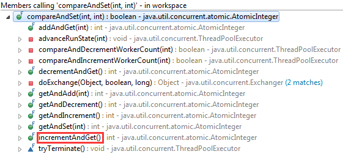
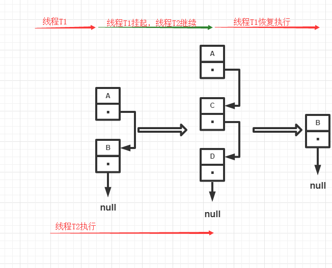

#   CAS

CAS (Compare And Swap)，即比较并交换。简单的来说，CAS有3个操作数，内存值V，旧的预期值A，要修改的新值B。当且仅当预期值A等于内存值V，那么将 内存值V 修改为新值B。

原理很简单，找个源码看看。

网上很多都是用AtomicInteger来做例子，就让我们来看一下其源码是如何实现CAS。

#   AtomicInteger JDK7源码解析

### 构造函数

AtomicInteger 提供了2个构造方法：一个可以自定义初始值，一个是空构造函数。

```java
public AtomicInteger(int initialValue) {
    value = initialValue;
}

public AtomicInteger(){
}
```

接下来看一下构造函数里面涉及到的 `value` 。

```java
private volatile int value;
```

可以看到AtomicInteger在类加载的时候声明了一个volatile变量。volatile保证了变量的内存可见性。这里的 **value** 就是上面提到CAS操作数中旧的预期值A。

类加载过程中还会初始化一个重要的值 `valueOffset` value的偏移量，根据偏移量可以获取value在内存中的位置，从而获取内存中的值。

```java
private static final Unsafe unsafe = Unsafe.getUnsafe();
private static final long valueOffset;

static {
    try {

    // 反射出value属性，获取其在内存中的位置
    valueOffset = unsafe.objectFieldOffset
        (AtomicInteger.class.getDeclaredField("value"));
    } catch (Exception ex) { throw new Error(ex); }
}
```

上面的Unsafe是引自sun.misc.Unsafe包。对于Unsafe我们可以简单的理解为能够直接对主内存进行读写。我们平常对变量的操作都是在java的工作内存中进行的，没有和主内存有直接的接触。从 **主内存** 中获取值就是CAS中的内存值V。

### AtomicInteger中CAS实现

```java
public final boolean compareAndSet(int expect, int update) {
    return unsafe.compareAndSwapInt(this, valueOffset, expect, update);
}
```

如果CAS成功，将update值赋值到主内存中的变量并返回true；否则，返回false;

看看 `compareAndSet` 这个方法在哪里可以用的到?



具体看看其中的一个实现 -- 自增 `incrementAndGet()`;

```java
public final int incrementAndGet() {
    for (;;) {
        // 获取期望值
        int current = get();
        // 获取要赋值的更新值，因为这个是递增的方法，所以+1
        int next = current + 1;
        if (compareAndSet(current, next))
            return next;
    }
}
```

方法里面是一个无限循环，唯一的出口就是 `compareAndSet` 成功，即CAS成功，返回新值。

## CAS的缺点

> 在多线程 计算中，ABA问题发生在同步期间，当一个位置被读取两次，两个读取具有相同的值，并且“值相同”用于指示“没有任何改变”。但是，另一个线程可以在两个读取之间执行并更改值，执行其他工作，然后更改该值，从而欺骗第一个线程思考“没有任何改变”，即使第二个线程的工作违反了该假设。

CAS看起来很爽，但是会导致 **ABA** 问题。

比如现在有两个线程，线程A和线程B都获取了变量a=1。此时线程A挂起，线程B继续执行，CAS成功之后，a的值还是为1。接着线程A开始执行，因为a的值没有发生变化，所线程A的CAS能够执行成功，不需要重新从主内存中重新获取a值。

可以看出线程B确实对a进行了操作，但变量a在主内存中的值确实没有发生变化，所以线程A继续执行CAS会成功。尽管CAS成功了，但可能存在一些隐藏的问题。

## CAS的隐藏问题

现有一个用单向链表实现的堆栈，栈顶为A，这时线程T1已经知道A.next为B，然后希望用CAS将栈顶替换为B。

>head.compareAndSet(A,B);

在T1执行上面这条指令之前，线程T2介入，将A、B出栈，再pushD、C、A。此时对象B此时处于游离状态。

轮到线程T1执行CAS操作，检测发现栈顶仍为A，所以CAS成功，栈顶变为B。但实际上B.next为null，此时堆栈中只有B一个元素，C和D组成的链表不再存在于堆栈中，C、D被丢掉了。



### 如何解决ABA问题

为了解决ABA的问题，通常会使用版本戳来记录来避免并发操作带来的ABA问题。

JDK中也提供了 **AtomicStampedReference** 来解决这个问题。

#### AtomicStampedReference 源码解析

#### 初始化

```java
/**
 * @initialRef, 初始化引用，可以当做是CAS中的主内存中对象的引用
 * @initialStamp，初始化版本戳
 */
public AtomicStampedReference(V initialRef, int initialStamp) {
    pair = Pair.of(initialRef, initialStamp);
}

// pair是volatile，所以pair保证了内存的可见性
private volatile Pair<V> pair;
```

AtomicStampedReference 提供了一个内部类 **Pair**。通过这个Pair可以辨别出变量的版本。

#### compareAndSet

```java
public boolean compareAndSet(V   expectedReference,
                            V   newReference,
                            int expectedStamp,
                            int newStamp) {
    Pair<V> current = pair;
    // 只有当stamp+reference都没有改变的时候才能成功执行CAS
    return
        expectedReference == current.reference &&
        expectedStamp == current.stamp &&
        ((newReference == current.reference &&
            newStamp == current.stamp) ||
            casPair(current, Pair.of(newReference, newStamp)));
}

// 只有主内存中的对象等于cmp，才将主内存中的对象刷新为val
private boolean casPair(Pair<V> cmp, Pair<V> val) {
    return UNSAFE.compareAndSwapObject(this, pairOffset, cmp, val);
}
```

AtomicStampReference还是比较简单的，下面用一个例子来具体看看。

```java
public class ResloveABA {

	private static AtomicInteger atomicInt = new AtomicInteger(100);
	private static AtomicStampedReference<Integer> atomicStampedReference = new AtomicStampedReference<Integer>(100, 0);
	
	private static void runABA() throws InterruptedException {
		Thread t1 = new Thread(new Runnable() {
			@Override
			public void run() {
				System.out.println("------------- start : " + Thread.currentThread().getName());
				atomicInt.compareAndSet(100, 101);
				atomicInt.compareAndSet(101, 100);
				System.out.println("------------- end : " + Thread.currentThread().getName());
			}
		});
		
		Thread t2 = new Thread(new Runnable() {

			@Override
			public void run() {
				try {
					TimeUnit.SECONDS.sleep(1);
				} catch (InterruptedException e) {
					e.printStackTrace();
				}
				
				System.out.println("------------- start : " + Thread.currentThread().getName());
				boolean CASStatus = atomicInt.compareAndSet(100, 102);
				System.out.println("------------- end : " + Thread.currentThread().getName());
				System.out.println("CAS success : " + CASStatus);
			}
			
		});
		
		t1.start();
		t2.start();
		t1.join();
		t2.join();
	}
	
	public static void resolveABA() throws InterruptedException {
		Thread t1 = new Thread(new Runnable() {

			@Override
			public void run() {
				try {
					TimeUnit.SECONDS.sleep(1);
				} catch (InterruptedException e) {
					e.printStackTrace();
				}
				
				int expectedStamp = atomicStampedReference.getStamp();
				int newStamp = expectedStamp + 1;
				atomicStampedReference.compareAndSet(100, 101, expectedStamp, newStamp);
				
				expectedStamp = atomicStampedReference.getStamp();
				newStamp = expectedStamp + 1;
				atomicStampedReference.compareAndSet(101, 100, expectedStamp, newStamp);
			}
			
		});
		
		Thread t2 = new Thread(new Runnable() {

			@Override
			public void run() {
				int stamp = atomicStampedReference.getStamp();
                System.out.println("before sleep : stamp = " + stamp); 
                try {
                    TimeUnit.SECONDS.sleep(2);
                } catch (InterruptedException e) {
                    e.printStackTrace();
                }
                System.out.println("after sleep : stamp = " + atomicStampedReference.getStamp());
                boolean CASStatus = atomicStampedReference.compareAndSet(100, 101, stamp, stamp + 1);
                System.out.println("CAS success : " + CASStatus); 
			}
			
		});
		
		t1.start();
		t2.start();
		t1.join();
		t2.join();
	}
	
	public static void main(String[] args) throws InterruptedException {
		runABA();
		resolveABA();
	}
}
```

#### 结果

> ------------- start : Thread-0    
> ------------- end : Thread-0  
> ------------- start : Thread-1    
> ------------ end : Thread-1   
> CAS success : true    
> before sleep : stamp = 0  
> after sleep : stamp = 2   
> CAS success : false   

#   参考
-   [占小狼](https://www.jianshu.com/p/fb6e91b013cc)
-   [DZone](https://dzone.com/articles/how-cas-compare-and-swap-java)
-   [CSDN](https://blog.csdn.net/z742182637/article/details/50417550)
-   [peerless_hero](https://blog.csdn.net/peerless_hero/article/details/55271478)

##  [BACK](/mds/summary.md)