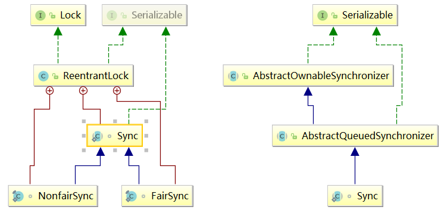
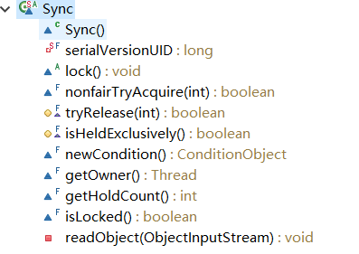

# ReentrantLock

> 看本文之前，需要了解 [**AQS**](../../mds/concurrency/c-5.md)。

-   [1. Sync](#aqs-1)
    -   [1.1 重写 - tryRelease(int)](#aqs-1-1)
    -   [1.2 公平锁与非公平锁](#aqs-1-2)
        -   [1.2.1 tryAcquire - 公平锁](#aqs-1-2-1)
        -   [1.2.2 tryAcquire - 非公平锁](#aqs-1-2-2)
        -   [1.2.3 公平锁与非公平锁之间的区别](#aqs-1-2-3)
    -   [1.3 ReentrantLock的特点](#aqs-1-3)
-   [2. 实战](#aqs-2)
    -   [2.1 lock() & unlock()](#aqs-2-1)
    -   [2.2 tryLock(long, TimeUnit) & tryLock()](#aqs-2-2)
-   [3. ReentrantLock 与 synchronized 区别](#aqs-3)

---



ReentrantLock 是 AQS 同步框架的一个组件，是支持重进入的锁，意思就是任意线程在获取到锁之后能够再次获取该锁而不会被锁阻塞住。

既然说 ReentrantLock 是 AQS 的一个组件。那么它必然实现了 AQS 一部分方法。下面，我们来看一下具体代码实现。

## <a id="aqs-1">1. Sync</a>

Sync 是 ReentrantLock的一个内部静态抽象类，同时也继承了 AbstractQueuedSynchronizer。



### <a id="aqs-1-1">1.1 重写 - tryRelease(int)</a>

从 ReentrantLock 的内部类 Sync 中重写了tryRelease(int) 方法可以看出，ReentrantLock 是仅支持了独占式同步状态的获取与释放。

```java
/**
 * 释放资源
 * @param releases，释放资源的个数
 */
protected final boolean tryRelease(int releases) {
    // 计算拥有锁的线程个数
    int c = getState() - releases;
    // 如果当前线程不是当前独占锁的线程，抛出异常
    if (Thread.currentThread() != getExclusiveOwnerThread())
        throw new IllegalMonitorStateException();
    boolean free = false;

    // 如果拥有锁的线程个数为0，说明成功释放掉了锁
    if (c == 0) {
        free = true;
        // 将独占锁的线程设置为null
        setExclusiveOwnerThread(null);
    }
    // 更新state
    setState(c);
    return free;
}
```

### <a id="aqs-1-2">1.2 公平锁与非公平锁</a>

你或许会好奇，为什么没有重写tryAcquire这个方法？理由是，在ReentrantLock中将独占锁分为 **公平独占锁** 与 **非公平独占锁** 两种。这两种锁才是 ReentrantLock 内部真正的锁。它们都各自实现了具体的 tryAcquire 方法。

#### <a id="aqs-1-2-1">1.2.1 tryAcquire - 公平锁</a>

```java
/**
 * @param acquires，尝试获取资源的个数
 */
protected final boolean tryAcquire(int acquires) {
    // 获取当前线程
    final Thread current = Thread.currentThread();
    // 获取当前拥有锁的线程个数
    int c = getState();
    // 如果c==0，说明当前没有线程占有锁
    if (c == 0) {
        
        // hasQueuedPredecessors，判断同步队列中是否有线程排在当前线程前面。
        // 如果不存在，尝试 CAS 更新 state 值；否则，返回false
        if (!hasQueuedPredecessors() &&
            compareAndSetState(0, acquires)) {
            // 将当前拥有锁的线程设置为当前的线程
            setExclusiveOwnerThread(current);
            return true;
        }
    }
    /**
     * 进入这个分支，说明当前有线程占有着锁
     * 判断当前拥有锁的线程是不是同一个线程，如果是，成功获取锁。
     */
    else if (current == getExclusiveOwnerThread()) {
        int nextc = c + acquires;
        if (nextc < 0)
            throw new Error("Maximum lock count exceeded");
        // 更新state值
        setState(nextc);
        return true;
    }
    return false;
}
```

#### hasQueuedPredecessors

检查当前线程前面是否已经有线程在等待获取同步状态。

```java
/**
 * @return true，说明当前线程是 head 或者是 head 的后继节点
 */
public final boolean hasQueuedPredecessors() {
    Node t = tail; // Read fields in reverse initialization order
    Node h = head;
    Node s;
    return h != t &&
        ((s = h.next) == null || s.thread != Thread.currentThread());
}
```

#### <a id="aqs-1-2-2">1.2.2 tryAcquire - 非公平锁</a>

```java
protected final boolean tryAcquire(int acquires) {
    return nonfairTryAcquire(acquires);
}
```

非公平锁中的 tryAcquire 实际上是调用了 Sync 中的 nonfairTryAcquire 方法。

```java
final boolean nonfairTryAcquire(int acquires) {
    // 获取当前线程
    final Thread current = Thread.currentThread();

    // 获取当前同步队列中资源使用状态
    int c = getState();

    if (c == 0) {
        if (compareAndSetState(0, acquires)) {
            setExclusiveOwnerThread(current);
            return true;
        }
    }

    // 拥有锁的线程，可重复获取锁
    else if (current == getExclusiveOwnerThread()) {
        int nextc = c + acquires;
        if (nextc < 0) // overflow
            throw new Error("Maximum lock count exceeded");
        setState(nextc);
        return true;
    }
    return false;
}
```

#### <a id="aqs-1-2-3">1.2.3 公平锁与非公平锁之间的区别</a>

从上面对公平锁与非公平锁的 tryAcquire 方法的分析，可以看出，两者唯一的区别就是在公平锁中增加了 hasQueuedPredecessors() 这个判断。

```java
public final boolean hasQueuedPredecessors() {
    // The correctness of this depends on head being initialized
    // before tail and on head.next being accurate if the current
    // thread is first in queue.
    Node t = tail; // Read fields in reverse initialization order
    Node h = head;
    Node s;
    return h != t &&
        ((s = h.next) == null || s.thread != Thread.currentThread());
}
```

hasQueuedPredecessors 判断了当前线程前面是否存在其他线程也在等待获取同步状态。如果该方法返回true，说明除了当前线程之外没有存在其他线程存在于同步队列中。

而在非公平锁的 tryAcquire 中不需要关心同步队列中是否有其他线程排在当前线程的前面，直接尝试 CAS 来更新同步状态，谁更新成功了谁就能占用共享资源。

### <a id="aqs-1-3">1.3 ReentrantLock的特点</a>

1. 线程再次获取锁。锁需要去识别获取锁的线程是否为当前占据锁的线程，如果是，则再次获取成功。

2. 锁的最终释放。线程重复 n 此获取了锁，随后在第 n 次释放该锁之后，其他线程才能够获取到这个锁。同一线程对于同一资源的重复获取，每获取一次，state 进行自增；释放的时候，state 进行自减。当 state 为0的时候，说明锁已经成功释放，其他线程可以尝试获取资源。

## 实战

了解过 [AQS](../../mds/concurrency/c-5.md) 我们知道 ReentrantLock 是面向锁的使用者。前面讲了 ReentrantLock 的代码实现原理。下面我们以锁的使用者身份来看看，怎么使用 ReentrantLock 。

### <a id="aqs-2-1">2.1 lock() & unlock()</a>

如下面的代码所示，ReentryLock 通常是与 **try/finally** 配合一起使用的：

```java
public void anyMethod() {
   reentrantLock.lock();
   try {
       //perform task
   }finally {
       reentrantLock.unlock();
   }    
} 
```

unlock 始终在 finally 语句块中被调用，如果在方法体中有异常抛出，可以确保锁能够被及时释放。

**Task**

```java
public interface Task {
	void  performTask();
}
```

**LockUnlockDemo.java**

```java
public class LockUnlockDemo implements Task{

	final ReentrantLock lock = new ReentrantLock();
	
	public void performTask() {
		lock.lock();
		
		try {
			System.out.println(Thread.currentThread().getName() + " : Lock acquired.");
			System.out.println("Processing...");
			TimeUnit.SECONDS.sleep(2);
		} catch (InterruptedException e) {
			e.printStackTrace();
		} finally {
			System.out.println(Thread.currentThread().getName() + " : Lock release.");
			lock.unlock();
		}
	}
}
```

**Worker.java**

```java
public class Worker implements Runnable {

	private Task task;
	
	public Worker(Task task) {
		this.task = task;
	}

	@Override
	public void run() {
		task.performTask();
	}

}
```

**ConcurrencyTest.java**

```java
public class ConcurrencyTest {

	private static final int MAX_THREADS = 5;
	private static final ExecutorService EXECUTOR_SERVICE = Executors.newFixedThreadPool(MAX_THREADS);
	
	public static void main(String[] args) {
		Task task = new LockUnlockDemo();
		for(int i = 0; i<MAX_THREADS; i++) {
			EXECUTOR_SERVICE.execute(new Worker(task));
		}
		
		EXECUTOR_SERVICE.shutdown();
	}
}
```

结果输出：

> pool-1-thread-1 : Lock acquired.
Processing...   
pool-1-thread-1 : Lock release.     
pool-1-thread-2 : Lock acquired.        
Processing...   
pool-1-thread-2 : Lock release.     
pool-1-thread-3 : Lock acquired.    
Processing...   
pool-1-thread-3 : Lock release.     
pool-1-thread-4 : Lock acquired.        
Processing...
pool-1-thread-4 : Lock release. 
pool-1-thread-5 : Lock acquired.    
Processing...   
pool-1-thread-5 : Lock release.

### <a id="aqs-2-2">2.2 tryLock(long, TimeUnit) & tryLock()</a>

**TryLockDemo.java**

```java
public class TryLockDemo implements Task {
	final ReentrantLock lock = new ReentrantLock();

	@Override
	public void performTask() {
		try {
			String currentThread;
			boolean flag = lock.tryLock(5, TimeUnit.SECONDS);
			if (flag) {
				try {
					currentThread = Thread.currentThread().getName();
					System.out.println(currentThread + " : Lock acquired.");
					System.out.println("Performing task... ...");
					TimeUnit.SECONDS.sleep(5);
				} finally {
					System.out.println(Thread.currentThread().getName() + " : Lock released.");
					lock.unlock();
				}
			}
		} catch (InterruptedException e) {
			e.printStackTrace();
		}
	}

}
```

在 ConcurrencyTest.java 中将 LockUnlockDemo 改成 TryLockDemo：

```java
final Task task = new TryLockDemo();
```

结果如下：

> pool-1-thread-1 : Lock acquired.  
Performing task... ...  
pool-1-thread-1 : Lock released.    
pool-1-thread-2 : Lock acquired.    
Performing task... ...  
pool-1-thread-2 : Lock released.

从输出结果可以看出，tryLock(int, TimeUnit) 在规定的时间内回去尝试获取同步状态。但是如果时间超时，将会返回方法，终止获取。

查看其源码，会发现，如果线程未成功获取同步状态会进入 **doAcquireNanos(int, long)** 这个方法：

```java
/**
 * @param arg, 获取参数
 * @param nanosTimeout, 超时间隔
 */
private boolean doAcquireNanos(int arg, long nanosTimeout) throws InterruptedException {
    // 记录当前时间点
    long lastTime = System.nanoTime();

    // 加入同步队列中
    final Node node = addWaiter(Node.EXCLUSIVE);
    boolean failed = true;
    try {
        // 进入无限循环，尝试获取同步状态
        for (;;) {
            // 获取前驱节点
            final Node p = node.predecessor();

            // 只有前驱节点为head的前提下，才有资格尝试获取同步状态
            if (p == head && tryAcquire(arg)) {
                setHead(node);
                p.next = null; // help GC
                failed = false;
                return true;
            }

            if (nanosTimeout <= 0)
                return false;
            if (shouldParkAfterFailedAcquire(p, node) &&
                nanosTimeout > spinForTimeoutThreshold)
                LockSupport.parkNanos(this, nanosTimeout);
            
            // 再次记录当前时间点
            long now = System.nanoTime();
            // 重新计算超时间隔
            nanosTimeout -= now - lastTime;
            lastTime = now;
            if (Thread.interrupted())
                throw new InterruptedException();
        }
    } finally {
        if (failed)
            cancelAcquire(node);
    }
}
```

从 **doAcquireNanos** 源码中可以看出，这个方法有三种情况会返回方法：

1. 线程成功获取同步状态。
2. 线程被中断。
3. 获取同步状态超时。

我提供的例子属于第三种情况，导致后面的几个线程获取同步状态超时，所以输出的结果会比创建的线程数量要少。

在 TryLockDemo.java 中将 `boolean flag = lock.tryLock(5, TimeUnit.SECONDS);` 改成如下代码：

```java
boolean flag = lock.tryLock();
```

结果如下：

> pool-1-thread-1 : Lock acquired.  
Performing task... ...  
pool-1-thread-1 : Lock released.   

输出的线程数量比我们实际上创建的线程数要少。这是因为 **tryLock()** 这个方法本身就是单纯的尝试获取同步状态，如果失败的话，不会进行 **自旋** 尝试获取对象状态，直接返回方法。

### <a id="aqs-3">3. ReentrantLock 与 synchronized 区别</a>

假设我们有一个资源类，它有一些操作，我们希望它是线程安全的，而有些方法不需要线程安全。

```java
public class Resource {

	public void doSomething(){
		//do some operation, DB read, write etc
	}
	
	public void doLogging(){
		//logging, no need for thread safety
	}
}
```

现在假设我们有一个Runnable类，我们将在其中使用资源方法。

```java
public class SynchronizedLockExample implements Runnable{

	private Resource resource;
	
	public SynchronizedLockExample(Resource r){
		this.resource = r;
	}
	
	@Override
	public void run() {
		synchronized (resource) {
			resource.doSomething();
		}
		resource.doLogging();
	}
}
```

> 注意，我正在使用 `synchronized` 块获取资源对象上的锁。我们可以在类中创建一个虚拟对象并将其用于锁定目的。

现在让我们看看如何使用 Java Lock API 来替代上面的 synchronized。

```java
import java.util.concurrent.TimeUnit;
import java.util.concurrent.locks.Lock;
import java.util.concurrent.locks.ReentrantLock;

public class ConcurrencyLockExample implements Runnable{

	private Resource resource;
	private Lock lock;
	
	public ConcurrencyLockExample(Resource r){
		this.resource = r;
		this.lock = new ReentrantLock();
	}
	
	@Override
	public void run() {
		try {
			if(lock.tryLock(10, TimeUnit.SECONDS)){
			    resource.doSomething();
			}
		} catch (InterruptedException e) {
			e.printStackTrace();
		} finally {
            if(((ReentrantLock)lock).isHeldByCurrentThread()) {
                //release lock
			    lock.unlock();
            }
		}
		resource.doLogging();
	}

}
```

基于上述细节和程序，我们可以很容易地得出Java锁和同步之间的区别:

1. ReentrantLock 和 synchronized 关键字之间的另一个重要区别是 **公平性**。synchronized关键字不支持公平性。任何线程在释放后都可以获得锁，不可以指定优先级。

    另一方面，我们可以通过参数来指定创建公平锁 - `new ReentrantLock(true);`。公平状态下的ReentrantLock为等待时间最长的线程提供锁，以防出现争用。

2. ReentrantLock 提供了 tryLock() 方法。这个只是去尝试获取锁的方法。无论是否成功获取锁都会及时返回方法。这减少了Java应用程序中等待锁的线程的阻塞。

3. 线程等待锁时能够响应线程中断。
    -   在 synchronized 关键字的情况下，一个线程可能因为等待获取锁而被阻塞，在这段不确定的时间内，你没有办法控制终止它。
    -   而ReentrantLock提供了 lockInterruptibly() 这个方法，它可以用于在线程等待锁时响应中断。类似地，如果锁在特定时间段内不可用，可以使用带有超时的 tryLock(int, TimeUnit) 来超时。

4. ReentrantLock 还提供了方便的方法来获取正在等待锁的所有线程的列表。

## 参考

-   《Java并发编程的艺术 - 第五章》
-   [Java Lock Example – ReentrantLock](https://www.journaldev.com/2377/java-lock-example-reentrantlock)
-   [ReentrantLock Java Example](https://www.concretepage.com/java/reentrantlock-java-example-with-lock-unlock-trylock-lockinterruptibly-isheldbycurrentthread-and-getholdcount)
-   [ReentrantLock Example in Java, Difference between synchronized vs ReentrantLock](https://javarevisited.blogspot.com/2013/03/reentrantlock-example-in-java-synchronized-difference-vs-lock.html)

##  [BACK](../../mds/summary.md)