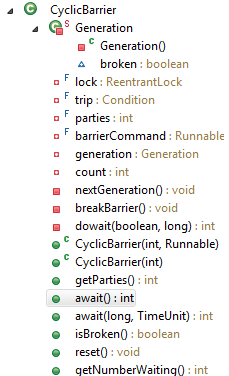

# CyclicBarrier

> 版本 JDK7。

-   [1. CyclicBarrier 的用途](#clib-1)
-   [2. 源码解析](#clib-2)
    -   [2.1 CyclicBarrier 的成员变量](#clib-2-1)
    -   [2.2 await() & await(long, TimeUnit)](#clib-2-2)
-   [3. 实战](#clib-3)
-   [4. CyclicBarrier 与 CountDownLatch 之间的区别？](#clib-4)

## <a id="clib-1">1. CyclicBarrier 的用途</a>

CyclicBarrier 的字面意思是可循环使用（Cyclic）的屏障（Barrier）。它要做的事情是，让一组线程达到一个屏障（也可以叫同步点）时被阻塞，直到最后一个线程到达屏障时，屏障才会打开，所有被拦截的线程才会继续运行。

## <a id="clib-2">2. 源码解析</a>



上图是 CyclicBarrier 的整个内容，其内容结构与上面一篇 [CountDownLatch](.../../mds/concurrency/c-5-4.md) 一样简单。

仔细观察，你会发现，CyclicBarrier 实际上没有自己重写 AQS 的方法，而是利用了 **ReentrantLock** 与 AQS 的内部静态类 **Condition**，来实现了屏障的功能。

### <a id="clib-2-1">2.1 CyclicBarrier 的成员变量</a>

```java
// CyclicBarrier 使用非公平模式下的 ReentrantLock 来做为锁
private final ReentrantLock lock = new ReentrantLock();

// 利用 Condition 来控制屏障的开关
private final Condition trip = lock.newCondition();

// 初始化的时候，指定需要 parties 个线程到达屏障才会打开屏障
private final int parties;

// 当所有的线程都到达屏障之后，优先执行 barrierCommand 线程的 run 方法(并不是启动一个新的线程)。
private final Runnable barrierCommand;

/** The current generation */
private Generation generation = new Generation();

/**
 * 还需 count 个线程到达屏障，就会打开屏障(count == 0)，唤醒所有的线程继续执行它们的工作。
 * 注意：只有当 CyclicBarrier 创建对象 或者 调用 reset() 方法 或者 调用nextGeneration() 的时，count 才会等于 parties。
 */
private int count;
```

### <a id="clib-2-2">2.2 await() & await(long, TimeUnit)</a>

await() 和 await(int, TimeUnit) 内部都调用了 dowait(boolean, long) 这个方法。dowait(boolean, long) 是 CyclicBarrier 中的核心，理解了 dowait(boolean, long) 就差不多理解 CyclicBarrier 如何实现的。


```java
/**
 * @param timed, 是否要控制等待时间
 * @param nanos, 超时时间
 */
private int dowait(boolean timed, long nanos) throws InterruptedException, BrokenBarrierException, TimeoutException {
    final ReentrantLock lock = this.lock;
    // 加锁
    lock.lock();
    try {
        final Generation g = generation;

        // g.broken 初始化的时候默认是false，只有当当前线程被标记为中断状态或者调用了 reset() 这个方法才会将 broken 设置为 true。
        if (g.broken)
            throw new BrokenBarrierException();

        if (Thread.interrupted()) {
            breakBarrier();
            // 将中断状态传播出去
            throw new InterruptedException();
        }

        // 还需 index 个线程到达屏障，屏障才会打开
        int index = --count;
        if (index == 0) {  // 说明此时最后一个线程已经到达屏障
            boolean ranAction = false;
            try {
                // 获取优先要执行的线程
                final Runnable command = barrierCommand;
                if (command != null)
                    // 只要优先执行的线程不为null，就优先执行
                    command.run();
                ranAction = true;
                /**
                 * nextGeneration 这个方法做了三件事情：
                 * 1. 唤醒所有等在屏障的线程，让它们继续执行
                 * 2. 将 count 值重置为 parties
                 * 3. 重新生成 generation
                 */
                nextGeneration();
                return 0;
            } finally {
                /**
                 * 前面一直对这个 ranAction 的存在意义很疑惑。
                 * 但是看到这里，唯一能解释的就是这个 ranAction 是为了避免 barrierCommand.run() 这个方法抛出异常
                 * 如果抛出异常，nextGeneration() 就不会被执行。
                 * 所以 ranAction == false，说明 nextGeneration() 没有被执行，需要强制唤醒哪些等待的线程，让它们自己终止掉(往下看就知道了)。
                 */
                if (!ranAction)
                    breakBarrier();
            }
        }

        // loop until tripped, broken, interrupted, or timed out
        for (;;) {
            try {
            if (!timed)
                // 阻塞当前线程
                trip.await();
            else if (nanos > 0L)
                // 当有时间超时限制的时候
                nanos = trip.awaitNanos(nanos);
            } catch (InterruptedException ie) {
                if (g == generation && ! g.broken) {
                    breakBarrier();
                    throw ie;
                } else {
                    Thread.currentThread().interrupt();
                }
            }

            // 线程被唤醒之后的操作 或者 (timed == true && nanos <= 0L)
            if (g.broken)
                // 这里说明屏障在打开之前出现了问题，需要让那些等待在屏障的线程终止掉。
                throw new BrokenBarrierException();

            // g != generation 说明当前成功执行了 nextGeneration()
            if (g != generation)
                return index;

            // 这个是参数非法的时候
            if (timed && nanos <= 0L) {
                breakBarrier();
                throw new TimeoutException();
            }
        }
    } finally {
        // 最后解锁
        lock.unlock();
    }
}
```

看完这个之后再来看看 await() 与 await(long, TimeUnit)。

-   await(): 线程一直等待，直到被唤醒，没有时间限制

```java
public int await() throws InterruptedException, BrokenBarrierException {
    try {
        return dowait(false, 0L);
    } catch (TimeoutException toe) {
        throw new Error(toe); // cannot happen;
    }
}
```

-   await(long, TimeUnit)：线程一直，在指定的时间内可以被唤醒，否则抛出异常。

```java
public int await(long timeout, TimeUnit unit) throws InterruptedException, BrokenBarrierException, TimeoutException {
    return dowait(true, unit.toNanos(timeout));
}
```

## <a id="clib-3">3. 实战</a>

1.  await()
    ```java
    public class CyclicBarrierTest {

        static CyclicBarrier cyclicBarrier = new CyclicBarrier(2);
        
        public static void main(String[] args) {
            new Thread(new Runnable() {

                @Override
                public void run() {
                    try {
                        cyclicBarrier.await();
                    } catch (InterruptedException | BrokenBarrierException e) {
                        e.printStackTrace();
                    }
                    System.out.println(1);
                }
                
            }).start();
            
            try {
                cyclicBarrier.await();
            } catch (InterruptedException e) {
                e.printStackTrace();
            } catch (BrokenBarrierException e) {
                e.printStackTrace();
            }
            System.out.println(2);
        }
    }
    ```

    **Output：**

    > 1     
    2

    或

    > 2     
    1

    2. 执行优先线程
    ```java
    public class CyclicBarrierTest {

        static CyclicBarrier cyclicBarrier = new CyclicBarrier(2, new A());
        
        public static void main(String[] args) {
            new Thread(new Runnable() {

                @Override
                public void run() {
                    try {
                        cyclicBarrier.await();
                    } catch (InterruptedException | BrokenBarrierException e) {
                        e.printStackTrace();
                    }
                    System.out.println(1);
                }
                
            }).start();
            
            try {
                cyclicBarrier.await();
            } catch (InterruptedException e) {
                e.printStackTrace();
            } catch (BrokenBarrierException e) {
                e.printStackTrace();
            }
            System.out.println(2);
        }
        
        static class A implements Runnable {

            @Override
            public void run() {
                System.out.println(3);
            }
            
        }
    }
    ```

    **Output：**

    > 3     
    2   
    1   

    或 

    > 3     
    1   
    2

## <a id="clib-4">4. CyclicBarrier 与 CountDownLatch 之间的区别？</a>

CountDownLatch 的计数器只能用一次(这里指的是同一个对象的情况下)，想要重新计数只能创建一个新的对象。而 CyclicBarrier 的计数器在成功唤醒所有等待的线程之后，会自动刷新。同时也可以使用 reset() 方法来重置。

CyclicBarrier 能处理更为复杂的业务场景。例如，如果计算发生错误，可以重置计数器，让线程重新执行一次。

##  [BACK](../../mds/summary.md)