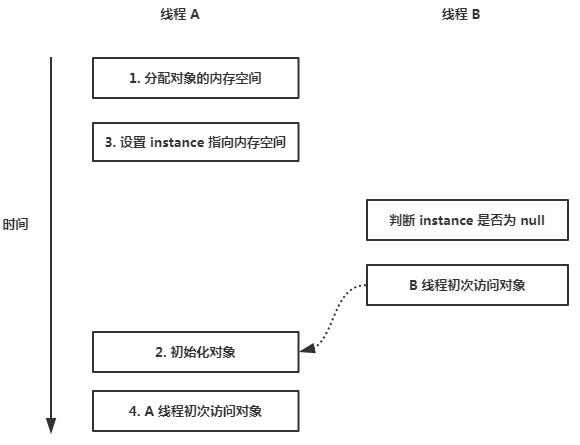

# 单例模式

## 动机

有时候一个类只有一个实例对象是很重要的。比如，在一个系统中只能有一个 window manager。通常单例模式被用于内部的或者外部的资源的中央管理，它们为自己提供一个全局的访问点。

单例模式是最简单的设计模式之一：它只涉及一个负责实例化自身的类，以确保这个类最多只实例化出一个对象。同时，它提供一个全局访问这个实例的方法。在这种情况下，可以在任何地方使用相同的实例，不可能每次都直接调用构造函数。

## 意图

-   确保一个类只有一个实例被创建；
-   提供一个访问这个实例的全局点。


## 实现

### 1. 懒加载 - 非线程安全

```java
public class UnsafeLazySingleton {
    private static UnsafeLazySingleton instance;

    private UnsafeLazySingleton() {}

    public static UnsafeLazySingleton getInstance() {
        if(instance == null) {
            instance = new UnsafeLazySingleton();
        }
        return instance;
    }
}
```

适用场景：没有并发的环境

优点：能够避免内存不必要的浪费

缺点：在并发环境下，会造成一个类创建出多个实例的情况。

### 2. 懒加载 - 线程安全（synchronized 控制）

```java
public class SafeLazySingleton {

    private static SafeLazySingleton instance;

    private SafeLazySingleton() {}

    public static synchronized SafeLazySingleton getInstance() {
        
        if(instance == null) {
            instance = new SafeLazySingleton();
        }

        return instance;
    }
}
```

显然，通过 `synchronized` 排斥锁解决了并发环境下可能造成 instance 多次初始化的情况。但是这样做，会导致程序执行性能下降。

为了提高程序的执行性能，我们可以通过双重检查锁定。

```java
public class DoubleCheckSingleton {

    private static DoubleCheckSingleton instance;

    private DoubleCheckSingleton() {}

    public static DoubleCheckSingleton getInstance() {
        if(instance != null) {
            synchronized(DoubleCheckSingleton.class) {
                if(instance != null) {
                    instance = new DoubleCheckSingleton();
                }
            }
        }

        return instance;
    }
}
```

双重检查锁定的实现，提高了程序执行性能，但是它是非线程安全的。为什么这么说呢？

关键是这条语句：`instance = new DoubleCheckSingleton();`

这行代码可以分解为如下 3 行伪代码：

```txt
memory = allocate();  //1. 为新生对象分配内存空间
ctorInstance(memory); //2. 初始化对象
instance = memory;    //3. 设置 instance 指向刚分配的内存地址
```

上面 3 行伪代码中的 2 和 3 之间可能会被重排序。当 2 和 3 发生重排序的时候，伪代码如下：

```txt
memory = allocate();  //1. 为新生对象分配内存空间
instance = memory;    //3. 设置 instance 指向刚分配的内存地址
ctorInstance(memory); //2. 初始化对象
```

那么，我们来模拟一下在并发环境下可能出现的情况：



从上图可知，在线程 A 成功获取到 DoubleCheckSingleton 的排斥锁之后，线程 A 开始执行实例过程。线程 A 成功执行完 `设置 instance 指向内存空间` 这步骤之后，CPU 分配时间给线程 B 去调用 `DoubleCheckSingleton.getInstance()` 方法。这个时候的 instance 自然不为空，但是却没有初始化。到此为止，已经解释了上面这种双重检查锁定的非线程安全的原因。

知晓问题发生的原因之后，我们可以有 2 个办法来实现双重检查锁定在并发环境下的线程安全。

1.  禁止步骤 2 和 3 的重排序。

1.  允许 2 和 3 的重排序，但不允许其他线程 “看到” 这个重排序。

#### 2.1 基于 volatile 的解决方案

> 有兴趣可以看看这篇文章，讲述了 volatile 的内存语义 -> [volatile、synchronized 和 final 的内存语义](../books/concurrency-3.md)

实现代码如下：

```java
public class DoubleCheckSingleton {

    private volatile static DoubleCheckSingleton instance;

    private DoubleCheckSingleton() {}

    public static DoubleCheckSingleton getInstance() {
        if(instance != null) {
            synchronized(DoubleCheckSingleton.class) {
                if(instance != null) {
                    instance = new DoubleCheckSingleton();
                }
            }
        }
        return instance;
    }
}
```

#### 2.2 基于类初始话的解决方案

JVM 在类的初始化阶段（即在 Class 被加载后，且被线程使用之前），会执行类的初始化。在执行类的初始化期间，JVM 会去获取一个锁。这个锁可以同步多个线程对同一个类的初始化（简单点理解就是避免类被多次初始化）。

基于这个特性，实现代码如下：

```java
public class InstanceFactory {
    private static class InstanceHolder {
        public static Singleton instance = new Singleton();
    }

    public static Singleton getInstance() {
        return InstanceHolder.instance;
    }
}
```

### 3. 饿汉模式（线程安全）

```java
public class EarlySingleton {

    private static EarlySingleton instance = new EarlySingleton();

    private EarlySingleton() {}

    public static EarlySingleton getInstance() {
        return instance;
    }
}
```

优点：线程安全

缺点：会造成内存的浪费

### 4. 如何避免反序列化对单例模式的破坏

当一个类实现了序列化的时候，我们来看一下反序列出来的对象是否还是同一个对象。

```java
public class SingletonSerialized implements Serializable {

	private static final long serialVersionUID = 1L;

	private static SingletonSerialized instance = new SingletonSerialized();
	
	private SingletonSerialized() {
		
		System.out.println("SingletonSerialized is creating");
	}
	
	public static SingletonSerialized getInstance() {
		return instance;
	}
}
```

测试代码

```java
public class SingletonSerializedTest implements Serializable {

	@Test
	public void testSingletonSerialized() throws IOException, ClassNotFoundException {
		SingletonSerialized serializedObj;
		SingletonSerialized instance = SingletonSerialized.getInstance();
		
		FileOutputStream fos = new FileOutputStream("serializedObj.obj");
		ObjectOutputStream oos = new ObjectOutputStream(fos);
		oos.writeObject(instance);  
        oos.flush();  
        oos.close(); 
        
        FileInputStream fis = new FileInputStream("serializedObj.obj");  
        ObjectInputStream ois = new ObjectInputStream(fis); 
        serializedObj = (SingletonSerialized) ois.readObject();
        assertEquals(instance, serializedObj);
	}
}
```

结果：测试未通过

```java
public class SingletonSerialized implements Serializable {

	private static final long serialVersionUID = 1L;

	private static SingletonSerialized instance = new SingletonSerialized();
	
	private SingletonSerialized() {
		
		System.out.println("SingletonSerialized is creating");
	}
	
	public static SingletonSerialized getInstance() {
		return instance;
	}
	
	private Object readResolve() {
		return instance;
	}
}
```

##  [BACK](../../mds/summary.md)