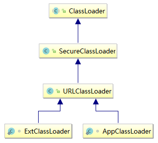
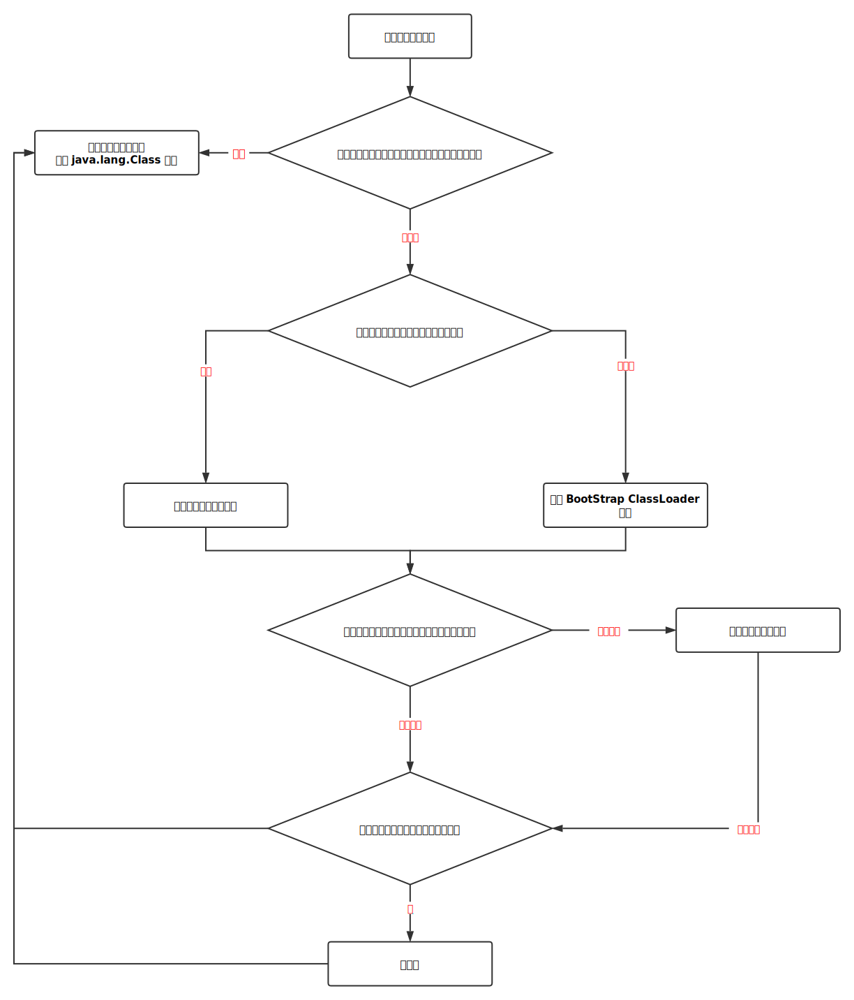
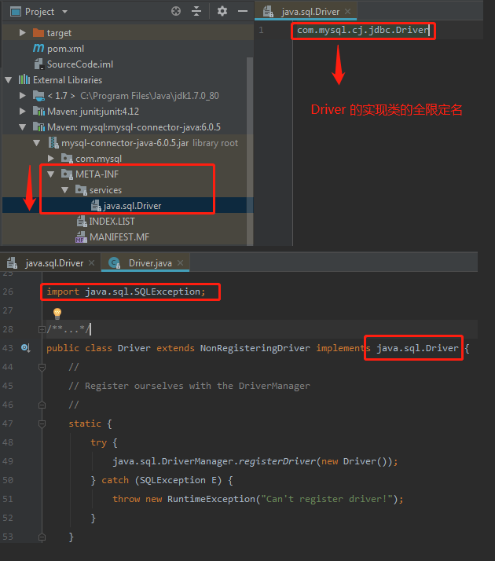

# 深入理解类加载器

> 时间：2018-10-24

-   [1. 类加载机制](#r-1)
-   [2. 类加载器简介](#r-2)
-   [3. 双亲委派模式](#r-3)
    -   [3.1 双亲委派模式概念以及原理](#r-3-1)
    -   [3.2 ClassLoader 解析](#r-3-2)
    -   [3.3 sun.misc.Launcher 介绍](#r-3-3)
-   [4. 自定义类加载器](#r-4)
-   [5. 破坏双亲委派模型](#r-5)

---

## <a id="r-1">1. 类加载机制</a>

在讲类加载器之前，让我们来谈谈类加载机制。


-   加载阶段

    主要做了 3 件事情：

    1.  通过一个类的全限定名来获取此类的二进制字节流；
    1.  将这个字节流所代表的静态存储结构转化为方法区的运行时数据结构；
    1.  为这个类在内存中创建一个 java.lang.Class 对象，作为方法区该类的数据访问入口。

-   连接阶段

    1.  验证

        主要是为了防止加载进来的字节流信息危害到虚拟机自身的安全，包括：文件格式验证、元数据验证、字节码验证和符号引用验证。

    1.  准备

        根据加载进来的类的二进制字节流所代表的类变量（static 修饰的变量） **分配内存** 和 设置类变量的初始值。

        >   这里讲的初始值是初始值

        Java 基本数据类型的零值

        | 数据类型 | 零值 |
        | :-: | :-: |
        |int|0|
        |long|0L|
        |short|(short)0|
        |char|'\u0000'|
        |byte|(byte)0|
        |boolean|false|
        |float|0.0f|
        |double|0.0d|
        |reference|null|

        > 被 final static 这两个同时修饰的变量将直接初始化。

    1.  解析

        将加载进来的二进制字符流中的符号引用转换成直接引用。

        -   符号引用：由一组字面量组成，用来表示所引用的对象；
        -   直接引用：是直接指向目标的指针、相对偏移量或一个能间接定位到目标的句柄；

-   初始化

    类加载最后阶段，是执行类构造器 `<clinit>()` 方法的过程。
    
    若该类具有超类，则对其进行初始化，执行静态初始化器和静态初始化成员变量（如前面准备阶段只初始化了默认值的 static 变量将会在这个阶段赋值，成员变量也将被初始化）。

## <a id="r-2">2. 类加载器简介</a>

上面简单介绍了类加载的机制，在加载阶段，Java 虚拟机会利用类加载器通过类的全限定名来获取该类的二进制字节流。

JVM 提供了 3 种类加载器：

1.  Bootstrap ClassLoader（启动类加载器）

    启动类加载器主要加载的是 JVM 自身需要的类，这个类加载器是由 C++ 实现的。
    
    启动类加载器将负责加载 `<JAVA_HOME>/lib` 路径下的核心类或 `-Xbootclasspath` 参数指定的路径下的 `jar包` 加载到内存中。

    > 注意：由于虚拟机是按照文件名识别要加载的 `jar包`，如：rt.jar。如果，将其他名称的 `jar包` 放到这个路径下面也是不会被加载进去。

1.  Extension ClassLoader（扩展类加载器）

    扩展类加载器指的是 `sun.misc.Launcher$ExtClassLoader` 类，这个类是由 Java 代码实现的。

    扩展类加载器主要负责加载 `<JAVA_HOME>/lib/ext` 或 `-Djava.ext.dir` 路径下的 `jar包`。

1.  Application ClassLoader（应用程序类加载器）

    应用程序类加载器指的是 `sun.misc.Launcher$AppClassLoader` 类，这个类也是由 Java 代码实现的。

    应用程序类加载器负责加载系统路径 `java -classpath` 或 `-D java.class.path` 路径下的 `jar包`。

## <a id="r-3">3. 双亲委派模式</a>

从 Java 虚拟机的角度来讲，只存在两种类加载器：一种是启动类加载器，是虚拟机自身的一部分；另一种就是其他的类加载器，这些加载器都是由 Java 语言实现的，独立于虚拟机外部，并且全部继承自 `java.lang.ClassLoader` 这个抽象类。

### <a id="r-3-1">3.1 双亲委派模式简介</a>

>   注意：下面的模式图是逻辑上父子关系，而不是代码上的继承关系。


双亲委派模型要求除了顶层的启动类加载器之外，其他的类加载器都应当有自己的父类加载器。

双亲委派模式过程如下：如果一个类加载器收到了类加载的请求，它首先不会自己去尝试加载这个类，而是将这个请求委派给父类加载器去完成，每一层次的类加载器都是如此。因此所有的加载请求最终都应该委派到顶层的启动类加载器中，只有当父加载器反馈自己无法完成这个加载请求时，子类加载器才会去尝试自己加载。

### <a id="r-3-2">3.2 ClassLoader 解析</a>

ClassLoader 跟双亲委派模式有着密不可分的关系。除了 BootStrap ClassLoader 是由 C++ 代码实现的，其余的所有类加载器都是继承自 ClassLoader 这个抽象类，包括 ExtClassLoader 和 AppClassLoader。



ClassLoader 作为类加载器的父类（除了 BootStrap ClassLoader）为我们提供了很多有用的方法，下面通过这 4 个常用的方法来了解 ClassLoader 内部构造。

1.  [loadClass](#r-3-2-1)

1.  [findClass](#r-3-2-2)

1.  [defineClass](#r-3-2-3)

1.  [resolveClass](#r-3-2-4)

#### <a id="r-3-2-1">3.2.1 loadClass</a>

loadClass(String)

```java
public Class<?> loadClass(String name) throws ClassNotFoundException {
    return loadClass(name, false);
}
```

其内部其实调用了 loadClass(String, boolean)。

```java
protected Class<?> loadClass(String name, boolean resolve) throws ClassNotFoundException {
    synchronized (getClassLoadingLock(name)) {
        // 从缓存中查找看看，当前这个全限定名对应的类是否已经被加载进来
        Class c = findLoadedClass(name);
        if (c == null) { // 类还未被加载
            long t0 = System.nanoTime();
            try {
                // 如果有父类加载器，就委派给父类加载器加载
                if (parent != null) {
                    // 这里是一个递归调用
                    c = parent.loadClass(name, false);
                } else {
                    // 父类不存在，就用 BootStrapClassLoader 加载
                    c = findBootstrapClassOrNull(name);
                }
            } catch (ClassNotFoundException e) {
            }

            if (c == null) {// 父类加载失败，子类自己加载
                
                long t1 = System.nanoTime();

                // findClass 是抽象方法，需要子类自己实现
                c = findClass(name);

                // this is the defining class loader; record the stats
                sun.misc.PerfCounter.getParentDelegationTime().addTime(t1 - t0);
                sun.misc.PerfCounter.getFindClassTime().addElapsedTimeFrom(t1);
                sun.misc.PerfCounter.getFindClasses().increment();
            }
        }
        if (resolve) {
            // 解析这个类
            resolveClass(c);
        }
        return c;
    }
}
```

通过 loadClass(String) 这个方法在一定程度上解释了第一节 - 类加载机制的内容。

让我们来回顾一下，加载阶段做的 3 件事情：

1.  通过一个类的全限定名来获取此类的二进制字节流；
1.  将这个字节流所代表的静态存储结构转化为方法区的运行时数据结构；
1.  为这个类在内存中创建一个 java.lang.Class 对象，作为方法区该类的数据访问入口。

在上面的 `loadClass(String, boolean)` 中可以验证其中的 1,3点。无论是 loadClass 方法还是 findClass 方法，它们返回的数据类型都是 `java.lang.Class` 的对象。

除此之外，可以清晰的看到，类加载的模式即双亲委派模式，是通过下面步骤实现的：



#### <a id="r-3-2-2">3.2.2 findClass</a>

`loadClass(String, boolean)` 内部在父类加载器加载失败的时候，子类加载器只能自己加载，这个时候子类加载器通过调用 `findClass(String)` 这个方法来实现自己的加载。

```java
protected Class<?> findClass(String name) throws ClassNotFoundException {
    throw new ClassNotFoundException(name);
}
```

在 ClassLoader 中的 `findClass` 是需要子类加载器自己实现，来满足不同加载器的需求。

下面来简单看看，ClassLoader 的一个子类 —— **URLClassLoader**。URLClassLoader 重写了父类 ClassLoader 的 findClass 方法。

```java
protected Class<?> findClass(final String name)
         throws ClassNotFoundException {
    try {
        return AccessController.doPrivileged(
            new PrivilegedExceptionAction<Class>() {
                public Class run() throws ClassNotFoundException {
                    String path = name.replace('.', '/').concat(".class");
                    Resource res = ucp.getResource(path, false);
                    if (res != null) {
                        try {
                            return defineClass(name, res);
                        } catch (IOException e) {
                            throw new ClassNotFoundException(name, e);
                        }
                    } else {
                        throw new ClassNotFoundException(name);
                    }
                }
            }, acc);
    } catch (java.security.PrivilegedActionException pae) {
        throw (ClassNotFoundException) pae.getException();
    }
}
```

`URLClassLoader.findClass(String)` 这个方法内部实现步骤如下：

1.  通过类的全限定名来获取到该类对应的二进制字符流；

1.  调用 `defineClass(String, Resource)` 将这个字节流转换成 `java.lang.Class` 的一个对象。

#### <a id="r-3-2-3">3.2.3 defineClass</a>

ClassLoader 提供了多个重载的 defineClass 方法，我们就来看看其中的一个重载方法。

```java
protected final Class<?> defineClass(String name, byte[] b, int off, int len) throws ClassFormatError {
    return defineClass(name, b, off, len, null);
}

protected final Class<?> defineClass(String name, byte[] b, int off, int len, ProtectionDomain protectionDomain) throws ClassFormatError {
    // 获取全限定名对应的保护域，这里是null
    protectionDomain = preDefineClass(name, protectionDomain);

    Class c = null;
    // 获取保护域类的 location，这里是null
    String source = defineClassSourceLocation(protectionDomain);

    try {
        // 调用本地方法将二进制字符流转换成 Class 对象
        c = defineClass1(name, b, off, len, protectionDomain, source);
    } catch (ClassFormatError cfe) {
        // 类格式化错误，尝试格式化字节流之后再转换成 Class 对象
        c = defineTransformedClass(name, b, off, len, protectionDomain, cfe, source);
    }

    postDefineClass(c, protectionDomain);
    return c;
}
```

#### <a id="r-3-2-4">3.2.4 resolveClass</a>

```java
protected final void resolveClass(Class<?> c) {
    resolveClass0(c);
}

private native void resolveClass0(Class c);
```

上面提到了，在解析阶段，是将类的二进制字符流中 **符号引用** 转化成 **直接引用**。

### <a id="r-3-3">3.3 sun.misc.Launcher 介绍</a>

上一节介绍了 ClassLoader 的 4 个常用的方法，解释了 ClassLoader 是如何实现双亲委派模式的。下面来看看 Launcher 这个类是如何定义 BootStrap ClassLoader、ExtClassLoader 和 AppClassLoader 这三种类加载器之间的关系的。

Launcher 只是一个封装了虚拟机的执行外壳，由它负责装载 JRE 环境和 windows 平台下的 `jvm.dll` 动态链接库。简单来讲，Launcher 就是 Java 程序的入口。

下面来看看，Launcher 内部结构。


#### Launcher 构造方法

```java
public class Launcher {
    private ClassLoader loader;

    private static Launcher launcher = new Launcher();

    public static Launcher getLauncher() {
        return launcher;
    }

    public Launcher() {
        Launcher.ExtClassLoader var1;
        try {
            // 获取 ExtClassLoader
            var1 = Launcher.ExtClassLoader.getExtClassLoader();
        } catch (IOException var10) {
            throw new InternalError("Could not create extension class loader");
        }

        try {
            // 将 ExtClassLoader 作为 AppClassLoader 的父类加载器
            this.loader = Launcher.AppClassLoader.getAppClassLoader(var1);
        } catch (IOException var9) {
            throw new InternalError("Could not create application class loader");
        }

        // 把 AppClassLoader 默认设置为线程上下文类加载器
        Thread.currentThread().setContextClassLoader(this.loader);
        String var2 = System.getProperty("java.security.manager");
        if (var2 != null) {
            SecurityManager var3 = null;
            if (!"".equals(var2) && !"default".equals(var2)) {
                try {
                    var3 = (SecurityManager)this.loader.loadClass(var2).newInstance();
                } catch (IllegalAccessException var5) {
                    ;
                } catch (InstantiationException var6) {
                    ;
                } catch (ClassNotFoundException var7) {
                    ;
                } catch (ClassCastException var8) {
                    ;
                }
            } else {
                var3 = new SecurityManager();
            }

            if (var3 == null) {
                throw new InternalError("Could not create SecurityManager: " + var2);
            }

            System.setSecurityManager(var3);
        }

    }
}
```

可以看出，ExtClassLoader 的父类加载器为 null，而 AppClassLoader 的父类加载器为 ExtClassLoader。自定义的类加载器的父类加载器是 AppClassLoader。

## <a id="r-4">4. 自定义类加载器</a>

判断两个类是否相等：两个类来源于同一个 Class 文件，并且由同一个类加载器加载。

实现自定义类加载器有两种方式：

1.  继承 ClassLoader

1.  继承 URLClassLoader

### 4.1 ClassLoader 和 URLClassLoader 两者有什么区别？

ClassLoader 提供了更多的灵活性，用户自定义的类加载器必须实现 `findClass(String)` 方法，不然就会抛出 `ClassNotFoundException`。

而 URLClassLoader 其实已经实现了 `findClass(String)` 这个方法，这样就省去自己编写 `findClass(String)` 的具体实现。

### 4.2 什么时候需要自定义类加载器？

1.  当 class 文件不在 ClassPath（System.getProperty("java.class.path")） 路径下，默认系统类加载器无法找到该 class 文件，在这种情况下我们需要实现一个自定义的 ClassLoader 来加载特定路径下的class文件生成 class 对象。

1.  当一个 class 文件是通过网络传输并且可能会进行相应的加密操作时，需要先对 class 文件进行相应的解密后再加载到 JVM 内存中，这种情况下也需要编写自定义的 ClassLoader 并实现相应的逻辑。

1.  当需要实现热部署功能时(一个 class 文件通过不同的类加载器产生不同 class 对象从而实现热部署功能)，需要实现自定义 ClassLoader 的逻辑。

### 4.3 实现自定义类加载器

1.  继承 ClassLoader 的自定义类加载器

    `SelfClassLoader.java`

    ```java
    package learn.reflect;

    import java.io.*;

    public class SelfClassLoader extends ClassLoader {

        private static final String PATH_PERFIX = "D:/test/";

        @Override
        protected Class<?> findClass(String name) throws ClassNotFoundException {

            byte[] bytes = getByteArrayByName(name);
            if(bytes == null) {
                throw new ClassNotFoundException();
            } else {
                return defineClass(name, bytes,0,bytes.length);
            }
        }

        private byte[] getByteArrayByName(String name) {

            String path = PATH_PERFIX + name.replace('.', '/').concat(".class");

            try {
                InputStream readStream = new FileInputStream(path);
                ByteArrayOutputStream baos = new ByteArrayOutputStream();
                int maxBufferSize = 1024 * 2;
                byte[] bytes = new byte[maxBufferSize];
                int readNumRead = 0;
                while((readNumRead = readStream.read(bytes)) != -1) {
                    baos.write(bytes,0, readNumRead);
                }
                return baos.toByteArray();
            } catch (FileNotFoundException e) {
                e.printStackTrace();
            } catch (IOException e) {
                e.printStackTrace();
            }
            return null;
        }
    }

    ```

    将 `OutClass.class` 字节码文件放到 `D:/test/com/test/` 目录下面。

    ```java
    package com.test;

    public class OutClass {

        @Override
        public String toString() {
            System.out.println("Test...");
        }
    }
    ```

    测试类：`SelfClassLoaderTest.java`

    ```java
    package learn.reflect;

    import org.junit.Test;

    public class SelfClassLoaderTest {

        @Test
        public void testSelfClassLoader() throws ClassNotFoundException, IllegalAccessException, InstantiationException {

            SelfClassLoader classLoader = new SelfClassLoader();
            Class object = classLoader.loadClass("com.test.OutClass");
            System.out.println(object.newInstance().toString());
        }
    }

    ```

    输出： 

    > Test...

1.  继承 URLClassLoader 的自定义类加载器

    由于 URLClassLoader 实现了 `findClass(String)` 的方法，代码就更加简洁。

    `SelfURLClassLoader.java`

    ```java
    package learn.reflect;

    import java.io.File;
    import java.net.MalformedURLException;
    import java.net.URL;
    import java.net.URLClassLoader;
    import java.net.URLStreamHandlerFactory;

    public class SelfURLClassLoader extends URLClassLoader {

        public SelfURLClassLoader(URL[] urls) {
            super(urls);
        }

        public SelfURLClassLoader(URL[] urls, ClassLoader parent) {
            super(urls, parent);
        }

        public SelfURLClassLoader(URL[] urls, ClassLoader parent, URLStreamHandlerFactory factory) {
            super(urls, parent, factory);
        }

        public static URL[] getURLArrayByPath(String path) {
            File file = new File(path);
            try {
                return new URL[]{ file.toURI().toURL() };
            } catch (MalformedURLException e) {
                e.printStackTrace();
            }
            return null;
        }
    }
    ```

    测试类：`SelfURLClassLoaderTest.java`

    ```java
    package learn.reflect;

    import org.junit.Test;

    import java.net.URL;

    import static org.junit.Assert.assertEquals;
    import static org.junit.Assert.assertNotNull;

    public class SelfURLClassLoaderTest {

        @Test
        public void testSelfURLClassLoaderTest() throws ClassNotFoundException, IllegalAccessException, InstantiationException {
            URL[] urls = SelfURLClassLoader.getURLArrayByPath("D:/test/");
            assertNotNull(urls);
            SelfURLClassLoader classLoader = new SelfURLClassLoader(urls);
            Class object = classLoader.loadClass("com.test.OutClass");
            assertEquals("Test .....", object.newInstance().toString());
        }
    }
    ```

## <a id="r-5">5. 破坏双亲委派模型</a>

双亲委派模型很好的解决了各个类加载器的基础类的统一问题（越基础的类由越上层的加载器进行加载）。

但是，在 Java 应用中存在着很多服务提供者接口（Service Provider Interface，SPI），这些接口允许第三方为它们提供实现，如常见的 SPI 有 JDBC、JNDI 等。这些 SPI 属于 Java 核心库，一般存在 rt.jar 中，由 BootStrap ClassLoader 加载，而 SPI 的第三方实现代码则是在 Java 应用的 classpath 路径下面。

这样就会导致在 SPI 中的代码需要加载具体的第三方实现类并调用其相关方法时，由于此时的 SPI 是由 BootStrap ClassLoader 来加载，而 BootStrap ClassLoader 无法直接加载 SPI 的实现类，并且因为双亲委派模式的存在，BootStrap 无法反向委托 AppClassLoader 加载 SPI 的实现类。

面对上面的情况，Java 提供了 **线程上下文类加载器（contextClassLoader）** 来解决上面这个问题。

### 以 java.sql.DriverManager 为例介绍 contextClassLoader

DriverManager 中定义了一个静态块：

```java
static {
    loadInitialDrivers();
    println("JDBC DriverManager initialized");
}
```

在 DriverManager 被请求加载的时候会执行上面的静态块。

```java
private static void loadInitialDrivers() {
    ... ...
    AccessController.doPrivileged(new PrivilegedAction<Void>() {
            public Void run() {
                
                ServiceLoader<Driver> loadedDrivers = ServiceLoader.load(Driver.class);
                Iterator driversIterator = loadedDrivers.iterator();

                try{
                    // 通过调用 LazyIterator.next() 加载了 
                    // 'META-INF/services/' 目录下的 Driver 实现类的全限定名
                    while(driversIterator.hasNext()) {
                        driversIterator.next();
                    }
                } catch(Throwable t) {
    ... ...
}
```

`loadInitialDrivers()` 方法通过 `ServiceLoader.load(Driver.class)` 定位到 Driver.class 的实现类，再通过调用 `driverIterator.next()` 根据 `java.sql.Driver` 中记录的全限定名将实现类加载进来。



```java
public static <S> ServiceLoader<S> load(Class<S> service) {
    // 获取当前线程的上下文类加载器，默认是 AppClassLoader
    ClassLoader cl = Thread.currentThread().getContextClassLoader();
    // 调用重载的 load 方法
    return ServiceLoader.load(service, cl);
}

public static <S> ServiceLoader<S> load(Class<S> service, ClassLoader loader) {
    // 初始化了一个 ServiceLoader 对象
    return new ServiceLoader<>(service, loader);
}
```

至此，我们已经基本了解了类加载的全部过程。

##  [BACK](../../mds/summary.md)