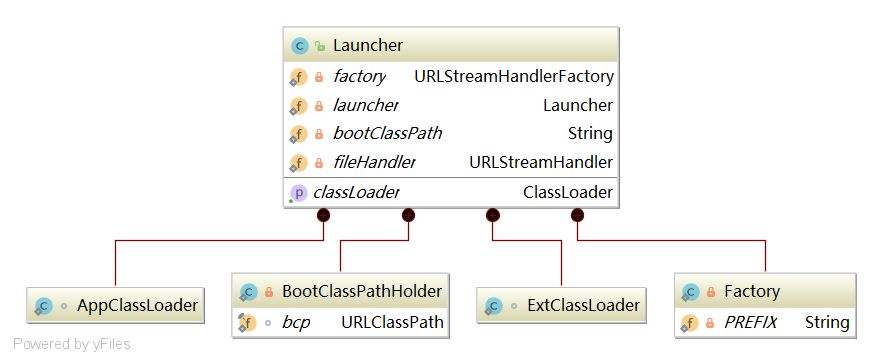

# 深入理解类加载器

> 时间：2018-10-24

-   [1. 类加载机制](#r-1)
-   [2. 类加载器简介](#r-2)
-   [3. 双亲委派模式](#r-3)
    -   [3.1 双亲委派模式概念以及原理](#r-3-1)
    -   [3.2 sun.misc.Launcher 介绍](#r-3-2)

---

## <a id="r-1">1. 类加载机制</a>

在讲类加载器之前，让我们来谈谈类加载机制。


-   加载阶段

    主要做了 3 件事情：

    1.  通过一个类的全限定名来获取此类的二进制字节流；
    1.  将这个字节流所代表的静态存储结构转化为方法区的运行时数据结构；
    1.  为这个类在内存中创建一个 java.lang.Class 对象，作为方法区该类的数据访问入口。

-   连接阶段

    1.  验证

        主要是为了防止加载进来的字节流信息危害到虚拟机自身的安全，包括：文件格式验证、元数据验证、字节码验证和符号引用验证。

    1.  准备

        根据加载进来的类的二进制字节流所代表的类变量（static 修饰的变量） **分配内存** 和 设置类变量的初始值。

        >   这里讲的初始值是初始值

        Java 基本数据类型的零值

        | 数据类型 | 零值 |
        | :-: | :-: |
        |int|0|
        |long|0L|
        |short|(short)0|
        |char|'\u0000'|
        |byte|(byte)0|
        |boolean|false|
        |float|0.0f|
        |double|0.0d|
        |reference|null|

        > 被 final static 这两个同时修饰的变量将直接初始化。

    1.  解析

        将加载进来的二进制字符流中的符号引用转换成直接引用。

        -   符号引用：由一组字面量组成，用来表示所引用的对象；
        -   直接引用：是直接指向目标的指针、相对偏移量或一个能间接定位到目标的句柄；

-   初始化

    类加载最后阶段，是执行类构造器 `<clinit>()` 方法的过程。
    
    若该类具有超类，则对其进行初始化，执行静态初始化器和静态初始化成员变量（如前面准备阶段只初始化了默认值的 static 变量将会在这个阶段赋值，成员变量也将被初始化）。

## <a id="r-2">2. 类加载器简介</a>

上面简单介绍了类加载的机制，在加载阶段，Java 虚拟机会利用类加载器通过类的全限定名来获取该类的二进制字节流。

JVM 提供了 3 种类加载器：

1.  Bootstrap ClassLoader（启动类加载器）

    启动类加载器主要加载的是 JVM 自身需要的类，这个类加载器是由 C++ 实现的。
    
    启动类加载器将负责加载 `<JAVA_HOME>/lib` 路径下的核心类或 `-Xbootclasspath` 参数指定的路径下的 `jar包` 加载到内存中。

    > 注意：由于虚拟机是按照文件名识别要加载的 `jar包`，如：rt.jar。如果，将其他名称的 `jar包` 放到这个路径下面也是不会被加载进去。

1.  Extension ClassLoader（扩展类加载器）

    扩展类加载器指的是 `sun.misc.Launcher$ExtClassLoader` 类，这个类是由 Java 代码实现的。

    扩展类加载器主要负责加载 `<JAVA_HOME>/lib/ext` 或 `-Djava.ext.dir` 路径下的 `jar包`。

1.  Application ClassLoader（应用程序类加载器）

    应用程序类加载器指的是 `sun.misc.Launcher$AppClassLoader` 类，这个类也是由 Java 代码实现的。

    应用程序类加载器负责加载系统路径 `java -classpath` 或 `-D java.class.path` 路径下的 `jar包`。

## <a id="r-3">3. 双亲委派模式</a>

从 Java 虚拟机的角度来讲，只存在两种类加载器：一种是启动类加载器，是虚拟机自身的一部分；另一种就是其他的类加载器，这些加载器都是由 Java 语言实现的，独立于虚拟机外部，并且全部继承自 `java.lang.ClassLoader` 这个抽象类。

### <a id="r-3-1">3.1 双亲委派模式简介</a>

>   注意：下面的模式图是逻辑上父子关系，而不是代码上的继承关系。


双亲委派模型要求除了顶层的启动类加载器之外，其他的类加载器都应当有自己的父类加载器。

双亲委派模式过程如下：如果一个类加载器收到了类加载的请求，它首先不会自己去尝试加载这个类，而是将这个请求委派给父类加载器去完成，每一层次的类加载器都是如此。因此所有的加载请求最终都应该委派到顶层的启动类加载器中，只有当父加载器反馈自己无法完成这个加载请求时，子类加载器才会去尝试自己加载。

### <a id="r-3-2">3.2 sun.misc.Launcher 介绍</a>

Launcher 只是一个封装了虚拟机的执行外壳，由它负责装载 JRE 环境和 windows 平台下的 `jvm.dll` 动态链接库。简单来讲，Launcher 就是 Java 程序的入口。

下面来看看，Launcher 内部结构。



#### 3.2.1 Launcher 构造方法

省略不必要的代码

```java
public class Launcher {

    private static Launcher launcher = new Launcher();

    public static Launcher getLauncher() {
        return launcher;
    }

    public Launcher() {
        Launcher.ExtClassLoader var1;
        try {
            var1 = Launcher.ExtClassLoader.getExtClassLoader();
        } catch (IOException var10) {
            throw new InternalError("Could not create extension class loader");
        }

        try {
            this.loader = Launcher.AppClassLoader.getAppClassLoader(var1);
        } catch (IOException var9) {
            throw new InternalError("Could not create application class loader");
        }

        Thread.currentThread().setContextClassLoader(this.loader);
        String var2 = System.getProperty("java.security.manager");
        if (var2 != null) {
            SecurityManager var3 = null;
            if (!"".equals(var2) && !"default".equals(var2)) {
                try {
                    var3 = (SecurityManager)this.loader.loadClass(var2).newInstance();
                } catch (IllegalAccessException var5) {
                    ;
                } catch (InstantiationException var6) {
                    ;
                } catch (ClassNotFoundException var7) {
                    ;
                } catch (ClassCastException var8) {
                    ;
                }
            } else {
                var3 = new SecurityManager();
            }

            if (var3 == null) {
                throw new InternalError("Could not create SecurityManager: " + var2);
            }

            System.setSecurityManager(var3);
        }

    }
}
```