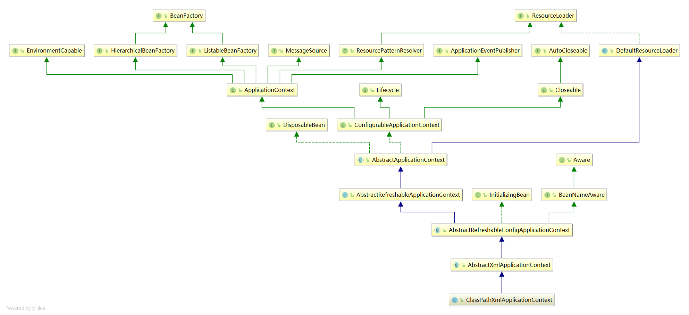
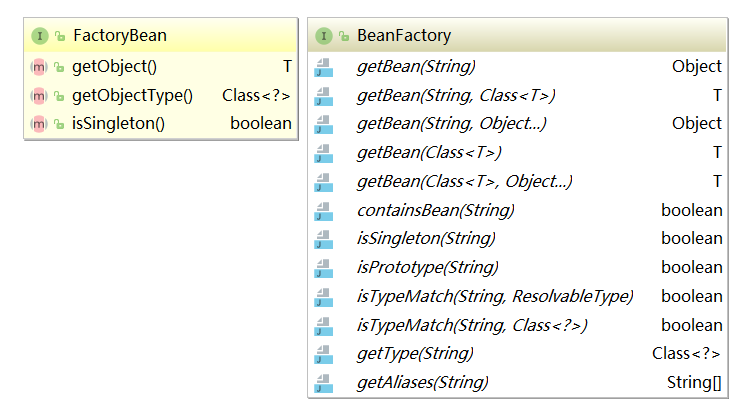

# <a id="sp-1">BeanFactory与FactoryBean之间的区别？</a>

同：
- 都是接口。
- 都在同一个包下`org.springframework.beans.factory`。

异：
- **FactoryBean** 是让 IoC 容器中的 Bean 能够更加简单的生成出来。FactoryBean 是一个工厂用来创建和返回指定 Bean 对象。
    
    1.  FactoryBean code

    ```java
    org.springframework.beans.factory.FactoryBean<T>
    org.springframework.beans.factory.FactoryBean.getObject()
    org.springframework.beans.factory.FactoryBean.getObjectType()
    org.springframework.beans.factory.FactoryBean.isSingleton()
    ```

    2. FactoryBean Usage Example

    首先创建 FactoryBean 的实现类 - ToolFactory。ToolFactory 是用来生产 Tool 实例对象。

    ```java
    package com.wfms.spring.selftest;

    import org.springframework.beans.factory.FactoryBean;

    public class ToolFactory implements FactoryBean<Tool> {
        
        private int factoryId;
        private int toolId;
        
        @Override
        public Tool getObject() throws Exception {
            return new Tool(toolId);
        }

        @Override
        public Class<?> getObjectType() {
            return Tool.class;
        }

        @Override
        public boolean isSingleton() {
            return true;
        }

        public int getFactoryId() {
            return factoryId;
        }

        public int getToolId() {
            return toolId;
        }

        public void setFactoryId(int factoryId) {
            this.factoryId = factoryId;
        }

        public void setToolId(int toolId) {
            this.toolId = toolId;
        }

    }

    package com.wfms.spring.selftest;

    public class Tool {

        private int id;

        public Tool(int id) {
            this.id = id;
        }

        public int getId() {
            return id;
        }

        public void setId(int id) {
            this.id = id;
        }
        
    }
    ```

    `factorybean-bean.xml` 通过 xml 文件格式来装配 bean。

    ```xml
    <?xml version="1.0" encoding="UTF-8"?>
    <beans xmlns="http://www.springframework.org/schema/beans"
        xmlns:xsi="http://www.w3.org/2001/XMLSchema-instance"
        xsi:schemaLocation="http://www.springframework.org/schema/beans http://www.springframework.org/schema/beans/spring-beans.xsd">


        <bean id="tool" class="com.wfms.spring.selftest.ToolFactory">
            <property name="factoryId" value="9090"/>
            <property name="toolId" value="1"/>
        </bean>
    </beans>
    ```

    测试代码如下：

    ```java
    //Test
    package com.wfms.spring.selftest;

    import static org.junit.Assert.assertEquals;
    import static org.junit.Assert.assertNotNull;

    import org.junit.Test;
    import org.junit.runner.RunWith;
    import org.springframework.beans.factory.annotation.Autowired;
    import org.springframework.context.support.ClassPathXmlApplicationContext;
    import org.springframework.test.context.ContextConfiguration;
    import org.springframework.test.context.junit4.SpringJUnit4ClassRunner;

    @RunWith(SpringJUnit4ClassRunner.class)
    @ContextConfiguration(locations="classpath:spring/selftest/factorybean-bean.xml")
    public class FactoryBeanTest {

        @Autowired
        private ToolFactory toolFactory;
        
        @Test
        public void testToolFactoryBean() {
            assertNotNull(toolFactory);
            assertEquals(1, toolFactory.getToolId());
            assertEquals(9090, toolFactory.getFactoryId());
        }
        
        @Test
        public void testToolFactoryBeanCreateByClassPathXmlApplicationContext() {
            String locationPath = "classpath:/spring/selftest/factorybean-bean.xml";
            ClassPathXmlApplicationContext context = new ClassPathXmlApplicationContext(locationPath);
            /**
             * 这里通过ClassPathXmlApplicationContext来获取Bean对象
             * 获取的对象并不是ToolFactory对象，而是Tool对象。
             */
            Tool tool = context.getBean("tool", Tool.class);
            /**
             * 可以通过'&'来得到FactoryBean的本身
             */
            ToolFactory toolFactory = context.getBean("&tool", ToolFactory.class);
            
            assertNotNull(tool);
            assertEquals(1, tool.getId());

            assertNotNull(toolFactory);
        }
    }
    ```

    这里的 ClassPathXmlApplicationContext 实际上是 BeanFactory 接口的一个实现类。

    

- **BeanFactory** 是 IoC 最基本的容器，可以通过 IoC 容器来生产和管理 Bean，为其他的 IoC 容器提供了最基本的规范。

#### 总结



在大多数情况下，我们不会直接使用或实现 BeanFactory 接口，除非你正在扩展框架的核心功能。当你有需要 Spring 管理的工厂创建的对象时，你就需要实现 FactoryBean。更简洁地说，BeanFactory 表示Spring 容器，FactoryBean 表示工厂类，其创建的对象被获取并作为容器中的bean注册。

参考： 
[geekAbyte](http://www.geekabyte.io/2014/11/difference-between-beanfactory-and.html)

##  [BACK](../../mds/summary.md)