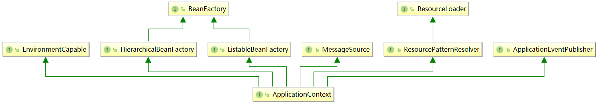
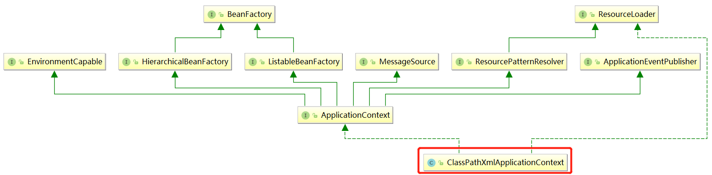

# <a id="sp-2">BeanFactory 和 ApplicationContext 之间的区别？</a>

首先看一下 BeanFactory 与 ApplicationContext 之间的继承关系图。 



-   BeanFactory 是 ApplicationContext 的父接口。 
-   BeanFactory 和 ApplicationContext 都可以看做是 IoC 容器的具体表现形式。而 **BeanFactory** 是 IoC 容器基本的功能规范，**ApplicationContext** 只是其中的一种 IoC 容器的表现形式。


具体 BeanFactory 与 ApplicationContext 之间有什么区别，可以从2个方向来对比一下：   
1.  应用场景：   
    -   BeanFactory 定义了很多接口方法：   
        -   **FACTORY_BEAN_PREFIX**，可以通过`&`来获取指定的FactoryBean的对象。
        -   **getBean**，可以获取IoC容器中指定的Bean对象。
        -   **containsBean**，让用户能够判断容器是否含有指定名字的Bean。
        -   **isSingleton**，查询指定名字的Bean是否是Singleton属性。
        -   **isPrototype**，查询指定名字的Bean是否是prototype类型。
        -   **isTypeMatch**，判断Bean的类型是否与指定的类型一致。
        -   **getType**，获取指定名字Bean的类型。
        -   **getAliases**，查询指定名字Bean的所有别名。
    -   ApplicationContext

          
        
        从 ApplicationContext 的继承图可以看出，ApplicationContext 不但继承了 BeanFactory 还继承了其他接口，比如 MessageSource, ApplicationEventPublisher, ResourcePatternResolver等等。所以说 ApplicationContext 是一个功能更加丰富的 IoC 容器。

2.  设计原理：

    >   BeanFactory (以 DefaultListableBeanFactory 为例)

    

    -   **DefaultListableBeanFactory** 可以被看做是一个默认的功能完整的 IoC 容器。

        下面通过 DefaultListableBeanFactory 来初始化 IoC 容器的事例来感受一下 BeanFactory：  
        
        ```xml
        <?xml version="1.0" encoding="UTF-8"?>
        <beans xmlns="http://www.springframework.org/schema/beans"
            xmlns:xsi="http://www.w3.org/2001/XMLSchema-instance"
            xsi:schemaLocation="http://www.springframework.org/schema/beans http://www.springframework.org/schema/beans/spring-beans.xsd">


            <bean id="tool" class="com.wfms.spring.selftest.ToolFactory">
                <property name="factoryId" value="9090"/>
                <property name="toolId" value="1"/>
            </bean>
        </beans>

        ```
        
        ```java
        @Test
        public void testDefaultListableBeanFactory() {
            // Resource 定位
            ClassPathResource resource = new ClassPathResource("/spring/selftest/factorybean-bean.xml");
            // 创建一个BeanFactory，这里使用DefaultListableBeanFactory
            DefaultListableBeanFactory factory = new DefaultListableBeanFactory();
            // 创建一个载入BeanDefinition的读取器
            XmlBeanDefinitionReader read = new XmlBeanDefinitionReader(factory);
            // 将BeanDefinition载入
            read.loadBeanDefinitions(resource);

            // 测试
            Tool tool = factory.getBean("tool", Tool.class);
		    ToolFactory toolFactory = factory.getBean("&tool", ToolFactory.class);

            assertNotNull(tool);
            assertNotNull(toolFactory);
            assertEquals(1, tool.getId());
        }
        ```
    -   ApplicationContext(以 ClassPathXmlApplicationContext 为例)

        

        ```java
        @Test
        public void testClassPathXmlApplicationContext() {
            ClassPathXmlApplicationContext context = new ClassPathXmlApplicationContext("classpath:/spring/selftest/factorybean-bean.xml");
            Tool tool = context.getBean("tool", Tool.class);
            ToolFactory toolFactory = context.getBean("&tool", ToolFactory.class);
            
            //test
            assertNotNull(tool);
            assertNotNull(toolFactory);
            assertEquals(1, tool.getId());
        }
        ```

        相比较 BeanFactory，通过 ApplicationContext 封装了 BeanDefinition 的 Resource 的定位、载入和注册这些过程。我们只需要将 Resource 文件的地址传入进去即可。

        

#### 总结

BeanFactory 就是一个 IoC 容器的规范。所有的 IoC 容器的实现都必须遵循这个规范。而 ApplicationContext 是 IoC 其中的一个具体实现并且增加了一些附属的功能，比如支持国际化的实现、可以从不同的地方获取 BeanDefinition 的定义信息等。对于开发而言，ApplicationContext 简化了代码。但纯粹的 IoC 容器并不是一无是处，使用类似 **DefaultListableBeanFactory** 这种底层的容器，能够提高定制IoC容器的灵活性。

##  [BACK](../../mds/summary.md)