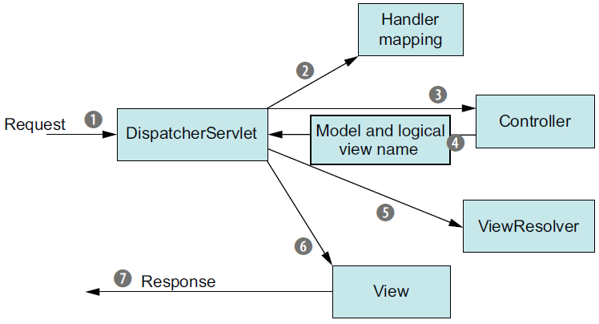

# Spring MVC 的工作流程介绍

1.  用户请求页面或者提交表单时，请求会发送到 DispatcherServlet。DispatcherServlet 决定了请求下一站的去向。

2.  DispatcherServlet 将根据请求的 URL 信息，在一个或者多个 Handler mapping 中查询，从而决定合适的 Controller。

3.  找到合适的 Controller 之后，DispatcherServlet 将请求发送给选中的 Controller 同时将请求信息转交给 Controller 并等待 Controller 处理这些信息。

4.  Controller 完成处理之后，会产生一些信息，这些信息是需要返回到页面供用户浏览的，我们称之为 model。Controller 完成信息处理，将 model 和 view name 发送返回给 DispatcherServlet。

5.  从 Controller 那里发送过来的 view name 只是一个逻辑名称，这还需要视图解析器（ViewResolver）来按照这个逻辑名匹配一个特定的视图实现。

6.  找到特定的视图实现之后，Dispatcher 将 model 交付给该视图。视图使用 model 来渲染输出。

7.  最后视图将通过响应对象传递给客户端。

##  [BACK](../../mds/summary.md)