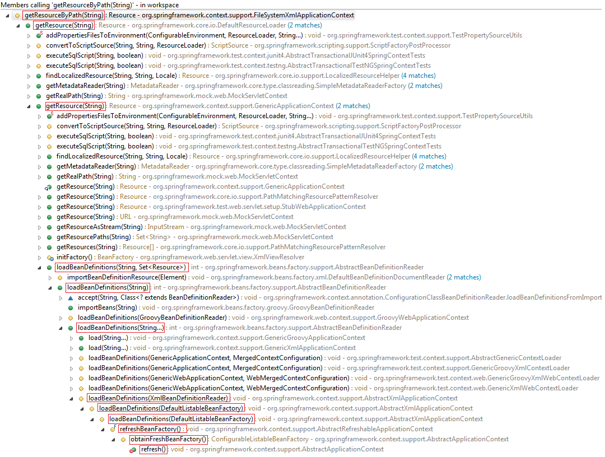

# <a id="sp-4">Spring IoC的初始化过程</a>

我们知道IoC容器最常用的就是ApplicationContext和BeanFactory这两个。接下来我们就以Spring4.3.14中的**org.springframework.context.support.FileSystemXmlApplicationContext**为例，来深入了解下IoC的初始化过程。

-   ## Resource定位    
    
    > 这个阶段的目的就是对**BeanDefinition**资源的path进行解析，然后生成一个**org.springframework.core.io.Resource**对象供后面载入和解析。

    看一下FileSystemXmlApplicationContext的继承关系以及其内部方法。
    

    看到FileSystemXmlApplicationContext中的 **getResourceByPath(String)** 是否心生疑惑，这个方法有什么用？什么时候会被调用？

    可以先看一下，**getResourceByPath(String)** 的方法调用栈。下面就跟着这张方法调用栈来看看每个方法的实现。

    

    从上述的方法调用栈可以看出，**getResourceByPath(String)** 最开始是在FileSystemXmlApplicationContext的构造方法的 **refresh()** 中开始的，同时这个方法也是 **IoC初始化** 的入口。

    ```java
    public FileSystemXmlApplicationContext(
			String[] configLocations, boolean refresh, @Nullable ApplicationContext parent)
			throws BeansException {

		super(parent);
            //设置BeanDefinitions路径
		setConfigLocations(configLocations);
		if (refresh) {
		    refresh();
		}
	}
    ```

    ```java
    public void setConfigLocations(@Nullable String... locations) {
		if (locations != null) {
			Assert.noNullElements(locations, "Config locations must not be null");
			this.configLocations = new String[locations.length];
			for (int i = 0; i < locations.length; i++) {
				this.configLocations[i] = resolvePath(locations[i]).trim();
			}
		}
		else {
			this.configLocations = null;
		}
	}
    ```

    接下来看 **org.springframework.context.support.AbstractApplicationContext.refresh()** 方法。从上面的继承图可以看出，refresh这个方法是实现自 **org.springframework.context.ConfigurableApplicationContext** 这个接口。

    ```java
    /**
	 * Load or refresh the persistent representation of the configuration,
	 * which might an XML file, properties file, or relational database schema.
	 * <p>As this is a startup method, it should destroy already created singletons
	 * if it fails, to avoid dangling resources. In other words, after invocation
	 * of that method, either all or no singletons at all should be instantiated.
	 * @throws BeansException if the bean factory could not be initialized
	 * @throws IllegalStateException if already initialized and multiple refresh
	 * attempts are not supported
	 */
	void refresh() throws BeansException, IllegalStateException;
    ```

    refresh()方法详细的描述了ApplicationContext初始化的整个过程。

    ```java
    @Override
	public void refresh() throws BeansException, IllegalStateException {
		synchronized (this.startupShutdownMonitor) {
			// Prepare this context for refreshing.
			prepareRefresh();

			// Tell the subclass to refresh the internal bean factory.
			ConfigurableListableBeanFactory beanFactory = obtainFreshBeanFactory();

			// Prepare the bean factory for use in this context.
			prepareBeanFactory(beanFactory);

			try {
				// Allows post-processing of the bean factory in context subclasses.
				postProcessBeanFactory(beanFactory);

				// Invoke factory processors registered as beans in the context.
				invokeBeanFactoryPostProcessors(beanFactory);

				// Register bean processors that intercept bean creation.
				registerBeanPostProcessors(beanFactory);

				// Initialize message source for this context.
				initMessageSource();

				// Initialize event multicaster for this context.
				initApplicationEventMulticaster();

				// Initialize other special beans in specific context subclasses.
				onRefresh();

				// Check for listener beans and register them.
				registerListeners();

				// Instantiate all remaining (non-lazy-init) singletons.
				finishBeanFactoryInitialization(beanFactory);

				// Last step: publish corresponding event.
				finishRefresh();
			}

			catch (BeansException ex) {
				if (logger.isWarnEnabled()) {
					logger.warn("Exception encountered during context initialization - " +
							"cancelling refresh attempt: " + ex);
				}

				// Destroy already created singletons to avoid dangling resources.
				destroyBeans();

				// Reset 'active' flag.
				cancelRefresh(ex);

				// Propagate exception to caller.
				throw ex;
			}

			finally {
				// Reset common introspection caches in Spring's core, since we
				// might not ever need metadata for singleton beans anymore...
				resetCommonCaches();
			}
		}
    ```

    obtainFreshBeanFactory这个方法是告诉AbstractApplication的子类(这里是FileSystemXmlApplicationContext)刷新内部的Bean Factory。

    ```java
    protected ConfigurableListableBeanFactory obtainFreshBeanFactory() {
		refreshBeanFactory();
		ConfigurableListableBeanFactory beanFactory = getBeanFactory();
		if (logger.isDebugEnabled()) {
			logger.debug("Bean factory for " + getDisplayName() + ": " + beanFactory);
		}
		return beanFactory;
	}
    ```

    先调用了 **refreshBeanFactory()** 根据BeanDefinition的位置来刷新Bean Factory。

    ### 思考：
    为什么说这个方法会去读取BeanDefinition的位置？虽然这个方法没有参数，但是根据方法名可知，其内部实现一定会有去读取BeanDefinition位置的步骤。

    继续往下看，这里refreshBeanFactory()根据继承关系调用的是 **org.springframework.context.support.AbstractRefreshableApplicationContext**中的refreshBeanFactory方法。

    ```java
    @Override
	protected final void refreshBeanFactory() throws BeansException {
            //先判断Bean Factory是否已经存在
            //如果存在就销毁存在的Bean Factory
		if (hasBeanFactory()) {
			destroyBeans();
			closeBeanFactory();
		}
		try {
                    //创建一个Bean Factory
			DefaultListableBeanFactory beanFactory = createBeanFactory();
			beanFactory.setSerializationId(getId());
			customizeBeanFactory(beanFactory);
                    //加载BeanFactory
			loadBeanDefinitions(beanFactory);
			synchronized (this.beanFactoryMonitor) {
				this.beanFactory = beanFactory;
			}
		}
		catch (IOException ex) {
			throw new ApplicationContextException("I/O error parsing bean definition source for " + getDisplayName(), ex);
		}
	}
    ```

    从 **refreshBeanFactory** 中可以获取两个信息：
    1.  这里的BeanFactory使用的是 **DefaultListableBeanFactory** 。从这里也可以看出，其实 **ApplicationContext** 是封装了BeanFactory初始化的步骤。
    2.  开始加载BeanDefinitions。既然要加载，必然需要先定位BeanDefinition的位置。

    这里调用的是 **org.springframework.context.support.AbstractXmlApplicationContext.loadBeanDefinitions()** 。

    ```java
    protected void loadBeanDefinitions(DefaultListableBeanFactory beanFactory) throws BeansException, IOException {
		// 为给定的BeanFactory创建出一个XmlBeanDefinitionReader
		XmlBeanDefinitionReader beanDefinitionReader = new XmlBeanDefinitionReader(beanFactory);

		// 给这个BeanDifinitionReader配置加载资源
		beanDefinitionReader.setEnvironment(this.getEnvironment());
		beanDefinitionReader.setResourceLoader(this);
		beanDefinitionReader.setEntityResolver(new ResourceEntityResolver(this));

		// 允许AbstractXmlApplicationContext的子类自定义reader的初始化过程
		initBeanDefinitionReader(beanDefinitionReader);
            // 开始加载BeanDefinition
		loadBeanDefinitions(beanDefinitionReader);
	}
    ```

    ```java
    protected void loadBeanDefinitions(XmlBeanDefinitionReader reader) throws BeansException, IOException {
		Resource[] configResources = getConfigResources();
		if (configResources != null) {
			reader.loadBeanDefinitions(configResources);
		}
		String[] configLocations = getConfigLocations();
		if (configLocations != null) {
			reader.loadBeanDefinitions(configLocations);
		}
	}
    ```    

    可以看到里面提供了两个获取BeanDefinition的定位方式。
    1.  getConfigResources()
    2.  getConfigLocations()

    根据 **getResourceByPath(String)** 的方法调用栈来看，我们会调用getConfigLocations();

    ```java
    @Nullable
	protected String[] getConfigLocations() {
            //在FileSystemXmlApplicationContext的构造函数中曽调用过setConfigLocations(String[])
            //所以这里直接就是返回了当时设定的BeanDefinition的路径
		return (this.configLocations != null ? this.configLocations : getDefaultConfigLocations());
	}
    ```

    接着开始调用 `reader.loadBeanDefinitions(configLocations);`

    ```java
    @Override
	public int loadBeanDefinitions(String... locations) throws BeanDefinitionStoreException {
		Assert.notNull(locations, "Location array must not be null");
		int counter = 0;
		for (String location : locations) {
			counter += loadBeanDefinitions(location);
		}
		return counter;
	}

    public int loadBeanDefinitions(String location) throws BeanDefinitionStoreException {
		return loadBeanDefinitions(location, null);
	}
    ```

    经过上面的层层调用终于到了真正加载BeanDefinition的方法 **org.springframework.beans.factory.support.AbstractBeanDefinitionReader.loadBeanDefinitions(String, Set)** 。

    ```java
    public int loadBeanDefinitions(String location, @Nullable Set<Resource> actualResources) throws BeanDefinitionStoreException {
		ResourceLoader resourceLoader = getResourceLoader();
		if (resourceLoader == null) {
			throw new BeanDefinitionStoreException(
					"Cannot import bean definitions from location [" + location + "]: no ResourceLoader available");
		}

		if (resourceLoader instanceof ResourcePatternResolver) {
			// Resource pattern matching available.
			try {
				Resource[] resources = ((ResourcePatternResolver) resourceLoader).getResources(location);
				int loadCount = loadBeanDefinitions(resources);
				if (actualResources != null) {
					for (Resource resource : resources) {
						actualResources.add(resource);
					}
				}
				if (logger.isDebugEnabled()) {
					logger.debug("Loaded " + loadCount + " bean definitions from location pattern [" + location + "]");
				}
				return loadCount;
			}
			catch (IOException ex) {
				throw new BeanDefinitionStoreException(
						"Could not resolve bean definition resource pattern [" + location + "]", ex);
			}
		}
		else {
			// Can only load single resources by absolute URL.
			Resource resource = resourceLoader.getResource(location);
			int loadCount = loadBeanDefinitions(resource);
			if (actualResources != null) {
				actualResources.add(resource);
			}
			if (logger.isDebugEnabled()) {
				logger.debug("Loaded " + loadCount + " bean definitions from location [" + location + "]");
			}
			return loadCount;
		}
	}
    ```

    这里走 **else** 分支，调用resourceLoader.getResource(location)进行获取Resource对象。

    ```java
    public Resource getResource(String location) {
		Assert.notNull(location, "Location must not be null");

		for (ProtocolResolver protocolResolver : this.protocolResolvers) {
			Resource resource = protocolResolver.resolve(location, this);
			if (resource != null) {
				return resource;
			}
		}

		if (location.startsWith("/")) {
			return getResourceByPath(location);
		}
		else if (location.startsWith(CLASSPATH_URL_PREFIX)) {
			return new ClassPathResource(location.substring(CLASSPATH_URL_PREFIX.length()), getClassLoader());
		}
		else {
			try {
				// Try to parse the location as a URL...
				URL url = new URL(location);
				return (ResourceUtils.isFileURL(url) ? new FileUrlResource(url) : new UrlResource(url));
			}
			catch (MalformedURLException ex) {
				// No URL -> resolve as resource path.
				return getResourceByPath(location);
			}
		}
	}
    ```

    因为**FileSystemXmlApplicationContext**重写了getResourceByPath(String)这个方法，所以最后调用了重写的方法，返回了一个 **FileSystemContextResource** 对象。

    ```java
    protected Resource getResourceByPath(String path) {
		if (path.startsWith("/")) {
			path = path.substring(1);
		}
		return new FileSystemContextResource(path);
	}
    ```

    至此，我们已经完整的了解了BeanDefinition的定位过程。

-   ## BeanDefinition的载入和解析。
    将用户定义好的Bean表示成IoC容器内部的数据结构，这个容器内部的数据结构就是BeanDefinition。

    上面的 `getResourceByPath(String)` 返回了Resource对象，接着就开始了BeanDefinition的载入。这里将调用 **org.springframework.beans.factory.xml.XmlBeanDefinitionReader.loadBeanDifinitions(Resource)**

    ```java
    public int loadBeanDefinitions(Resource resource) throws BeanDefinitionStoreException {
		return loadBeanDefinitions(new EncodedResource(resource));
	}

    public int loadBeanDefinitions(EncodedResource encodedResource) throws BeanDefinitionStoreException {
		Assert.notNull(encodedResource, "EncodedResource must not be null");
		if (logger.isInfoEnabled()) {
			logger.info("Loading XML bean definitions from " + encodedResource.getResource());
		}

		Set<EncodedResource> currentResources = this.resourcesCurrentlyBeingLoaded.get();
		if (currentResources == null) {
			currentResources = new HashSet<>(4);
			this.resourcesCurrentlyBeingLoaded.set(currentResources);
		}
		if (!currentResources.add(encodedResource)) {
			throw new BeanDefinitionStoreException(
					"Detected cyclic loading of " + encodedResource + " - check your import definitions!");
		}
		try {
                    // 获取到XML文件，并得到IO的InputSource准备进行加载
			InputStream inputStream = encodedResource.getResource().getInputStream();
			try {
				InputSource inputSource = new InputSource(inputStream);
				if (encodedResource.getEncoding() != null) {
					inputSource.setEncoding(encodedResource.getEncoding());
				}
                            //加载BeanDefinition
				return doLoadBeanDefinitions(inputSource, encodedResource.getResource());
			}
			finally {
				inputStream.close();
			}
		}
		catch (IOException ex) {
			throw new BeanDefinitionStoreException(
					"IOException parsing XML document from " + encodedResource.getResource(), ex);
		}
		finally {
			currentResources.remove(encodedResource);
			if (currentResources.isEmpty()) {
				this.resourcesCurrentlyBeingLoaded.remove();
			}
		}
	}
    ```

    通过调用 `doLoadBeanDefinitions(inputSource, encodedResource.getResource())` 来解析

    ```java
    protected int doLoadBeanDefinitions(InputSource inputSource, Resource resource)
			throws BeanDefinitionStoreException {
		try {
                    //取得XML文件的Document对象
			Document doc = doLoadDocument(inputSource, resource);
			return registerBeanDefinitions(doc, resource);
		}
		catch (BeanDefinitionStoreException ex) {
			throw ex;
		}
		catch (SAXParseException ex) {
			throw new XmlBeanDefinitionStoreException(resource.getDescription(),
					"Line " + ex.getLineNumber() + " in XML document from " + resource + " is invalid", ex);
		}
		catch (SAXException ex) {
			throw new XmlBeanDefinitionStoreException(resource.getDescription(),
					"XML document from " + resource + " is invalid", ex);
		}
		catch (ParserConfigurationException ex) {
			throw new BeanDefinitionStoreException(resource.getDescription(),
					"Parser configuration exception parsing XML from " + resource, ex);
		}
		catch (IOException ex) {
			throw new BeanDefinitionStoreException(resource.getDescription(),
					"IOException parsing XML document from " + resource, ex);
		}
		catch (Throwable ex) {
			throw new BeanDefinitionStoreException(resource.getDescription(),
					"Unexpected exception parsing XML document from " + resource, ex);
		}
	}
    ```

    其实到这里，已经完成了加载的阶段。

    解析BeanDefinition有两个过程：
    1.  将XML文件转换成document对象。
    2.  spring再对document对象按照Bean的规则进行解析。

    接下来看看spring是如何按照Bean的规则对Bean进行解析。

    ```java
    public int registerBeanDefinitions(Document doc, Resource resource) throws BeanDefinitionStoreException {
		BeanDefinitionDocumentReader documentReader = createBeanDefinitionDocumentReader();
		int countBefore = getRegistry().getBeanDefinitionCount();
            //spring按照Bean的规则开始解析BeanDefinition
		documentReader.registerBeanDefinitions(doc, createReaderContext(resource));
		return getRegistry().getBeanDefinitionCount() - countBefore;
	}

    public void registerBeanDefinitions(Document doc, XmlReaderContext readerContext) {
		this.readerContext = readerContext;
		logger.debug("Loading bean definitions");
		Element root = doc.getDocumentElement();
            //开始进行解析并且注册BeanDefinitions
		doRegisterBeanDefinitions(root);
	}

    protected void doRegisterBeanDefinitions(Element root) {
		BeanDefinitionParserDelegate parent = this.delegate;
		this.delegate = createDelegate(getReaderContext(), root, parent);

		if (this.delegate.isDefaultNamespace(root)) {
			String profileSpec = root.getAttribute(PROFILE_ATTRIBUTE);
			if (StringUtils.hasText(profileSpec)) {
				String[] specifiedProfiles = StringUtils.tokenizeToStringArray(
						profileSpec, BeanDefinitionParserDelegate.MULTI_VALUE_ATTRIBUTE_DELIMITERS);
				if (!getReaderContext().getEnvironment().acceptsProfiles(specifiedProfiles)) {
					if (logger.isInfoEnabled()) {
						logger.info("Skipped XML bean definition file due to specified profiles [" + profileSpec +
								"] not matching: " + getReaderContext().getResource());
					}
					return;
				}
			}
		}

		preProcessXml(root);
            //解析BeanDefinitions
		parseBeanDefinitions(root, this.delegate);
		postProcessXml(root);

		this.delegate = parent;
	}

    protected void parseBeanDefinitions(Element root, BeanDefinitionParserDelegate delegate) {
		if (delegate.isDefaultNamespace(root)) {
			NodeList nl = root.getChildNodes();
			for (int i = 0; i < nl.getLength(); i++) {
				Node node = nl.item(i);
				if (node instanceof Element) {
					Element ele = (Element) node;
					if (delegate.isDefaultNamespace(ele)) {
                                            //采用默认的解析方式
						parseDefaultElement(ele, delegate);
					}
					else {
						delegate.parseCustomElement(ele);
					}
				}
			}
		}
		else {
			delegate.parseCustomElement(root);
		}
	}

    private void parseDefaultElement(Element ele, BeanDefinitionParserDelegate delegate) {
		if (delegate.nodeNameEquals(ele, IMPORT_ELEMENT)) {
			importBeanDefinitionResource(ele);
		}
		else if (delegate.nodeNameEquals(ele, ALIAS_ELEMENT)) {
			processAliasRegistration(ele);
		}
		else if (delegate.nodeNameEquals(ele, BEAN_ELEMENT)) {
            //解析BeanDefinitions
			processBeanDefinition(ele, delegate);
		}
		else if (delegate.nodeNameEquals(ele, NESTED_BEANS_ELEMENT)) {
			// recurse
			doRegisterBeanDefinitions(ele);
		}
	}

    protected void processBeanDefinition(Element ele, BeanDefinitionParserDelegate delegate) {
		BeanDefinitionHolder bdHolder = delegate.parseBeanDefinitionElement(ele);
		if (bdHolder != null) {
			bdHolder = delegate.decorateBeanDefinitionIfRequired(ele, bdHolder);
			try {
				// Register the final decorated instance.
				BeanDefinitionReaderUtils.registerBeanDefinition(bdHolder, getReaderContext().getRegistry());
			}
			catch (BeanDefinitionStoreException ex) {
				getReaderContext().error("Failed to register bean definition with name '" +
						bdHolder.getBeanName() + "'", ele, ex);
			}
			// Send registration event.
			getReaderContext().fireComponentRegistered(new BeanComponentDefinition(bdHolder));
		}
	}

    protected void parseBeanDefinitions(Element root, BeanDefinitionParserDelegate delegate) {
		if (delegate.isDefaultNamespace(root)) {
			NodeList nl = root.getChildNodes();
			for (int i = 0; i < nl.getLength(); i++) {
				Node node = nl.item(i);
				if (node instanceof Element) {
					Element ele = (Element) node;
					if (delegate.isDefaultNamespace(ele)) {
                                            //进行默认解析
						parseDefaultElement(ele, delegate);
					}
					else {
						delegate.parseCustomElement(ele);
					}
				}
			}
		}
		else {
			delegate.parseCustomElement(root);
		}
	}

    private void parseDefaultElement(Element ele, BeanDefinitionParserDelegate delegate) {
		if (delegate.nodeNameEquals(ele, IMPORT_ELEMENT)) {
			importBeanDefinitionResource(ele);
		}
		else if (delegate.nodeNameEquals(ele, ALIAS_ELEMENT)) {
			processAliasRegistration(ele);
		}
		else if (delegate.nodeNameEquals(ele, BEAN_ELEMENT)) {
                    //解析BeanDefinition
			processBeanDefinition(ele, delegate);
		}
		else if (delegate.nodeNameEquals(ele, NESTED_BEANS_ELEMENT)) {
			// recurse
			doRegisterBeanDefinitions(ele);
		}
	}

    protected void processBeanDefinition(Element ele, BeanDefinitionParserDelegate delegate) {
            // 开始解析
		BeanDefinitionHolder bdHolder = delegate.parseBeanDefinitionElement(ele);
		if (bdHolder != null) {
			bdHolder = delegate.decorateBeanDefinitionIfRequired(ele, bdHolder);
			try {
				// 将解析好的BeanDefinition，注册到IoC容器中去。
				BeanDefinitionReaderUtils.registerBeanDefinition(bdHolder, getReaderContext().getRegistry());
			}
			catch (BeanDefinitionStoreException ex) {
				getReaderContext().error("Failed to register bean definition with name '" +
						bdHolder.getBeanName() + "'", ele, ex);
			}
			// Send registration event.
			getReaderContext().fireComponentRegistered(new BeanComponentDefinition(bdHolder));
		}
	}
    ```

    经过上面一系列的方法调用终于到了真正开始解析BeanDefinition的步骤了。

    ```java
    public AbstractBeanDefinition parseBeanDefinitionElement(
			Element ele, String beanName, @Nullable BeanDefinition containingBean) {

		this.parseState.push(new BeanEntry(beanName));

		String className = null;
		if (ele.hasAttribute(CLASS_ATTRIBUTE)) {
			className = ele.getAttribute(CLASS_ATTRIBUTE).trim();
		}
		String parent = null;
		if (ele.hasAttribute(PARENT_ATTRIBUTE)) {
			parent = ele.getAttribute(PARENT_ATTRIBUTE);
		}

		try {
			AbstractBeanDefinition bd = createBeanDefinition(className, parent);

			parseBeanDefinitionAttributes(ele, beanName, containingBean, bd);
			bd.setDescription(DomUtils.getChildElementValueByTagName(ele, DESCRIPTION_ELEMENT));

			parseMetaElements(ele, bd);
			parseLookupOverrideSubElements(ele, bd.getMethodOverrides());
			parseReplacedMethodSubElements(ele, bd.getMethodOverrides());

			parseConstructorArgElements(ele, bd);
			parsePropertyElements(ele, bd);
			parseQualifierElements(ele, bd);

			bd.setResource(this.readerContext.getResource());
			bd.setSource(extractSource(ele));

			return bd;
		}
		catch (ClassNotFoundException ex) {
			error("Bean class [" + className + "] not found", ele, ex);
		}
		catch (NoClassDefFoundError err) {
			error("Class that bean class [" + className + "] depends on not found", ele, err);
		}
		catch (Throwable ex) {
			error("Unexpected failure during bean definition parsing", ele, ex);
		}
		finally {
			this.parseState.pop();
		}

		return null;
	}
    ```

    可以看到上面对bean的各种属性进行解析。

-   ## 将BeanDefinition注册到容器中。

    **org.springframework.beans.factory.support.BeanDefinitionReaderUtils.registerBeanDefinition(BeanDefinitionHolder, BeanDefinitionRegistry)** 中开始注册

    ```java
    public static void registerBeanDefinition(
			BeanDefinitionHolder definitionHolder, BeanDefinitionRegistry registry)
			throws BeanDefinitionStoreException {

		// Register bean definition under primary name.
		String beanName = definitionHolder.getBeanName();
		registry.registerBeanDefinition(beanName, definitionHolder.getBeanDefinition());

		// Register aliases for bean name, if any.
		String[] aliases = definitionHolder.getAliases();
		if (aliases != null) {
			for (String alias : aliases) {
				registry.registerAlias(beanName, alias);
			}
		}
	}
    ```

    ```java
    public void registerBeanDefinition(String beanName, BeanDefinition beanDefinition)
			throws BeanDefinitionStoreException {

		Assert.hasText(beanName, "Bean name must not be empty");
		Assert.notNull(beanDefinition, "BeanDefinition must not be null");

		if (beanDefinition instanceof AbstractBeanDefinition) {
			try {
				((AbstractBeanDefinition) beanDefinition).validate();
			}
			catch (BeanDefinitionValidationException ex) {
				throw new BeanDefinitionStoreException(beanDefinition.getResourceDescription(), beanName,
						"Validation of bean definition failed", ex);
			}
		}

		BeanDefinition oldBeanDefinition;
        
            // 先判断当前这个BeanDefinition是否已经注册过
		oldBeanDefinition = this.beanDefinitionMap.get(beanName);
		if (oldBeanDefinition != null) {
			if (!isAllowBeanDefinitionOverriding()) {
				throw new BeanDefinitionStoreException(beanDefinition.getResourceDescription(), beanName,
						"Cannot register bean definition [" + beanDefinition + "] for bean '" + beanName +
						"': There is already [" + oldBeanDefinition + "] bound.");
			}
			else if (oldBeanDefinition.getRole() < beanDefinition.getRole()) {
				// e.g. was ROLE_APPLICATION, now overriding with ROLE_SUPPORT or ROLE_INFRASTRUCTURE
				if (this.logger.isWarnEnabled()) {
					this.logger.warn("Overriding user-defined bean definition for bean '" + beanName +
							"' with a framework-generated bean definition: replacing [" +
							oldBeanDefinition + "] with [" + beanDefinition + "]");
				}
			}
			else if (!beanDefinition.equals(oldBeanDefinition)) {
				if (this.logger.isInfoEnabled()) {
					this.logger.info("Overriding bean definition for bean '" + beanName +
							"' with a different definition: replacing [" + oldBeanDefinition +
							"] with [" + beanDefinition + "]");
				}
			}
			else {
				if (this.logger.isDebugEnabled()) {
					this.logger.debug("Overriding bean definition for bean '" + beanName +
							"' with an equivalent definition: replacing [" + oldBeanDefinition +
							"] with [" + beanDefinition + "]");
				}
			}
			this.beanDefinitionMap.put(beanName, beanDefinition);
		}
		else {
            //检查Bean Factory创建阶段是否已经启动，例如，同时是否有任何bean被标记为以创建。
            //如果没有启动，执行true分支；否则，执行false分支
			if (hasBeanCreationStarted()) {
				// Cannot modify startup-time collection elements anymore (for stable iteration)
				synchronized (this.beanDefinitionMap) {
					this.beanDefinitionMap.put(beanName, beanDefinition);
					List<String> updatedDefinitions = new ArrayList<>(this.beanDefinitionNames.size() + 1);
					updatedDefinitions.addAll(this.beanDefinitionNames);
					updatedDefinitions.add(beanName);
					this.beanDefinitionNames = updatedDefinitions;
					if (this.manualSingletonNames.contains(beanName)) {
						Set<String> updatedSingletons = new LinkedHashSet<>(this.manualSingletonNames);
						updatedSingletons.remove(beanName);
						this.manualSingletonNames = updatedSingletons;
					}
				}
			}
			else {
				// Still in startup registration phase
				this.beanDefinitionMap.put(beanName, beanDefinition);
				this.beanDefinitionNames.add(beanName);
				this.manualSingletonNames.remove(beanName);
			}
			this.frozenBeanDefinitionNames = null;
		}

		if (oldBeanDefinition != null || containsSingleton(beanName)) {
			resetBeanDefinition(beanName);
		}
	}
    ```

参考：
-   [jinnianshilongnian](http://jinnianshilongnian.iteye.com/blog/1413846)
-   [有爱jj](https://www.cnblogs.com/chenjunjie12321/p/6124649.html)
-   [Spring IoC容器初始化过程](https://www.jianshu.com/p/d5f1670c3c0f)
-   《Spring 技术内幕 第2版》

## [Back](../../summary.md)