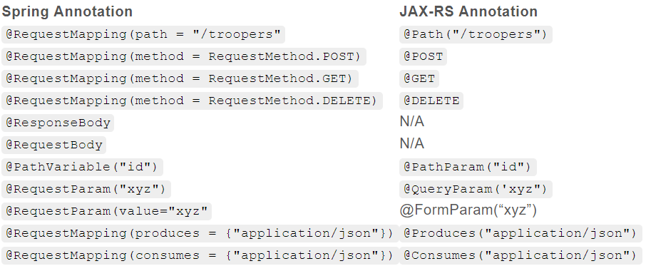

#   JAX-RS vs Spring for REST Endpoints

>   2018-10-8   
>   [原文地址](https://stormpath.com/blog/jax-rs-vs-spring-rest-endpoints)

REST 端通常是被用在将 web 服务端和客户端解耦的地方。许多开发者通过 Spring 或者 JAX-RS 来达到这个目的。有些人只使用其中的一种方式来实现 REST 而不是另一种。在这篇文章中，我将使用基本相同的代码来辨别两者之间的区别。

**JAX-RS** 全称 Java API for RESTful Web Services，是一个 Java 编程语言API 规范，它支持根据具象状态传输(Representational State Transfer, REST)体系结构模式创建 Web 服务。这是 Java EE 6 的一部分，但是可以很容易地在一个简单的 servlet 容器中使用。它是专门为简化 REST 资源编写而创建的。

**Spring Framework** 以及其支持库的范围显然要比创建一些 REST 端要大的多，但是那些情况是针对于不同的 post 情况。今天我们来构建一些简单的 CRUD 应用，通过 [Jackson库](http://wiki.fasterxml.com/JacksonHome) 的 JSON 来管理 Stormtroopers。

## Lay Down the Foundation - Model and DAO

为了集中注意力，我将把 Maven 的依赖关系排除在本文之外。你可以在 [Github](http://github.com/stormpath/jaxrs-spring-blog-example) 上浏览完整的源代码。

首先，我们需要去掉一些常见的部分。所有的例子都将使用一个简单的 model 和DAO 来注册和管理 `Stormtrooper` 对象。

```java
public class Stormtrooper {
 
    private String id;
    private String planetOfOrigin;
    private String species;
    private String type;
 
    public Stormtrooper() {
        // empty to allow for bean access
    }
 
    public Stormtrooper(String id, String planetOfOrigin, String species, String type) {
        this.id = id;
        this.planetOfOrigin = planetOfOrigin;
        this.species = species;
        this.type = type;
    }
 
    ...
    // bean accessor methods
```

Stormtrooper 有四个成员变量：id, planetOfOrigin, species 和 type。

DAO 层接口也很简单，提供了基础地 CRUD 方法和一个额外的 list 方法：

```java
public interface StormtrooperDao {
 
    Stormtrooper getStormtrooper(String id);
 
    Stormtrooper addStormtrooper(Stormtrooper stormtrooper);
 
    Stormtrooper updateStormtrooper(String id, Stormtrooper stormtrooper);
 
    boolean deleteStormtrooper(String id);
 
    Collection<Stormtrooper> listStormtroopers();
}
```

对于这些例子，StormtrooperDao 的实际实现并不是那么重要。如果你敢兴趣，你可以看一下这个类 - DefaultStormtrooperDao，它随机生成 50 个 Stormtroopers。

## Spring

现在，我们已经解决了常见的问题，现在我们可以进入 Spring 示例的核心部分了。 没有一个能比 Spring boot 更加简单的配置一个 Spring 应用了。

```java
@SpringBootApplication
public class SpringBootApp {
 
    @Bean
    protected StormtrooperDao stormtrooperDao() {
        return new DefaultStormtrooperDao();
    }
 
    public static void main(String[] args) {
        SpringApplication.run(SpringBootApp.class, args);
    }
}
```

有几点需要指出：

1.  @SpringBootApplication 注释设置了 Spring 组件的自动配置和类路径扫描。

1.  @Bean 将 DefaultStormtrooperDao 对象作为 StormtrooperDao 的实例注册进去。

1.  `main` 静态方法用来启动 Spring 应用。

## Spring Controller

接下来，我们来实现 REST 端或者是一个 Controller。

```java
@RestController
@RequestMapping("/troopers")
public class StormtroooperController {
 
    private final StormtrooperDao trooperDao;
 
    @Autowired
    public StormtrooperController(StormtrooperDao trooperDao) {
        this.trooperDao = trooperDao;
    }
 
    @RequestMapping(path = "/{id}", method = RequestMethod.GET)
    public Stormtrooper getTrooper(@PathVariable("id") String id) throws NotFoundException {
 
        Stormtrooper stormtrooper = trooperDao.getStormtrooper(id);
        if (stormtrooper == null) {
            throw new NotFoundException();
        }
        return stormtrooper;
    }
 
    @RequestMapping(method = RequestMethod.POST)
    public Stormtrooper createTrooper(@RequestBody Stormtrooper trooper) {
        return trooperDao.addStormtrooper(trooper);
    }
 
    @RequestMapping(path = "/{id}", method = RequestMethod.POST)
    public Stormtrooper updateTrooper(@PathVariable("id") String id, @RequestBody Stormtrooper updatedTrooper) throws NotFoundException {
        return trooperDao.updateStormtrooper(id, updatedTrooper);
    }
 
 
    @RequestMapping(path = "/{id}", method = RequestMethod.DELETE)
    @ResponseStatus(value = HttpStatus.NO_CONTENT)
    public void deleteTrooper(@PathVariable("id") String id) {
        trooperDao.deleteStormtrooper(id);
    }
 
    @RequestMapping(method = RequestMethod.GET)
    public Collection<Stormtrooper> listTroopers() {
        return trooperDao.listStormtroopers();
    }
}
```

下面我们逐一分析上述代码：

```java
@RestController
@RequestMapping("/troopers")
public class StormtroooperController {
```

对于 `@Controller` 和 `@ResponseBody` 来说，`@RestController` 是一个方便的注解。被 `@RequestMapping` 修饰的类在 classpath 扫描期间会被标记为 web 组件。类级别的 `@RequestMapping` 用来定义该类任意 RequestMapping 的基础映射。在本例中，本类所有的端点开始的 URL 地址是 `/troopers`。

```java
@RequestMapping(path = "/{id}", method = RequestMethod.POST)
public Stormtrooper updateTrooper(@PathVariable("id") String id, @RequestBody Stormtrooper updatedTrooper) throws NotFoundException {
    return trooperDao.updateStormtrooper(id, updatedTrooper);
}
```

`@RequestMapping` 注解有很多选择，这里只是使用其中的一部分功能：

-   `@PathVariable("id")` 对应着 `path = "/{id}"`。将给定的方法参数传递到 URL 路径的 `{id}` 部分 - 示例 URL: `/troopers/FN-2187`。
-   `method=RequestMethod.GET` 指定请求方式为 get
-   `value = HttpStatus.NO_CONTENT` 设置了预期 HTTP 响应状态码为 204。

HTTP 请求传递过来的参数将被反序列化后，再传递到用 `@RequestBody` 注解的方法参数。返回值 `return trooperDao.updateStormtrooper(id, updatedTrooper);` 是直接通过 `@RquestBody` 注解（或简单实用 `@RestController`）序列化结果，接着响应到 HTTP 上面。`@RquestBody` 和 `@RestController` 将绕过任何 MVC 模板。

```java
@RequestMapping(path = "/{id}", method = RequestMethod.POST)
public Stormtrooper updateTrooper(@PathVariable("id") String id, @RequestBody Stormtrooper updatedTrooper) throws NotFoundException {
    return trooperDao.updateStormtrooper(id, updatedTrooper);
}
```

在代码块中，`updateTrooper()` 这个方法支持来自 `/trooper/{id}` 发出的 POST HTTP 请求，并包括一个序列化的 `Stormtrooper(JSON)`。如果请求路径是 `/troopers/FN-2187`，那么 POST 请求路径中 id 部分的值就是 `FN-2187` 并且传递给方法中的 id 参数。最后将一个更新后的 `Stormtrooper` 对象返回，并且将其序列化到 HTTP 相应中。

## Run the Spring Example

要运行这个例子，请先获取[资源](https://github.com/stormpath/jaxrs-spring-blog-example)，并且改变 Spring boot 的目录，运行 `mvn spring-boot:run` 指定启动应用，最后向服务器发送请求。

>   拿到所有 Stormtrooper 的集合

```txt
$ curl http://localhost:8080/troopers
 
HTTP/1.1 200 
Content-Type: application/json;charset=UTF-8
Date: Tue, 08 Nov 2016 20:33:36 GMT
Transfer-Encoding: chunked
X-Application-Context: application
 
[
    {
        "id": "FN-2187",
        "planetOfOrigin": "Unknown",
        "species": "Human",
        "type": "Basic"
    },
    {
        "id": "FN-0984",
        "planetOfOrigin": "Coruscant",
        "species": "Human",
        "type": "Aquatic"
    },
    {
        "id": "FN-1253",
        "planetOfOrigin": "Tatooine",
        "species": "Unidentified",
        "type": "Sand"
    },
    ...
] 
```

根据 id 获取对应的 Stormtrooper 的对象。

```txt
$ curl http://localhost:8080/troopers/FN-2187
 
HTTP/1.1 200 
Content-Type: application/json;charset=UTF-8
Date: Tue, 08 Nov 2016 20:38:53 GMT
Transfer-Encoding: chunked
X-Application-Context: application
 
{
    "id": "FN-2187",
    "planetOfOrigin": "Unknown",
    "species": "Human",
    "type": "Basic"
}
```

## Rinse and Repeat – JAX-RS

在 JAX-RS 例子中，我们将使用相同的 model 和 DAO，要改变的只是 `StormtrooperController` 这个类上面的注释。

由于 JAX-RS 是一个 API 规范，你需要选择一个实现，因此在本例中我们将使用 [Jersey](https://jersey.github.io/)。虽然我们可以不依赖于某个具体的实现来直接创建一个 JAX-RS 应用，但是那样做会使得事例代码变得冗余。

我选择 Jersey 有几个原因，主要是因为我已经知道如何简单的依赖注入工作，而不需要跨越任何的困难，我们将用它与 Spring 来做比较。

与 `SpringBootApplication` 等价的 JAX-RS 是一个 `Application` 类。`Application` 的一个 Jersey 子集 - `ResourceConfig` 封装了一些实用的方法。下面的代码片段配置了类扫描路径以探测我们我个人资源类，并将一个 `DefaultStormtrooperDao` 实例绑定到 `StormtrooperDao` 接口上面。

```java
@ApplicationPath("/")
public class JaxrsApp extends ResourceConfig {
 
    public JaxrsApp() {
 
        // scan the resources package for our resources
        packages(getClass().getPackage().getName() + ".resources");
 
        // use @Inject to bind the StormtrooperDao
        register(new AbstractBinder() {
            @Override
            protected void configure() {
                bind(stormtrooperDao()).to(StormtrooperDao.class);
            }
        });
    }
 
    private StormtrooperDao stormtrooperDao() {
        return new DefaultStormtrooperDao();
    }
}
```

另外需要指出的是，在上面的类中，`@ApplicationPath` 注解将这个类标记为一个 JAX-RS 应用程序，将其绑定到一个特定的 url 路径，为了与上面的 Spring 示例一样，在本例中，我们将使用根路径:`/`。`resources`包中检测到的每个资源都将附加这个根路径。

JAX-RS 实现与上面 Spring 版本的实现看起来非常相似。

```java
@Path("/troopers")
@Produces("application/json")
public class StormtroooperResource {
 
    private final StormtrooperDao trooperDao;
 
    @Inject
    public StormtrooperResource(StormtrooperDao trooperDao) {
        this.trooperDao = trooperDao;
    }
 
    @Path("/{id}")
    @GET
    public Stormtrooper getTrooper(@PathParam("id") String id) throws NotFoundException {
 
        Stormtrooper stormtrooper = trooperDao.getStormtrooper(id);
        if (stormtrooper == null) {
            throw new NotFoundException();
        }
        return stormtrooper;
    }
 
    @POST
    public Stormtrooper createTrooper(Stormtrooper trooper) {
        return trooperDao.addStormtrooper(trooper);
    }
 
    @Path("/{id}")
    @POST
    public Stormtrooper updateTrooper(@PathParam("id") String id, Stormtrooper updatedTrooper) throws NotFoundException {
        return trooperDao.updateStormtrooper(id, updatedTrooper);
    }
 
    @Path("/{id}")
    @DELETE
    public void deleteTrooper(@PathParam("id") String id) {
        trooperDao.deleteStormtrooper(id);
    }
 
    @GET
    public Collection<Stormtrooper> listTroopers() {
        return trooperDao.listStormtroopers();
    }
}
```

为了进一步分析这个例子，我们先来看看下面代码片段：

```java
@Path("/troopers")
@Produces("application/json")
public class StormtroooperResource {
```

在 class 级别上，`@Path` 注解与上面 Spring 例子相似，意味着该 class 中的每个带注解的方法都将位于 `/troppers` 基本路径下面。`@Produces` 注解定义了默认的响应内容类型（当然可以自己指定响应内容类型来覆盖原来的内容）。

与 Spring 示例不同，在 JAX-RS 资源中，`@RequestMapping` 注解定义了请求的路径、方法和其他属性，每个属性使用单独的注解。与上面的示例类似，如果我们分解 `updateTrooper()` 方法：

```java
@Path("/{id}")
@POST
public Stormtrooper updateTrooper(@PathParam("id") String id, Stormtrooper updatedTrooper) throws NotFoundException {
    return trooperDao.updateStormtrooper(id, updatedTrooper);
}
```

我们看到 `@Path("/{id}")` 和 `@PathParam("id")` 允许将路径的 `id` 部分转换为方法参数。与 Spring 示例不同的是，`Stromtrooper` 参数和返回值不需要额外的注释，它们通过 `@Produces("application/ JSON")` 注释自动序列化/反序列化为 JSON。

## RUN the JAX-RS Example

这个例子可以从 `jersey` 目录开始，使用 `maven` 命令:`mvn jetty:run`。

用与上面 Spring 示例中 2 个相同的请求：

```txt
$ curl http://localhost:8080/troopers
 
HTTP/1.1 200 OK
Content-Length: 3944
Content-Type: application/json
Date: Tue, 08 Nov 2016 21:57:55 GMT
Server: Jetty(9.3.12.v20160915)
 
[
    {
        "id": "FN-2187",
        "planetOfOrigin": "Unknown",
        "species": "Human",
        "type": "Basic"
    },
    {
        "id": "FN-0064",
        "planetOfOrigin": "Naboo",
        "species": "Nikto",
        "type": "Sand"
    },
    {
        "id": "FN-0069",
        "planetOfOrigin": "Hoth",
        "species": "Twi'lek",
        "type": "Basic"
    },
    {
        "id": "FN-0169",
        "planetOfOrigin": "Felucia",
        "species": "Kel Dor",
        "type": "Jump"
    },
 
    ...
```

通过 `GET` 获取指定的资源：

```txt
$ curl http://localhost:8080/troopers/FN-2187
 
HTTP/1.1 200 OK
Content-Length: 81
Content-Type: application/json
Date: Tue, 08 Nov 2016 22:00:02 GMT
Server: Jetty(9.3.12.v20160915)
 
{
    "id": "FN-2187",
    "planetOfOrigin": "Unknown",
    "species": "Human",
    "type": "Basic"
}
```

现在，通过简单地更改注解，我们已经看到在 Spring 和 JAX-RS 应用程序中运行的代码基本相同。我更喜欢 JAX-RS 注解，它们更简洁。也就是说，为什么要在两者之间做出选择呢？Jersey 和 RestEasy 都支持 Spring (以及 Guice 和 CDI/Weld)。让我们创建第三个合并这两个的示例。

## JAX-RS and Spring – So Happy Together

对于这个示例，我们需要三个类：一个 Soring Boot application, Jersey 配置类和我们的资源。

我们的 `SpringBootApp` 和 `StormtrooperResource` 类与之前的版本相同，唯一的区别是 `Jersey` 配置类:

```java
@Configuration
public class JerseyConfig extends ResourceConfig {
 
    public JerseyConfig() {
 
        // scan the resources package for our resources
        packages(getClass().getPackage().getName() + ".resources");
    }
}
```

这个类比前面的例子要简单一些。首先，你可能注意到了 `@Configuration` 注解，标记这个类是被 Spring 容器所管理的。剩下的就是指示 Jersey 重新扫描资源包，剩下的就交给你了(看到我在那里做了什么了吗?!)。

从 `spring-jaxrs` 目录中，用 `mvn spring-boot:run` 命令启动示例。

## Spring to JAX-RS Cheat Sheet

这不是一个详尽的列表，但它确实包含了最常见的注释。



##  [BACK](../../mds/summary.md)