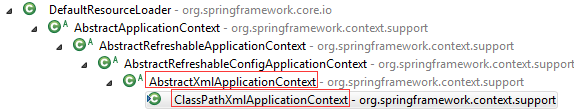
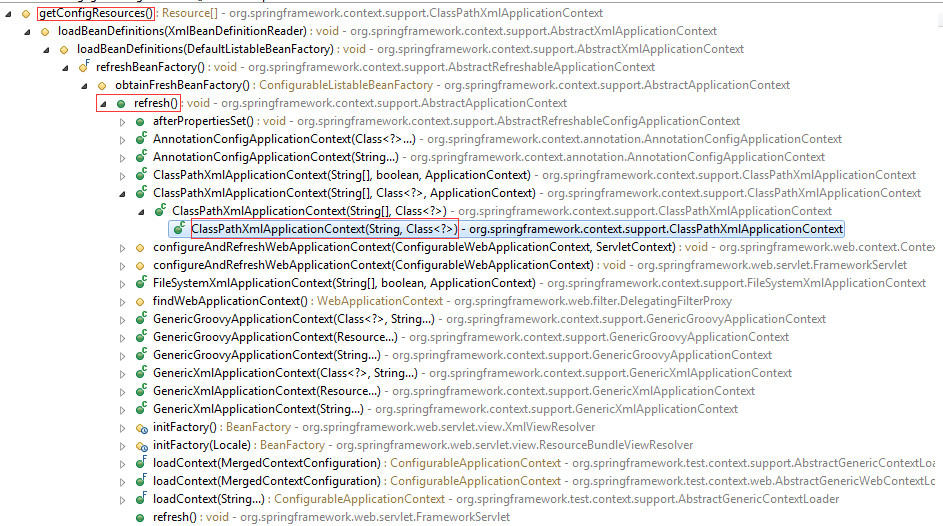

# Spring
-   [BeanFactory与FactoryBean之间的区别？](./mds/summary/sp-1.md)
-   [BeanFactory和ApplicationContext之间的区别？](./mds/summary/sp-2.md) 
-   [Spring IoC的理解](./mds/summary/sp-3.md)
-   [Spring IoC的初始化过程](./mds/summary/sp-4.md)

# 设计模式
-   创建型模式
    -   [简单工厂](#user-content-ds-0)
    -   [工厂方法模式](#user-content-ds-1)
    -   [抽象工厂模式](#user-content-ds-2)
    -   [单例模式](#user-content-ds-3)
    -   [建造者模式](#user-content-ds-4)
    -   [原型模式](#user-content-ds-5)
-   结构型模式
-   行为型模式
    -   [模板方法](#user-content-ds-xw-1)

### 意图
在创建一个对象时向客户暴露内部细节，并提供一个创建对象的通用接口。

### 类图
简单工厂不是设计模式，而更像是一种编程习惯。它将对象的实例化过程放到了一个类中。这个类就变成了简单工厂类，由它来决定应该实例化那个类。   

  

这样做能把客户类和具体子类的实现解耦，客户类不再需要知道有哪些子类以及应当实例化哪个子类。因为客户类往往有多个，如果不使用简单工厂，所有的客户类都要知道所有子类的细节。而且一旦子类发生改变，例如增加子类，那么所有的客户类都要进行修改。

如果存在下面这种代码，就需要使用简单工厂将对象实例化的部分放到简单工厂中。

```java
public class Client {
    public static void main(String[] args) {
        int type = 1;
        Product product;
        if (type == 1) {
            product = new ConcreteProduct1();
        } else if (type == 2) {
            product = new ConcreteProduct2();
        } else {
            product = new ConcreteProduct();
        }
    }
}
```

### 简单工厂实现

```java
public interface Product {
}

public class ConcreteProduct implements Product {
}

public class ConcreteProduct1 implements Product {
}

public class ConcreteProduct2 implements Product {
}

public class SimpleFactory {
    public Product createProduct(int type) {
        if (type == 1) {
            return new ConcreteProduct1();
        } else if (type == 2) {
            return new ConcreteProduct2();
        }
        return new ConcreteProduct();
    }
}

public class Client {
    public static void main(String[] args) {
        SimpleFactory simpleFactory = new SimpleFactory();
        Product product = simpleFactory.createProduct(1);
    }
}
```

# <a id="ds-1">工厂方法</a>
### 意图
定义了一个创建对象的接口，但由子类决定要实例化哪个类。工厂方法把实例化推迟到子类。

### 类图
**在简单工厂中，创建对象的是另一个类，而在工厂方法中，是由子类来创建对象。**

下图中，Factory 有一个 doSomethind() 方法，这个方法需要用到一个产品对象，这个产品对象由 factoryMethod() 方法创建。该方法是抽象的，需要由子类去实现。

  

### 工厂方法的实现

```java
public abstract class Factory {
    abstract public Product factoryMethod();
    public void doSomething() {
        Product product = factoryMethod();
        // do something with the product
    }
}

public class ConcreteFactory extends Factory {
    public Product factoryMethod() {
        return new ConcreteProduct();
    }
}

public class ConcreteFactory1 extends Factory {
    public Product factoryMethod() {
        return new ConcreteProduct1();
    }
}

public class ConcreteFactory2 extends Factory {
    public Product factoryMethod() {
        return new ConcreteProduct2();
    }
}

public class Client {
    public static void main(String[] args) {
        ConcreteFactory1 factory = new ConcreteFactory1();
        factory.doSomething();
    }
}
```

# <a id="ds-xw-1">模板方法</a>

### 意图
定义算法框架，并将一些步骤的实现延迟到子类。  
通过模板方法，子类可以重新定义算法的某些步骤，而不用改变算法的结构。

### 类图
  

### 实现
冲咖啡和冲茶都有类似的流程，但是某些步骤会有点不一样，要求复用那些相同步骤的代码。


```java
public abstract class CaffeineBeverage {

    final void prepareRecipe() {
        boilWater();
        brew();
        pourInCup();
        addCondiments();
    }

    abstract void brew();

    abstract void addCondiments();

    void boilWater() {
        System.out.println("boilWater");
    }

    void pourInCup() {
        System.out.println("pourInCup");
    }
}

public class Coffee extends CaffeineBeverage{
    @Override
    void brew() {
        System.out.println("Coffee.brew");
    }

    @Override
    void addCondiments() {
        System.out.println("Coffee.addCondiments");
    }
}

public class Tea extends CaffeineBeverage{
    @Override
    void brew() {
        System.out.println("Tea.brew");
    }

    @Override
    void addCondiments() {
        System.out.println("Tea.addCondiments");
    }
}

public class Client {
    public static void main(String[] args) {
        CaffeineBeverage caffeineBeverage = new Coffee();
        caffeineBeverage.prepareRecipe();
        System.out.println("-----------");
        caffeineBeverage = new Tea();
        caffeineBeverage.prepareRecipe();
    }
}
```

```text
boilWater
Coffee.brew
pourInCup
Coffee.addCondiments
-----------
boilWater
Tea.brew
pourInCup
Tea.addCondiments
```

### 框架举例

**org.springframework.context.support.AbstractXmlApplicationContext.getConfigResources**方法。用于获取Resource对象，供具体的ApplicationContext实现类定位BeanDefinition的资源位置。

在AbstractXmlApplicationContext中默认的**getConfigResources**返回的是一个null值。

```java
@Nullable
protected Resource[] getConfigResources() {
    return null;
}
```

以ClassPathXmlApplicationContext为例，看一下其继承关系。



AbstractXmlApplicationContext是ClassPathXmlApplicationContext的基类。

ClassPathXmlApplicationContext中重写了`getConfigResources`方法。

```java
@Override
@Nullable
protected Resource[] getConfigResources() {
    return this.configResources;
}
```

最后看一下ClassPathXmlApplicationContext中getConfigResources的方法调用栈。

 