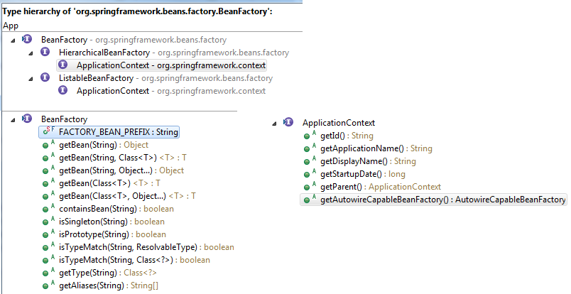
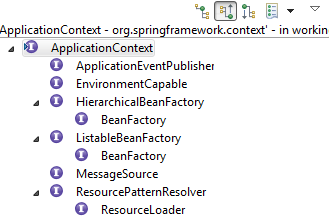
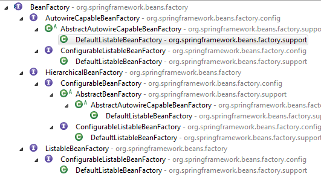
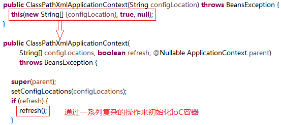

# Spring
-   [BeanFactory与FactoryBean之间的区别？](#user-content-sp-1)
-   [BeanFactory和ApplicationContext之间的区别？](#user-content-sp-2) 
-   [Spring IoC的理解，其初始化过程？](#user-content-sp-3)

# 设计模式
-   [工厂模式](#user-content-ds-1)

### <a id="sp-1">BeanFactory与FactoryBean之间的区别？</a>

同：
- 都是接口。
- 都在同一个包下`org.springframework.beans.factory`。

异：
- **FactoryBean**是让IoC容器中的Bean能够更加简单的生成出来。FactoryBean是一个工厂用来创建和返回指定Bean对象。
    
    FactoryBean code
    ```java
    org.springframework.beans.factory.FactoryBean<T>
    org.springframework.beans.factory.FactoryBean.getObject()
    org.springframework.beans.factory.FactoryBean.getObjectType()
    org.springframework.beans.factory.FactoryBean.isSingleton()
    ```

    - FactoryBean Usage Example
    ```java
    package com.wfms.spring.selftest;

    import org.springframework.beans.factory.FactoryBean;

    public class ToolFactory implements FactoryBean<Tool> {
        
        private int factoryId;
        private int toolId;
        
        @Override
        public Tool getObject() throws Exception {
            return new Tool(toolId);
        }

        @Override
        public Class<?> getObjectType() {
            return Tool.class;
        }

        @Override
        public boolean isSingleton() {
            return false;
        }

        public int getFactoryId() {
            return factoryId;
        }

        public int getToolId() {
            return toolId;
        }

        public void setFactoryId(int factoryId) {
            this.factoryId = factoryId;
        }

        public void setToolId(int toolId) {
            this.toolId = toolId;
        }

    }

    package com.wfms.spring.selftest;

    public class Tool {

        private int id;

        public Tool(int id) {
            this.id = id;
        }

        public int getId() {
            return id;
        }

        public void setId(int id) {
            this.id = id;
        }
        
    }

    //Test
    package com.wfms.spring.selftest;

    import static org.junit.Assert.assertEquals;
    import static org.junit.Assert.assertNotNull;

    import org.junit.Test;
    import org.junit.runner.RunWith;
    import org.springframework.beans.factory.annotation.Autowired;
    import org.springframework.context.support.ClassPathXmlApplicationContext;
    import org.springframework.test.context.ContextConfiguration;
    import org.springframework.test.context.junit4.SpringJUnit4ClassRunner;

    @RunWith(SpringJUnit4ClassRunner.class)
    @ContextConfiguration(locations="classpath:spring/selftest/factorybean-bean.xml")
    public class FactoryBeanTest {

        @Autowired
        private ToolFactory toolFactory;
        
        @Test
        public void testToolFactoryBean() {
            assertNotNull(toolFactory);
            assertEquals(1, toolFactory.getToolId());
            assertEquals(9090, toolFactory.getFactoryId());
        }
        
        @Test
        public void testToolFactoryBeanCreateByClassPathXmlApplicationContext() {
            String locationPath = "classpath:/spring/selftest/factorybean-bean.xml";
            ClassPathXmlApplicationContext context = new ClassPathXmlApplicationContext(locationPath);
            /**
             * 这里通过ClassPathXmlApplicationContext来获取Bean对象
             * 获取的对象并不是ToolFactory对象，而是Tool对象。
             */
            Tool tool = context.getBean("tool", Tool.class);
            /**
             * 可以通过'&'来得到FactoryBean的本身
             */
            ToolFactory toolFactory = context.getBean("&tool", ToolFactory.class);
            
            assertNotNull(tool);
            assertEquals(1, tool.getId());

            assertNotNull(toolFactory);
        }
    }

    ```

    `factorybean-bean.xml`
    ```xml
    <?xml version="1.0" encoding="UTF-8"?>
    <beans xmlns="http://www.springframework.org/schema/beans"
        xmlns:xsi="http://www.w3.org/2001/XMLSchema-instance"
        xsi:schemaLocation="http://www.springframework.org/schema/beans http://www.springframework.org/schema/beans/spring-beans.xsd">


        <bean id="tool" class="com.wfms.spring.selftest.ToolFactory">
            <property name="factoryId" value="9090"/>
            <property name="toolId" value="1"/>
        </bean>
    </beans>
    ```

- **BeanFactory**是IoC最基本的容器，可以通过IoC容器来生产和管理Bean。为其他的IoC容器提供了最基本的规范。

#### 总结
在大多数情况下，我们不会直接使用或实现BeanFactory接口，除非你正在扩展框架的核心功能。当你有需要Spring管理的工厂创建的对象时，你就需要实现FactoryBean。更简洁地说，BeanFactory表示Spring容器，FactoryBean表示工厂类，其创建的对象被获取并作为容器中的bean注册。

参考： 
[geekAbyte](http://www.geekabyte.io/2014/11/difference-between-beanfactory-and.html)

### <a id="sp-2">BeanFactory和ApplicationContext之间的区别？</a>

首先看一下BeanFactory与ApplicationContext之间的继承关系图。  


-   BeanFactory是ApplicationContext的父接口。 
-   BeanFactory和ApplicationContext都可以看做是IoC容器的具体表现形式。而**BeanFactory**是IoC容器基本的功能规范，**ApplicationContext**只是其中的一种IoC容器的表现形式。

具体BeanFactory与ApplicationContext之间有什么区别，可以从2个方向来对比一下：   
1.  应用场景：   
    -   BeanFactory定义了很多接口方法：   
        -   **FACTORY_BEAN_PREFIX**，可以通过`&`来获取指定的FactoryBean的对象。
        -   **getBean**，可以获取IoC容器中指定的Bean对象。
        -   **containsBean**，让用户能够判断容器是否含有指定名字的Bean。
        -   **isSingleton**，查询指定名字的Bean是否是Singleton属性。
        -   **isPrototype**，查询指定名字的Bean是否是prototype类型。
        -   **isTypeMatch**，判断Bean的类型是否与指定的类型一致。
        -   **getType**，获取指定名字Bean的类型。
        -   **getAliases**，查询指定名字Bean的所有别名。
    -   ApplicationContext
          
        从ApplicationContext的继承图可以看出，ApplicationContext不但继承了BeanFactory还继承了其他接口，比如MessageSource, ApplicationEventPublisher, ResourcePatternResolver等等。所以说ApplicationContext是一个功能更加丰富的IoC容器。

2.  设计原理：   
    -   BeanFactory(以DefaultListableBeanFactory为例)： 
        **DefaultListableBeanFactory**可以被看做是一个默认的功能完整的IoC容器。   
          
        通过DefaultListableBeanFactory来初始化IoC容器：  

        
        ```xml
        <?xml version="1.0" encoding="UTF-8"?>
        <beans xmlns="http://www.springframework.org/schema/beans"
            xmlns:xsi="http://www.w3.org/2001/XMLSchema-instance"
            xsi:schemaLocation="http://www.springframework.org/schema/beans http://www.springframework.org/schema/beans/spring-beans.xsd">


            <bean id="tool" class="com.wfms.spring.selftest.ToolFactory">
                <property name="factoryId" value="9090"/>
                <property name="toolId" value="1"/>
            </bean>
        </beans>

        ```
        
        ```java
        @Test
        public void testDefaultListableBeanFactory() {
            //Resource定位
            ClassPathResource resource = new ClassPathResource("/spring/selftest/factorybean-bean.xml");
            //创建一个BeanFactory，这里使用DefaultListableBeanFactory
            DefaultListableBeanFactory factory = new DefaultListableBeanFactory();
            //创建一个载入BeanDefinition的读取器
            XmlBeanDefinitionReader read = new XmlBeanDefinitionReader(factory);
            //将BeanDefinition载入
            read.loadBeanDefinitions(resource);

            //测试
            Tool tool = factory.getBean("tool", Tool.class);
		    ToolFactory toolFactory = factory.getBean("&tool", ToolFactory.class);

            assertNotNull(tool);
            assertNotNull(toolFactory);
            assertEquals(1, tool.getId());
        }
        ```
    -   ApplicationContext(以ClassPathXmlApplicationContext)

        ```java
        @Test
        public void testClassPathXmlApplicationContext() {
            ClassPathXmlApplicationContext context = new ClassPathXmlApplicationContext("classpath:/spring/selftest/factorybean-bean.xml");
            Tool tool = context.getBean("tool", Tool.class);
            ToolFactory toolFactory = context.getBean("&tool", ToolFactory.class);
            
            //test
            assertNotNull(tool);
            assertNotNull(toolFactory);
            assertEquals(1, tool.getId());
        }
        ```
        相比较BeanFactory，通过ApplicationContext来获取Bean的过程更加简便了。 
        

#### 总结
BeanFactory就是一个IoC容器的规范。所有的IoC容器的实现都必须遵循这个规范。而ApplicationContext是IoC其中的一个具体实现并且增加了一些附属的功能，比如支持国际化的实现、可以从不同的地方获取BeanDefinition的定义信息等。对于开发而言，ApplicationContext简化了代码。

### <a id="sp-3">Spring IoC的理解，其初始化过程？</a>

- 理解Spring IoC可以从以下三个方面来看：
    1.  IoC是什么？ 
        IoC全称Inversion of Control，即“控制反转”，不是什么技术，而是一种**设计思想**。在开发中，IoC意味着你将设计好的对象交给容器来创建，而不是通过传统的方式来创建。
        - 谁控制谁？控制什么？
        传统创建对象的方式是通过调用`new`这个关键词来进行的，而在IoC中是有个专门的容器来创建这些对象。
        所以，谁控制谁？IoC容器控制了对象。控制什么？控制了外部资源的获取`不只是对象包括比如文件等`。
        - 为什么是反转？哪些方面反转了？
        有反转就有正转，传统应用程序是由我们自己在对象中主动控制去直接获取依赖对象，也就是正转；而反转则是由容器来帮忙创建及注入依赖对象。  
        为什么是反转？因为由容器帮我们查找以及注入依赖对象，对象只是**被动的接受**依赖对象。  
        哪些方面反转了？依赖对象的获取被反转了。
    
    2.  IoC能做什么？    
        IoC实现了对象与对象之间的**松散耦合**，原来需要程序主动控制去获取依赖对象，转变到让IoC容器来控制。方便测试，利于功能复用，使得程序更加灵活。
        

    3. IoC和DI是什么关系？
        -   DI是什么？  
            DI，依赖注入。组件之间依赖关系由容器在运行期决定，即由容器动态的将某个**组件所依赖的对象**注入到组件中去，这个对象可能是另外一个组件也可能是POJO。
        -   理解DI的关键是：“谁依赖谁，为什么需要依赖？谁注入谁，注入了什么？”
            -   谁依赖谁：应用程序依赖IoC容器
            -   为什么需要依赖：应用程序需要IoC容器来提供对象所需的外部资源
            -   谁注入谁：IoC容器将应用程序所需的外部资源注入进去
            -   注入了什么：应用程序对象所需的外部资源

- Spring IoC的初始化过程？
    1.  Resource定位（Bean的定义文件定位）。
    2.  BeanDefinition的载入。将用户定义好的Bean表示成IoC容器内部的数据结构，这个容器内部的数据结构就是BeanDefinition。
    3.  将BeanDefinition注册到容器中。

参考：
-   [jinnianshilongnian](http://jinnianshilongnian.iteye.com/blog/1413846)
-   [有爱jj](https://www.cnblogs.com/chenjunjie12321/p/6124649.html)
-   [Spring IoC容器初始化过程](https://www.jianshu.com/p/d5f1670c3c0f)
-   《Spring 技术内幕 第2版》