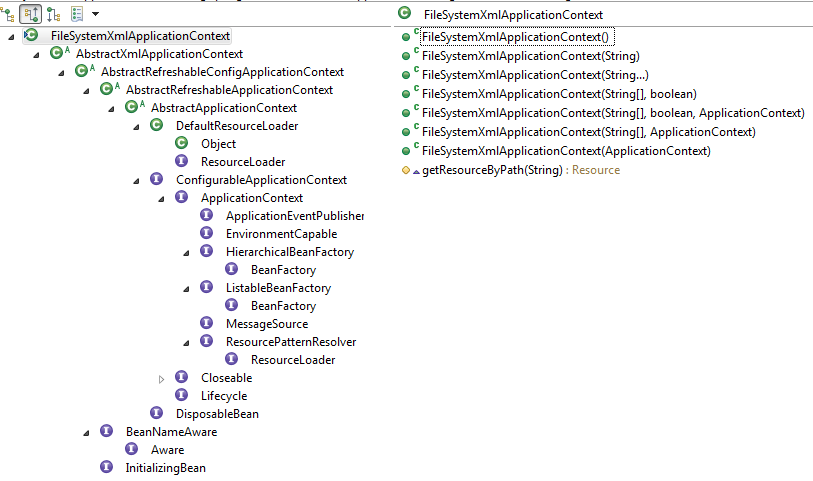

# Spring
-   [BeanFactory与FactoryBean之间的区别？](#user-content-sp-1)
-   [BeanFactory和ApplicationContext之间的区别？](#user-content-sp-2) 
-   [Spring IoC的理解](#user-content-sp-3)
-   [Spring IoC的初始化过程](#user-content-sp-4)

# 设计模式
-   创建型模式
    -   [简单工厂](#user-content-ds-0)
    -   [工厂方法模式](#user-content-ds-1)
    -   [抽象工厂模式](#user-content-ds-2)
    -   [单例模式](#user-content-ds-3)
    -   [建造者模式](#user-content-ds-4)
    -   [原型模式](#user-content-ds-5)
-   结构型模式
-   行为型模式
    -   [模板方法](#user-content-ds-xw-1)

# <a id="sp-1">BeanFactory与FactoryBean之间的区别？</a>

同：
- 都是接口。
- 都在同一个包下`org.springframework.beans.factory`。

异：
- **FactoryBean**是让IoC容器中的Bean能够更加简单的生成出来。FactoryBean是一个工厂用来创建和返回指定Bean对象。
    
    FactoryBean code
    ```java
    org.springframework.beans.factory.FactoryBean<T>
    org.springframework.beans.factory.FactoryBean.getObject()
    org.springframework.beans.factory.FactoryBean.getObjectType()
    org.springframework.beans.factory.FactoryBean.isSingleton()
    ```

    - FactoryBean Usage Example
    ```java
    package com.wfms.spring.selftest;

    import org.springframework.beans.factory.FactoryBean;

    public class ToolFactory implements FactoryBean<Tool> {
        
        private int factoryId;
        private int toolId;
        
        @Override
        public Tool getObject() throws Exception {
            return new Tool(toolId);
        }

        @Override
        public Class<?> getObjectType() {
            return Tool.class;
        }

        @Override
        public boolean isSingleton() {
            return false;
        }

        public int getFactoryId() {
            return factoryId;
        }

        public int getToolId() {
            return toolId;
        }

        public void setFactoryId(int factoryId) {
            this.factoryId = factoryId;
        }

        public void setToolId(int toolId) {
            this.toolId = toolId;
        }

    }

    package com.wfms.spring.selftest;

    public class Tool {

        private int id;

        public Tool(int id) {
            this.id = id;
        }

        public int getId() {
            return id;
        }

        public void setId(int id) {
            this.id = id;
        }
        
    }

    //Test
    package com.wfms.spring.selftest;

    import static org.junit.Assert.assertEquals;
    import static org.junit.Assert.assertNotNull;

    import org.junit.Test;
    import org.junit.runner.RunWith;
    import org.springframework.beans.factory.annotation.Autowired;
    import org.springframework.context.support.ClassPathXmlApplicationContext;
    import org.springframework.test.context.ContextConfiguration;
    import org.springframework.test.context.junit4.SpringJUnit4ClassRunner;

    @RunWith(SpringJUnit4ClassRunner.class)
    @ContextConfiguration(locations="classpath:spring/selftest/factorybean-bean.xml")
    public class FactoryBeanTest {

        @Autowired
        private ToolFactory toolFactory;
        
        @Test
        public void testToolFactoryBean() {
            assertNotNull(toolFactory);
            assertEquals(1, toolFactory.getToolId());
            assertEquals(9090, toolFactory.getFactoryId());
        }
        
        @Test
        public void testToolFactoryBeanCreateByClassPathXmlApplicationContext() {
            String locationPath = "classpath:/spring/selftest/factorybean-bean.xml";
            ClassPathXmlApplicationContext context = new ClassPathXmlApplicationContext(locationPath);
            /**
             * 这里通过ClassPathXmlApplicationContext来获取Bean对象
             * 获取的对象并不是ToolFactory对象，而是Tool对象。
             */
            Tool tool = context.getBean("tool", Tool.class);
            /**
             * 可以通过'&'来得到FactoryBean的本身
             */
            ToolFactory toolFactory = context.getBean("&tool", ToolFactory.class);
            
            assertNotNull(tool);
            assertEquals(1, tool.getId());

            assertNotNull(toolFactory);
        }
    }

    ```

    `factorybean-bean.xml`
    ```xml
    <?xml version="1.0" encoding="UTF-8"?>
    <beans xmlns="http://www.springframework.org/schema/beans"
        xmlns:xsi="http://www.w3.org/2001/XMLSchema-instance"
        xsi:schemaLocation="http://www.springframework.org/schema/beans http://www.springframework.org/schema/beans/spring-beans.xsd">


        <bean id="tool" class="com.wfms.spring.selftest.ToolFactory">
            <property name="factoryId" value="9090"/>
            <property name="toolId" value="1"/>
        </bean>
    </beans>
    ```

- **BeanFactory**是IoC最基本的容器，可以通过IoC容器来生产和管理Bean。为其他的IoC容器提供了最基本的规范。

#### 总结
在大多数情况下，我们不会直接使用或实现BeanFactory接口，除非你正在扩展框架的核心功能。当你有需要Spring管理的工厂创建的对象时，你就需要实现FactoryBean。更简洁地说，BeanFactory表示Spring容器，FactoryBean表示工厂类，其创建的对象被获取并作为容器中的bean注册。

参考： 
[geekAbyte](http://www.geekabyte.io/2014/11/difference-between-beanfactory-and.html)

# <a id="sp-2">BeanFactory和ApplicationContext之间的区别？</a>

首先看一下BeanFactory与ApplicationContext之间的继承关系图。  


-   BeanFactory是ApplicationContext的父接口。 
-   BeanFactory和ApplicationContext都可以看做是IoC容器的具体表现形式。而**BeanFactory**是IoC容器基本的功能规范，**ApplicationContext**只是其中的一种IoC容器的表现形式。

具体BeanFactory与ApplicationContext之间有什么区别，可以从2个方向来对比一下：   
1.  应用场景：   
    -   BeanFactory定义了很多接口方法：   
        -   **FACTORY_BEAN_PREFIX**，可以通过`&`来获取指定的FactoryBean的对象。
        -   **getBean**，可以获取IoC容器中指定的Bean对象。
        -   **containsBean**，让用户能够判断容器是否含有指定名字的Bean。
        -   **isSingleton**，查询指定名字的Bean是否是Singleton属性。
        -   **isPrototype**，查询指定名字的Bean是否是prototype类型。
        -   **isTypeMatch**，判断Bean的类型是否与指定的类型一致。
        -   **getType**，获取指定名字Bean的类型。
        -   **getAliases**，查询指定名字Bean的所有别名。
    -   ApplicationContext
          
        从ApplicationContext的继承图可以看出，ApplicationContext不但继承了BeanFactory还继承了其他接口，比如MessageSource, ApplicationEventPublisher, ResourcePatternResolver等等。所以说ApplicationContext是一个功能更加丰富的IoC容器。

2.  设计原理：   
    -   BeanFactory(以DefaultListableBeanFactory为例)：     
        **DefaultListableBeanFactory**可以被看做是一个默认的功能完整的IoC容器。   

          

        通过DefaultListableBeanFactory来初始化IoC容器：  
        ```xml
        <?xml version="1.0" encoding="UTF-8"?>
        <beans xmlns="http://www.springframework.org/schema/beans"
            xmlns:xsi="http://www.w3.org/2001/XMLSchema-instance"
            xsi:schemaLocation="http://www.springframework.org/schema/beans http://www.springframework.org/schema/beans/spring-beans.xsd">


            <bean id="tool" class="com.wfms.spring.selftest.ToolFactory">
                <property name="factoryId" value="9090"/>
                <property name="toolId" value="1"/>
            </bean>
        </beans>

        ```
        
        ```java
        @Test
        public void testDefaultListableBeanFactory() {
            //Resource定位
            ClassPathResource resource = new ClassPathResource("/spring/selftest/factorybean-bean.xml");
            //创建一个BeanFactory，这里使用DefaultListableBeanFactory
            DefaultListableBeanFactory factory = new DefaultListableBeanFactory();
            //创建一个载入BeanDefinition的读取器
            XmlBeanDefinitionReader read = new XmlBeanDefinitionReader(factory);
            //将BeanDefinition载入
            read.loadBeanDefinitions(resource);

            //测试
            Tool tool = factory.getBean("tool", Tool.class);
		    ToolFactory toolFactory = factory.getBean("&tool", ToolFactory.class);

            assertNotNull(tool);
            assertNotNull(toolFactory);
            assertEquals(1, tool.getId());
        }
        ```
    -   ApplicationContext(以ClassPathXmlApplicationContext)

        ```java
        @Test
        public void testClassPathXmlApplicationContext() {
            ClassPathXmlApplicationContext context = new ClassPathXmlApplicationContext("classpath:/spring/selftest/factorybean-bean.xml");
            Tool tool = context.getBean("tool", Tool.class);
            ToolFactory toolFactory = context.getBean("&tool", ToolFactory.class);
            
            //test
            assertNotNull(tool);
            assertNotNull(toolFactory);
            assertEquals(1, tool.getId());
        }
        ```
        相比较BeanFactory，通过ApplicationContext来获取Bean的过程更加简便了。 
        

#### 总结
BeanFactory就是一个IoC容器的规范。所有的IoC容器的实现都必须遵循这个规范。而ApplicationContext是IoC其中的一个具体实现并且增加了一些附属的功能，比如支持国际化的实现、可以从不同的地方获取BeanDefinition的定义信息等。对于开发而言，ApplicationContext简化了代码。但纯粹的IoC容器并不是一无是处，使用类似**DefaultListableBeanFactory**这种底层的容器，能够提高定制IoC容器的灵活性。

# <a id="sp-3">Spring IoC的理解</a>

- 理解Spring IoC可以从以下三个方面来看：
    1.  IoC是什么？ 
        IoC全称Inversion of Control，即“控制反转”，不是什么技术，而是一种**设计思想**。在开发中，IoC意味着你将设计好的对象交给容器来创建，而不是通过传统的方式来创建。
        - 谁控制谁？控制什么？
        传统创建对象的方式是通过调用`new`这个关键词来进行的，而在IoC中是有个专门的容器来创建这些对象。
        所以，谁控制谁？IoC容器控制了对象。控制什么？控制了外部资源的获取`不只是对象包括比如文件等`。
        - 为什么是反转？哪些方面反转了？
        有反转就有正转，传统应用程序是由我们自己在对象中主动控制去直接获取依赖对象，也就是正转；而反转则是由容器来帮忙创建及注入依赖对象。  
        为什么是反转？因为由容器帮我们查找以及注入依赖对象，对象只是**被动的接受**依赖对象。  
        哪些方面反转了？依赖对象的获取被反转了。
    
    2.  IoC能做什么？    
        IoC实现了对象与对象之间的**松散耦合**，原来需要程序主动控制去获取依赖对象，转变到让IoC容器来控制。方便测试，利于功能复用，使得程序更加灵活。
        

    3. IoC和DI是什么关系？
        -   DI是什么？  
            DI，依赖注入。组件之间依赖关系由容器在运行期决定，即由容器动态的将某个**组件所依赖的对象**注入到组件中去，这个对象可能是另外一个组件也可能是POJO。
        -   理解DI的关键是：“谁依赖谁，为什么需要依赖？谁注入谁，注入了什么？”
            -   谁依赖谁：应用程序依赖IoC容器
            -   为什么需要依赖：应用程序需要IoC容器来提供对象所需的外部资源
            -   谁注入谁：IoC容器将应用程序所需的外部资源注入进去
            -   注入了什么：应用程序对象所需的外部资源

# <a id="sp-4">Spring IoC的初始化过程</a>

我们知道IoC容器最常用的就是ApplicationContext和BeanFactory这两个。接下来我们就以Spring4.3.14中的**org.springframework.context.support.FileSystemXmlApplicationContext**为例，来深入了解下IoC的初始化过程。

-   ## Resource定位    
    
    > 这个阶段的目的就是对**BeanDefinition**资源的path进行解析，然后生成一个**org.springframework.core.io.Resource**对象供后面载入和解析。

    看一下FileSystemXmlApplicationContext的继承关系以及其内部方法。
    

    看到FileSystemXmlApplicationContext中的 **getResourceByPath(String)** 是否心生疑惑，这个方法有什么用？什么时候会被调用？

    可以先看一下，**getResourceByPath(String)** 的方法调用栈。下面就跟着这张方法调用栈来看看每个方法的实现。

    

    从上述的方法调用栈可以看出，**getResourceByPath(String)** 最开始是在FileSystemXmlApplicationContext的构造方法的 **refresh()** 中开始的，同时这个方法也是 **IoC初始化** 的入口。

    ```java
    public FileSystemXmlApplicationContext(
			String[] configLocations, boolean refresh, @Nullable ApplicationContext parent)
			throws BeansException {

		super(parent);
            //设置BeanDefinitions路径
		setConfigLocations(configLocations);
		if (refresh) {
		    refresh();
		}
	}
    ```

    ```java
    public void setConfigLocations(@Nullable String... locations) {
		if (locations != null) {
			Assert.noNullElements(locations, "Config locations must not be null");
			this.configLocations = new String[locations.length];
			for (int i = 0; i < locations.length; i++) {
				this.configLocations[i] = resolvePath(locations[i]).trim();
			}
		}
		else {
			this.configLocations = null;
		}
	}
    ```

    接下来看 **org.springframework.context.support.AbstractApplicationContext.refresh()** 方法。从上面的继承图可以看出，refresh这个方法是实现自 **org.springframework.context.ConfigurableApplicationContext** 这个接口。

    ```java
    /**
	 * Load or refresh the persistent representation of the configuration,
	 * which might an XML file, properties file, or relational database schema.
	 * <p>As this is a startup method, it should destroy already created singletons
	 * if it fails, to avoid dangling resources. In other words, after invocation
	 * of that method, either all or no singletons at all should be instantiated.
	 * @throws BeansException if the bean factory could not be initialized
	 * @throws IllegalStateException if already initialized and multiple refresh
	 * attempts are not supported
	 */
	void refresh() throws BeansException, IllegalStateException;
    ```

    refresh()方法详细的描述了ApplicationContext初始化的整个过程。

    ```java
    @Override
	public void refresh() throws BeansException, IllegalStateException {
		synchronized (this.startupShutdownMonitor) {
			// Prepare this context for refreshing.
			prepareRefresh();

			// Tell the subclass to refresh the internal bean factory.
			ConfigurableListableBeanFactory beanFactory = obtainFreshBeanFactory();

			// Prepare the bean factory for use in this context.
			prepareBeanFactory(beanFactory);

			try {
				// Allows post-processing of the bean factory in context subclasses.
				postProcessBeanFactory(beanFactory);

				// Invoke factory processors registered as beans in the context.
				invokeBeanFactoryPostProcessors(beanFactory);

				// Register bean processors that intercept bean creation.
				registerBeanPostProcessors(beanFactory);

				// Initialize message source for this context.
				initMessageSource();

				// Initialize event multicaster for this context.
				initApplicationEventMulticaster();

				// Initialize other special beans in specific context subclasses.
				onRefresh();

				// Check for listener beans and register them.
				registerListeners();

				// Instantiate all remaining (non-lazy-init) singletons.
				finishBeanFactoryInitialization(beanFactory);

				// Last step: publish corresponding event.
				finishRefresh();
			}

			catch (BeansException ex) {
				if (logger.isWarnEnabled()) {
					logger.warn("Exception encountered during context initialization - " +
							"cancelling refresh attempt: " + ex);
				}

				// Destroy already created singletons to avoid dangling resources.
				destroyBeans();

				// Reset 'active' flag.
				cancelRefresh(ex);

				// Propagate exception to caller.
				throw ex;
			}

			finally {
				// Reset common introspection caches in Spring's core, since we
				// might not ever need metadata for singleton beans anymore...
				resetCommonCaches();
			}
		}
    ```

    obtainFreshBeanFactory这个方法是告诉AbstractApplication的子类(这里是FileSystemXmlApplicationContext)刷新内部的Bean Factory。

    ```java
    protected ConfigurableListableBeanFactory obtainFreshBeanFactory() {
		refreshBeanFactory();
		ConfigurableListableBeanFactory beanFactory = getBeanFactory();
		if (logger.isDebugEnabled()) {
			logger.debug("Bean factory for " + getDisplayName() + ": " + beanFactory);
		}
		return beanFactory;
	}
    ```

    先调用了 **refreshBeanFactory()** 根据BeanDefinition的位置来刷新Bean Factory。

    ### 思考：
    为什么说这个方法会去读取BeanDefinition的位置？虽然这个方法没有参数，但是根据方法名可知，其内部实现一定会有去读取BeanDefinition位置的步骤。

    继续往下看，这里refreshBeanFactory()根据继承关系调用的是 **org.springframework.context.support.AbstractRefreshableApplicationContext**中的refreshBeanFactory方法。

    ```java
    @Override
	protected final void refreshBeanFactory() throws BeansException {
            //先判断Bean Factory是否已经存在
            //如果存在就销毁存在的Bean Factory
		if (hasBeanFactory()) {
			destroyBeans();
			closeBeanFactory();
		}
		try {
                    //创建一个Bean Factory
			DefaultListableBeanFactory beanFactory = createBeanFactory();
			beanFactory.setSerializationId(getId());
			customizeBeanFactory(beanFactory);
                    //加载BeanFactory
			loadBeanDefinitions(beanFactory);
			synchronized (this.beanFactoryMonitor) {
				this.beanFactory = beanFactory;
			}
		}
		catch (IOException ex) {
			throw new ApplicationContextException("I/O error parsing bean definition source for " + getDisplayName(), ex);
		}
	}
    ```

    从 **refreshBeanFactory** 中可以获取两个信息：
    1.  这里的BeanFactory使用的是 **DefaultListableBeanFactory** 。从这里也可以看出，其实 **ApplicationContext** 是封装了BeanFactory初始化的步骤。
    2.  开始加载BeanDefinitions。既然要加载，必然需要先定位BeanDefinition的位置。

    这里调用的是 **org.springframework.context.support.AbstractXmlApplicationContext.loadBeanDefinitions()** 。

    ```java
    protected void loadBeanDefinitions(DefaultListableBeanFactory beanFactory) throws BeansException, IOException {
		// 为给定的BeanFactory创建出一个XmlBeanDefinitionReader
		XmlBeanDefinitionReader beanDefinitionReader = new XmlBeanDefinitionReader(beanFactory);

		// 给这个BeanDifinitionReader配置加载资源
		beanDefinitionReader.setEnvironment(this.getEnvironment());
		beanDefinitionReader.setResourceLoader(this);
		beanDefinitionReader.setEntityResolver(new ResourceEntityResolver(this));

		// 允许AbstractXmlApplicationContext的子类自定义reader的初始化过程
		initBeanDefinitionReader(beanDefinitionReader);
        // 开始加载BeanDefinition
		loadBeanDefinitions(beanDefinitionReader);
	}
    ```

    ```java
    protected void loadBeanDefinitions(XmlBeanDefinitionReader reader) throws BeansException, IOException {
		Resource[] configResources = getConfigResources();
		if (configResources != null) {
			reader.loadBeanDefinitions(configResources);
		}
		String[] configLocations = getConfigLocations();
		if (configLocations != null) {
			reader.loadBeanDefinitions(configLocations);
		}
	}
    ```    

    可以看到里面提供了两个获取BeanDefinition的定位方式。
    1.  getConfigResources()
    2.  getConfigLocations()

    根据 **getResourceByPath(String)** 的方法调用栈来看，我们会调用getConfigLocations();

    ```java
    @Nullable
	protected String[] getConfigLocations() {
            //在FileSystemXmlApplicationContext的构造函数中曽调用过setConfigLocations(String[])
            //所以这里直接就是返回了当时设定的BeanDefinition的路径
		return (this.configLocations != null ? this.configLocations : getDefaultConfigLocations());
	}
    ```

    接着开始调用 `reader.loadBeanDefinitions(configLocations);`

    ```java
    @Override
	public int loadBeanDefinitions(String... locations) throws BeanDefinitionStoreException {
		Assert.notNull(locations, "Location array must not be null");
		int counter = 0;
		for (String location : locations) {
			counter += loadBeanDefinitions(location);
		}
		return counter;
	}

    public int loadBeanDefinitions(String location) throws BeanDefinitionStoreException {
		return loadBeanDefinitions(location, null);
	}
    ```

    经过上面的层层调用终于到了真正加载BeanDefinition的方法 **loadBeanDefinitions(String, Set)** 。

    ```java
    public int loadBeanDefinitions(String location, @Nullable Set<Resource> actualResources) throws BeanDefinitionStoreException {
		ResourceLoader resourceLoader = getResourceLoader();
		if (resourceLoader == null) {
			throw new BeanDefinitionStoreException(
					"Cannot import bean definitions from location [" + location + "]: no ResourceLoader available");
		}

		if (resourceLoader instanceof ResourcePatternResolver) {
			// Resource pattern matching available.
			try {
				Resource[] resources = ((ResourcePatternResolver) resourceLoader).getResources(location);
				int loadCount = loadBeanDefinitions(resources);
				if (actualResources != null) {
					for (Resource resource : resources) {
						actualResources.add(resource);
					}
				}
				if (logger.isDebugEnabled()) {
					logger.debug("Loaded " + loadCount + " bean definitions from location pattern [" + location + "]");
				}
				return loadCount;
			}
			catch (IOException ex) {
				throw new BeanDefinitionStoreException(
						"Could not resolve bean definition resource pattern [" + location + "]", ex);
			}
		}
		else {
			// Can only load single resources by absolute URL.
			Resource resource = resourceLoader.getResource(location);
			int loadCount = loadBeanDefinitions(resource);
			if (actualResources != null) {
				actualResources.add(resource);
			}
			if (logger.isDebugEnabled()) {
				logger.debug("Loaded " + loadCount + " bean definitions from location [" + location + "]");
			}
			return loadCount;
		}
	}
    ```

    这里走 **else** 分支，调用resourceLoader.getResource(location)进行获取Resource对象。

    ```java
    public Resource getResource(String location) {
		Assert.notNull(location, "Location must not be null");

		for (ProtocolResolver protocolResolver : this.protocolResolvers) {
			Resource resource = protocolResolver.resolve(location, this);
			if (resource != null) {
				return resource;
			}
		}

		if (location.startsWith("/")) {
			return getResourceByPath(location);
		}
		else if (location.startsWith(CLASSPATH_URL_PREFIX)) {
			return new ClassPathResource(location.substring(CLASSPATH_URL_PREFIX.length()), getClassLoader());
		}
		else {
			try {
				// Try to parse the location as a URL...
				URL url = new URL(location);
				return (ResourceUtils.isFileURL(url) ? new FileUrlResource(url) : new UrlResource(url));
			}
			catch (MalformedURLException ex) {
				// No URL -> resolve as resource path.
				return getResourceByPath(location);
			}
		}
	}
    ```

    因为**FileSystemXmlApplicationContext**重写了getResourceByPath(String)这个方法，所以最后调用了重写的方法，返回了一个 **FileSystemContextResource** 对象。

    ```java
    protected Resource getResourceByPath(String path) {
		if (path.startsWith("/")) {
			path = path.substring(1);
		}
		return new FileSystemContextResource(path);
	}
    ```

    至此，我们已经完整的了解了BeanDefinition的定位过程。

-   ## BeanDefinition的载入和解析。
    将用户定义好的Bean表示成IoC容器内部的数据结构，这个容器内部的数据结构就是BeanDefinition。

-   ## 将BeanDefinition注册到容器中。

参考：
-   [jinnianshilongnian](http://jinnianshilongnian.iteye.com/blog/1413846)
-   [有爱jj](https://www.cnblogs.com/chenjunjie12321/p/6124649.html)
-   [Spring IoC容器初始化过程](https://www.jianshu.com/p/d5f1670c3c0f)
-   《Spring 技术内幕 第2版》

# <a id="ds-0">简单工厂</a>

### 意图
在创建一个对象时向客户暴露内部细节，并提供一个创建对象的通用接口。

### 类图
简单工厂不是设计模式，而更像是一种编程习惯。它将对象的实例化过程放到了一个类中。这个类就变成了简单工厂类，由它来决定应该实例化那个类。   

  

这样做能把客户类和具体子类的实现解耦，客户类不再需要知道有哪些子类以及应当实例化哪个子类。因为客户类往往有多个，如果不使用简单工厂，所有的客户类都要知道所有子类的细节。而且一旦子类发生改变，例如增加子类，那么所有的客户类都要进行修改。

如果存在下面这种代码，就需要使用简单工厂将对象实例化的部分放到简单工厂中。

```java
public class Client {
    public static void main(String[] args) {
        int type = 1;
        Product product;
        if (type == 1) {
            product = new ConcreteProduct1();
        } else if (type == 2) {
            product = new ConcreteProduct2();
        } else {
            product = new ConcreteProduct();
        }
    }
}
```

### 简单工厂实现

```java
public interface Product {
}

public class ConcreteProduct implements Product {
}

public class ConcreteProduct1 implements Product {
}

public class ConcreteProduct2 implements Product {
}

public class SimpleFactory {
    public Product createProduct(int type) {
        if (type == 1) {
            return new ConcreteProduct1();
        } else if (type == 2) {
            return new ConcreteProduct2();
        }
        return new ConcreteProduct();
    }
}

public class Client {
    public static void main(String[] args) {
        SimpleFactory simpleFactory = new SimpleFactory();
        Product product = simpleFactory.createProduct(1);
    }
}
```

# <a id="ds-1">工厂方法</a>
### 意图
定义了一个创建对象的接口，但由子类决定要实例化哪个类。工厂方法把实例化推迟到子类。

### 类图
**在简单工厂中，创建对象的是另一个类，而在工厂方法中，是由子类来创建对象。**

下图中，Factory 有一个 doSomethind() 方法，这个方法需要用到一个产品对象，这个产品对象由 factoryMethod() 方法创建。该方法是抽象的，需要由子类去实现。

  

### 工厂方法的实现

```java
public abstract class Factory {
    abstract public Product factoryMethod();
    public void doSomething() {
        Product product = factoryMethod();
        // do something with the product
    }
}

public class ConcreteFactory extends Factory {
    public Product factoryMethod() {
        return new ConcreteProduct();
    }
}

public class ConcreteFactory1 extends Factory {
    public Product factoryMethod() {
        return new ConcreteProduct1();
    }
}

public class ConcreteFactory2 extends Factory {
    public Product factoryMethod() {
        return new ConcreteProduct2();
    }
}

public class Client {
    public static void main(String[] args) {
        ConcreteFactory1 factory = new ConcreteFactory1();
        factory.doSomething();
    }
}
```

# <a id="ds-xw-1">模板方法</a>

### 意图
定义算法框架，并将一些步骤的实现延迟到子类。  
通过模板方法，子类可以重新定义算法的某些步骤，而不用改变算法的结构。

### 类图
  

### 实现
冲咖啡和冲茶都有类似的流程，但是某些步骤会有点不一样，要求复用那些相同步骤的代码。


```java
public abstract class CaffeineBeverage {

    final void prepareRecipe() {
        boilWater();
        brew();
        pourInCup();
        addCondiments();
    }

    abstract void brew();

    abstract void addCondiments();

    void boilWater() {
        System.out.println("boilWater");
    }

    void pourInCup() {
        System.out.println("pourInCup");
    }
}

public class Coffee extends CaffeineBeverage{
    @Override
    void brew() {
        System.out.println("Coffee.brew");
    }

    @Override
    void addCondiments() {
        System.out.println("Coffee.addCondiments");
    }
}

public class Tea extends CaffeineBeverage{
    @Override
    void brew() {
        System.out.println("Tea.brew");
    }

    @Override
    void addCondiments() {
        System.out.println("Tea.addCondiments");
    }
}

public class Client {
    public static void main(String[] args) {
        CaffeineBeverage caffeineBeverage = new Coffee();
        caffeineBeverage.prepareRecipe();
        System.out.println("-----------");
        caffeineBeverage = new Tea();
        caffeineBeverage.prepareRecipe();
    }
}
```

```text
boilWater
Coffee.brew
pourInCup
Coffee.addCondiments
-----------
boilWater
Tea.brew
pourInCup
Tea.addCondiments
```

### 框架举例

**org.springframework.context.support.AbstractXmlApplicationContext.getConfigResources**方法。用于获取Resource对象，供具体的ApplicationContext实现类定位BeanDefinition的资源位置。

在AbstractXmlApplicationContext中默认的**getConfigResources**返回的是一个null值。

```java
@Nullable
protected Resource[] getConfigResources() {
    return null;
}
```

以ClassPathXmlApplicationContext为例，看一下其继承关系。


AbstractXmlApplicationContext是ClassPathXmlApplicationContext的基类。

ClassPathXmlApplicationContext中重写了`getConfigResources`方法。

```java
@Override
@Nullable
protected Resource[] getConfigResources() {
    return this.configResources;
}
```

最后看一下ClassPathXmlApplicationContext中getConfigResources的方法调用栈。

 